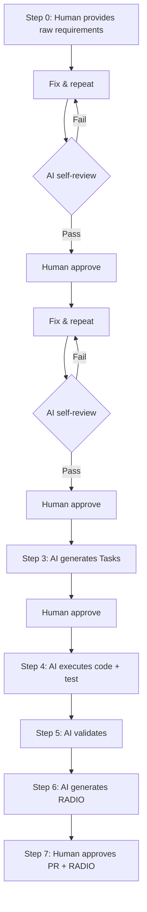

# AI-First, Spec-Driven Project Management Process

## "Self-Driving Software Team" Model

**Version:** 1.0
**Created by:** DungDV (Mr4) – Sabitech  
**Applicable to:** Software development organizations transitioning to an AI-first model  
**Target audience:** Project Manager, Tech Lead, Delivery Manager, QA/Tester, BA, Developer

### Change Log

| Version | Date | Changes | By |
|---------|------|---------|-----|
| 1.0 | 2026-05-21 | Initial version | DungDV (Mr4) |

---

## Glossary

| Abbreviation | Full Name | Definition |
|-------------|-----------|------------|
| **RACI** | Responsible, Accountable, Consulted, Informed | Responsibility assignment matrix |
| **RADIO** | Review, Action, Difficulty, Information, Outcome | 5-component progress reporting framework |
| **EARS** | Easy Approach to Requirements Syntax | Acceptance criteria syntax (THE/WHEN/IF + SHALL) |
| **DoD** | Definition of Done | Completion criteria for each artifact/phase |
| **CR** | Change Request | Change request from client/stakeholder |
| **QA** | Question & Answer | Clarification questions in the project |
| **PBT** | Property-Based Testing | Testing based on invariant properties |
| **SAST** | Static Application Security Testing | Static source code security scanning |
| **DAST** | Dynamic Application Security Testing | Runtime security scanning |
| **SLA** | Service Level Agreement | Response/resolution time commitment |
| **E2E** | End-to-End | Full flow testing from start to finish |
| **CI/CD** | Continuous Integration / Continuous Delivery | Automated build, test, deploy pipeline |
| **PR** | Pull Request | Request to merge code into main branch |
| **ERD** | Entity Relationship Diagram | Diagram of relationships between DB tables |
| **AC** | Acceptance Criteria | Acceptance criteria for requirements |
| **5WHY** | Five Whys | Method of asking "Why?" 5 times to find root cause |
| **IaC** | Infrastructure as Code | Managing infrastructure through code |
| **MCP** | Model Context Protocol | Protocol connecting AI with external tools |

---

## Table of Contents

| # | Section | Description |
|---|---------|-------------|
| 1 | [Overview](#1-overview) | 4 core components |
| 2 | [Component Definitions](#2-component-definitions) | RACI, RADIO, Spec, AI Agent |
| 3 | [Execution Process](#3-execution-process-workflow) | Workflow, comparison, testing strategy |
| 4 | [Real-World Examples](#4-real-world-examples-end-to-end) | API Login, Dashboard UI, Bugfix |
| 5 | [Adoption Levels](#5-adoption-levels) | Level 1–4 adoption roadmap |
| 6 | [System Architecture](#6-system-architecture) | Layer diagram, OpenSpec structure |
| 7 | [Risk Management](#7-risk-management-overview) | Risk matrix, process exceptions, Definition of Done |
| 8 | [Metrics & KPIs](#8-metrics--kpis) | Targets, baseline, measurement, alerts |
| 9 | [Roles and Responsibilities](#9-roles-and-responsibilities) | RACI matrix, role descriptions, escalation, versioning, failure handling, communication |
| 10 | [Change Request Management](#10-change-request-management-cr) | CR lifecycle, backlog format |
| 11 | [Risk & Issue Management](#11-risk--issue-management) | Risk vs Issue, 5WHY, lifecycle |
| 12 | [Q&A Management](#12-qa-management-question--answer) | Q&A index, thread format |
| 13 | [Limitations & Deliverables](#13-limitations--deliverables-management) | Deliverables tracking |
| 14 | [Approve Checklist](#14-standard-approve-checklist) | Approve checklists for all gates |
| 15 | [Implementation Checklist](#15-implementation-checklist) | Implementation checklist |
| 16 | [Conclusion](#16-conclusion) | Summary |
| A | [Appendix A](#appendix-a-feature-spec-document-structure) | Feature Spec structure |
| B | [Appendix B](#appendix-b-bugfix-spec-document-structure) | Bugfix Spec structure |

**Supplementary documents:**
- 📖 [`quick-start.md`](quick-start.md) – Get started in 15 minutes
- 🔧 [`toolchain.md`](toolchain.md) – Tool list & integration guide
- 💬 [`prompt-templates.md`](prompt-templates.md) – AI prompt templates for each phase

---

## 1. Overview

This process combines 4 components to create a next-generation delivery system:

| Component | Role in Process |
|-----------|----------------|
| **RACI** | Responsibility assignment |
| **RADIO** | Standardized progress reporting |
| **Specification** | Single source of truth |
| **AI Agent** | Automated execution layer |

**Core principles:**

> Humans approve and bear responsibility. AI defines, executes, and reports.

> 📖 **Just getting started?** See [`quick-start.md`](quick-start.md) to try it in 15 minutes.  
> 🔧 **Need to know which tools to use?** See [`toolchain.md`](toolchain.md).

---

## 2. Component Definitions

### 2.1 RACI – Responsibility Assignment Matrix

| Role | Definition | Entity in AI-first model |
|------|-----------|--------------------------|
| **R** – Responsible | Executes the work | 🤖 AI Agent |
| **A** – Accountable | Bears ultimate responsibility | 👤 Human (Lead / PM) |
| **C** – Consulted | Consulted before decisions | AI + Human (QA, Architect) |
| **I** – Informed | Notified of results | Stakeholder, PM |

**Rules:**
- Each task must have exactly 1 Accountable person (human).
- AI Agent is the default Responsible for execution tasks.
- Humans retain override authority at any time.

---

### 2.2 RADIO – Progress Reporting Framework

| Symbol | Content | Description |
|--------|---------|-------------|
| **R** | Review | Current status compared to spec |
| **A** | Action | Work currently being performed |
| **D** | Difficulty | Blockers, risks, issues requiring escalation |
| **I** | Information | Additional information affecting progress |
| **O** | Outcome | Results achieved, specific metrics |

**In the AI-first model:** RADIO is automatically generated by AI based on execution data (commits, test results, spec compliance), no longer a subjective report from developers.

**File location:** `openspec/specs/{feature-name}/radio.md` (see detailed format in Appendix A.5)

**RADIO update frequency:**

| Trigger | When | Required |
|---------|------|----------|
| Task complete | Each time a task in tasks.md changes to `[x]` | ✅ |
| Test fail | When CI/CD reports test failure | ✅ |
| New blocker | When a new blocker/risk is discovered | ✅ |
| End of day | End of work day (if there's progress) | ✅ |
| Sprint end | Summary at end of sprint | ✅ |
| Milestone | When completing a wave in task dependency | Recommended |
| Minimum | At least once/day if actively working | ✅ |

---

### 2.3 Specification – Single Source of Truth

Spec is the technical document that AI reads and executes. Valid spec types:

| Spec Type | Example | Purpose |
|-----------|---------|---------|
| API Spec | OpenAPI / Swagger | Define endpoints, input/output |
| Business Rules | Decision table, BPMN | Business logic |
| Acceptance Criteria | Given-When-Then | Acceptance criteria |
| Data Schema | JSON Schema, DB Schema | Data structure |
| UI Spec | Figma + annotation | Interface and behavior |

**Spec quality requirements:**
- Clear, unambiguous (AI cannot "guess intent" during execution)
- Version controlled
- AI generates spec from input requirements (meetings, tickets, brief descriptions)
- Reviewed and approved by at least 1 human before AI executes
- Includes both happy path and error cases

---

### 2.4 AI Agent – Execution Layer

> 💬 **How to prompt AI in correct format?** See [`prompt-templates.md`](prompt-templates.md) for templates for each phase.

AI Agent performs the following tasks:

| Task | Input | Output |
|------|-------|--------|
| Generate spec | Raw requirements / context | Standardized specification |
| Generate design | Spec (approved) | Complete design set (see details below) |
| Generate tasks | Design (approved) | Task breakdown + RACI |
| Generate code | Task + Design + Spec | Source code |
| Write tests | Spec + Code | Test cases (unit, integration, E2E, manual) |
| Run validation | Code + Test | Test report (all levels) |
| Generate RADIO report | Execution data | RADIO report |

**Design output details:**

| Design Type | Description | Format |
|-------------|-------------|--------|
| GUI Design | Wireframe, UI flow, mockup, interaction | **HTML Prototype** (recommended) |
| Site Map | Page/screen structure, hierarchy, navigation path | Markdown / Mermaid |
| Architecture | System diagram, sequence diagram, API contract | Markdown + Mermaid / PlantUML |
| Database Design + ERD | Table schema, relationship, index strategy | SQL DDL + ERD diagram |
| Infrastructure Design | Deployment topology, network, scaling, CI/CD | Diagram + IaC template |
| Components & Interfaces | Detail of each component: class, method, behavior | Markdown |

**⚠️ Recommendation: GUI Prototype in HTML**

Whether the application is developed for **Web, Mobile, or Desktop**, GUI prototypes should always be created in **interactive HTML** rather than static wireframes (Markdown/Figma sketch). Reasons:

| Problems with static wireframes | Benefits of HTML Prototype |
|--------------------------------|---------------------------|
| Just a rough draft, hard to visualize actual flow | Fully simulates screen navigation flow |
| Stakeholders have difficulty confirming precisely | Stakeholders click directly, confirm early and accurately |
| Cannot show interaction/transition | Includes navigation, transition, state handling |
| Must imagine during review | WYSIWYG – what you see is what you get |

**HTML Prototype requirements:**
- Include all screens in the feature
- Have complete navigation flow between screens
- Handle click/tap events for actual screen transitions
- Responsive (simulate mobile/tablet/desktop as needed)
- Can be opened directly in browser for review, no build required
- Use lightweight CSS framework (TailwindCSS, Bootstrap) for speed and aesthetics

---

## 3. Execution Process (Workflow)

### 3.1 Main Flow



**Step-by-step details:**

**Step 0: Human provides raw requirements**
- Brief description of feature/bug to be handled
- Can be a ticket, meeting note, or chat
- No standard format required

**Step 1: AI generates Spec** (+ self-check loop)
- AI analyzes raw requirements → generates standardized specification
- AI asks for clarification if ambiguous
- 🔄 Loop: AI self-reviews (clear? complete? contradictory? risk? ambiguity?) → self-fixes → repeats until pass
- If risk detected → creates RISK-XXX
- If ambiguity detected → creates QA-XXX
- ✅ Human reviews & approves → versioned in source control

**Step 2: AI generates Design** (+ self-check loop)
- AI reads approved spec → generates: architecture, GUI (HTML prototype), site map, DB design, infrastructure, components
- 🔄 Loop: AI self-reviews (covers requirements? scalable? secure? conflict? risk?) → self-fixes → repeats until pass
- ✅ Human reviews & approves → versioned in source control

**Step 3: AI generates Tasks**
- AI reads design → generates detailed task breakdown + assigns RACI
- ✅ Human reviews & approves

**Step 4: AI executes**
- Generates code per design + spec
- Writes unit test + integration test + E2E test
- Generates manual test cases (for QA)
- Runs CI/CD pipeline

**Step 5: AI validates**
- Runs all automation tests (L1–L4, L6)
- Checks spec compliance
- Detects gaps between code and spec
- QA performs manual test (L5)
- AI consolidates results

**Step 6: AI generates RADIO Report**
- Automatically consolidates from execution data
- Highlights blockers & risks
- Suggests next actions

**Step 7: Human approves**
- Reviews RADIO report + code changes (PR)
- Approves or requests changes
- Bears ultimate responsibility (Accountable)

### 3.2 Comparison with Traditional Process

| Step | Traditional | AI-first |
|------|------------|----------|
| Requirements analysis | BA analyzes, writes doc | AI generates spec from raw requirements, Human approves |
| Design | Architect writes design doc | AI generates design from spec, Human approves |
| Work breakdown | Lead manually splits tasks | AI generates tasks from design, Human approves |
| Assignment | Lead assigns to dev | AI self-assigns (R), Human is Accountable |
| Execution | Dev codes manually | AI generates code from design + spec |
| Testing | QA tests manually | AI generates + runs automated tests; QA manual tests for UX/edge cases |
| Reporting | Dev writes subjective report | AI generates RADIO from actual data |
| Review | Lead reads code | Lead approves PR + RADIO |

---

### 3.3 Testing Strategy – Test Levels

| Level | Test Type | Performed By | Tool/Framework | When to Run |
|-------|-----------|-------------|----------------|-------------|
| **L1** | Unit Test | AI Agent | Jest, PHPUnit, pytest... | Every commit (CI) |
| **L2** | Integration Test | AI Agent | Supertest, Laravel Feature Test... | Every PR |
| **L3** | E2E Automation (UI) | AI Agent | Selenium, Playwright, browser-use | Every PR / nightly |
| **L4** | Desktop/Native Automation | AI Agent | AutoIt, RobotFramework, browser-use/desktop | Nightly / release |
| **L5** | Manual Test | QA/Tester (Human) | Test cases generated by AI | Before release |
| **L6** | Property-Based Test | AI Agent | fast-check, Hypothesis... | Every PR (optional) |

**Assignment:**
- **AI generates all test scripts** (L1–L4, L6) + **generates manual test cases** (L5)
- **AI runs all automation** (L1–L4, L6) in CI/CD
- **QA/Tester only performs manual tests** (L5): exploratory, UX, edge cases hard to automate
- **QA/Tester reviews** coverage and results of all levels

**When Manual Test (L5) is needed:**
- UX/usability that automation cannot evaluate
- Exploratory testing (finding bugs outside spec)
- Cross-device/cross-browser visual check
- Complex business flows requiring human judgment
- Accessibility testing (screen reader, keyboard navigation)

**When E2E Automation (L3–L4) is needed:**
- End-to-end flows across multiple screens
- Regression testing for critical paths
- Testing across multiple browsers/devices automatically
- Desktop application testing (AutoIt, RobotFramework)
- Web scraping/interaction testing (browser-use)


---

## 4. Real-World Examples (End-to-End)

### 4.1 Example: Building a Login API

**Step 1 – Spec (AI-generated, Human-approved):**

Human provides raw requirement: *"Need a login API, accepts email + password, returns JWT token, handles wrong password cases, account lock, timeout."*

AI generates spec:

```yaml
endpoint: POST /api/v1/login
input:
  email: string (required, valid email format)
  password: string (required, min 8 chars)
output:
  success:
    token: JWT string
    expires_in: number (seconds)
  error:
    - code: INVALID_CREDENTIALS, message: "Email or password incorrect"
    - code: ACCOUNT_LOCKED, message: "Account locked after 5 attempts"
    - code: SERVICE_TIMEOUT, message: "Authentication service unavailable"
constraints:
  - Rate limit: 5 requests/minute per IP
  - Password not logged
  - Token expires in 3600s
```

**Step 2 – Design (AI-generated, Human-approved):**

AI generates complete design set from approved spec:

**a) Technical Design:**

```yaml
architecture:
  pattern: Controller → Service → Repository
  auth_provider: JWT (RS256)
  rate_limiter: Sliding window (Redis)

sequence:
  1. Controller receives request, validates input format
  2. Service calls Repository to check credentials
  3. If wrong 5 times → lock account (TTL 30 min)
  4. If correct → generate JWT token (exp: 3600s)
  5. Rate limiter checks before processing
```

**b) GUI Design (HTML Prototype):**

AI generates HTML prototype that can be opened directly in browser:

```
📁 openspec/specs/login-feature/gui/
├── index.html          ← Entry point (login page)
├── dashboard.html      ← Redirect after successful login
├── error-states.html   ← Error states
├── styles.css          ← TailwindCSS / Bootstrap
└── navigation.js       ← Screen navigation handling
```

Prototype includes:
- Login form with realtime validation (email format, password min 8)
- Click "Login" → loading state → navigate to dashboard.html
- Wrong password → display error toast "Invalid credentials"
- Wrong 5 times → display locked state with countdown
- Responsive: displays correctly on mobile/tablet/desktop

→ Human opens browser, clicks through entire flow, confirms UI before coding.

**c) Database Design + ERD:**

```sql
CREATE TABLE login_attempts (
  id UUID PRIMARY KEY,
  user_id UUID REFERENCES users(id),
  attempt_count INT DEFAULT 0,
  locked_until TIMESTAMP NULL,
  last_attempt_at TIMESTAMP DEFAULT NOW()
);

-- ERD: users 1──N login_attempts
```

**d) Infrastructure Design:**

```yaml
deployment:
  service: auth-service (container)
  redis: rate-limit + session cache
  load_balancer: ALB (HTTPS termination)
  scaling: min 2, max 10 (CPU > 70%)
```

Human (Tech Lead) reviews → approves entire design.

**Step 3 – Tasks (AI-generated, Human-approved):**

AI generates task breakdown from approved design:

| # | Task | Estimated | RACI (R/A) |
|---|------|-----------|------------|
| 1 | Setup rate limiter middleware (Redis) | 1h | AI / Tech Lead |
| 2 | Implement LoginController + input validation | 1h | AI / Tech Lead |
| 3 | Implement AuthService + credential check | 2h | AI / Tech Lead |
| 4 | Implement account lock logic | 1h | AI / Tech Lead |
| 5 | Implement JWT token generation | 1h | AI / Tech Lead |
| 6 | Write unit tests (12 cases) | 1h | AI / Tech Lead |
| 7 | Write integration test | 1h | AI / Tech Lead |

Human (Tech Lead) reviews → approves task list.

**Step 4 – RACI:**

| Role | Person/Agent |
|------|-------------|
| R (Responsible) | AI Agent |
| A (Accountable) | Tech Lead – Nguyen Van A |
| C (Consulted) | QA Lead, Security Engineer |
| I (Informed) | PM, Product Owner |

**Steps 5–6 – AI executes:**
- AI generates controller, service, repository layer
- AI generates unit tests (happy path + error cases)
- AI runs tests → 12/12 pass
- AI checks spec compliance → 100%

**Step 7 – RADIO Report (AI-generated):**

```
R: API POST /login implemented, 12/12 test cases pass, spec compliance 100%
A: Adding rate limiting middleware (5 req/min/IP)
D: Spec hasn't defined retry strategy when auth service timeout
I: Auth service has average latency 200ms, peak 800ms
O: Contract test pass, ready for integration testing
```

**Step 8 – Human action:**
- Tech Lead reviews PR → approves
- Escalates issue "D" to Architect to add retry spec
- Confirms with PM: feature ready for staging

---

### 4.2 Example: Building Analytics Dashboard (UI-heavy)

**Step 0 – Raw requirement:**

> "Need a dashboard showing user statistics: registration chart by day, top 10 active users, total revenue by month. Has date range filter. Responsive for mobile."

**Step 1 – Spec (AI-generated):**

```yaml
feature: Analytics Dashboard
screens:
  - dashboard_main: Overview with 3 widgets
  - filter_panel: Date range picker + apply
  - chart_detail: Click chart → view details

requirements:
  - R1: Dashboard displays 3 widgets (registrations, active users, revenue)
  - R2: Date range filter applies to all widgets
  - R3: Responsive: mobile (stack vertical), tablet (2 col), desktop (3 col)
  - R4: Loading state for each widget when fetching data
  - R5: Error state when API fails
```

**Step 2 – Design (HTML Prototype):**

```
📁 openspec/specs/analytics-dashboard/gui/
├── index.html          ← Main dashboard (3 widgets)
├── mobile.html         ← Mobile view (stack vertical)
├── loading-states.html ← Skeleton loading for each widget
├── error-states.html   ← Error UI when API fails
├── filter-panel.html   ← Date range picker interaction
├── chart-detail.html   ← Drill-down when clicking chart
├── styles.css          ← TailwindCSS responsive
└── navigation.js       ← Click handlers, filter logic
```

→ Human opens `index.html` in browser:
- Click filter → sees date picker open
- Resize browser → sees responsive working
- Click chart → navigates to `chart-detail.html`
- Confirms: "UI looks right, approved"

**Step 3 – Tasks:**

| # | Task | Wave |
|---|------|------|
| 1 | Setup chart library (Chart.js/Recharts) | 1 |
| 2 | Implement API endpoints (3 widgets) | 1 |
| 3 | Build Dashboard layout (responsive grid) | 2 |
| 4 | Build Registration chart widget | 2 |
| 5 | Build Active users widget | 2 |
| 6 | Build Revenue widget | 2 |
| 7 | Implement date range filter | 3 |
| 8 | Add loading/error states | 3 |
| 9 | E2E test (responsive + filter + navigation) | 4 |

**Value of HTML Prototype:** Stakeholders confirm UI before a single line of code is written. No more "only finding out it's wrong after it's built".

---

### 4.3 Example: Bugfix Flow (End-to-End)

**Situation:** QA reports bug: "User registering with email `test+alias@gmail.com` gets rejected, but spec allows it."

**Step 1 – AI creates bugfix.md:**

```markdown
# Bugfix Requirements Document

## Introduction
Bug discovered by QA during manual test (L5). Email with `+` character 
is incorrectly rejected by regex validation.

## Bug Analysis

### Current Behavior (Defect)
1.1 WHEN user registers with email containing "+" character 
    THEN the system rejects with "Invalid email format"

### Expected Behavior (Correct)
2.1 WHEN user registers with email containing "+" character 
    THE SYSTEM SHALL accept the email (RFC 5322 compliant)

### Unchanged Behavior (Regression Prevention)
3.1 WHEN user registers with invalid email (no @, no domain) 
    THE SYSTEM SHALL CONTINUE TO reject with "Invalid email format"
3.2 WHEN user registers with valid simple email 
    THE SYSTEM SHALL CONTINUE TO accept normally
```

**Step 2 – AI generates design.md with 5WHY:**

```markdown
## Hypothesized Root Cause (5WHY)

- Why 1: Why is email with "+" rejected?
  → Because regex validation doesn't include "+" in allowed characters
- Why 2: Why doesn't regex include "+"?
  → Because it uses simple regex `[a-zA-Z0-9._-]+@` instead of RFC 5322
- Why 3: Why use simple regex?
  → Because developer wrote custom regex instead of using validated library
- Why 4: Why not use a library?
  → Because there's no coding standard requiring library use for validation
- Why 5: Why is there no coding standard?
  → Because there's no linter rule enforcing "no custom email regex"

**Root cause:** Missing SAST scan in CI to detect custom email regex patterns
**Prevention:** Add ESLint rule banning custom email regex, require validator.js
```

**Step 3 – AI executes:**
- Fix: replace custom regex with `validator.isEmail()`
- Test: add test cases for `+`, `.`, and other special chars
- Prevention: add ESLint rule

**Step 4 – RADIO:**

```
R: Bug BUG-001 fixed, 3/3 tests pass, regression test pass
A: Adding ESLint rule for prevention
D: None
I: Found 2 other places also using custom regex → created CR-007
O: Fix merged, prevention rule active, 0 regression
```

---

## 5. Adoption Levels

> **Purpose:** Not every team can jump straight to AI-full. This section describes a step-by-step transition roadmap, helping teams gradually expand the scope of AI management. Each level builds on the previous one. The difference between levels is the **degree of management automation** (reporting, risk, Q&A, CR), not execution (AI already executes from Level 1).

```
Level 1              Level 2              Level 3              Level 4
AI-Spec+Execute  →   AI-Managed       →   AI-Autonomous    →   AI-Full
─────────────────    ─────────────────    ─────────────────    ─────────────────
AI generates spec    AI generates RADIO   AI self-detects risk AI manages everything
AI generates code    AI reviews quality   AI self-creates Q&A  AI self-manages CR
Human approves all   Human approves report AI self-flags issues Human only approves gates
```

### Level 1 – AI-Spec+Execute (Weeks 1–4)

**Goal:** AI generates spec + executes code + tests. Human approves at each gate. Management (reporting, risk, Q&A) still done manually by Human.

| Action | Expected Result |
|--------|----------------|
| AI generates spec from raw requirements, Human approves | Standardized spec, consistent format |
| AI generates design + tasks, Human approves | Complete design, clear tasks |
| AI executes code + tests, Human reviews PR | Code quality ensured |
| Apply RACI for all tasks | Clear responsibility assignment |
| Human writes RADIO report manually | Structured reporting (not yet automated) |

**Signs ready for Level 2:** AI generates accurate code, Human approves quickly, team is comfortable with spec-driven workflow.

### Level 2 – AI-Managed (Weeks 5–8)

**Goal:** AI begins managing reporting and review. RADIO automated, AI reviews spec quality. Human still manages risk/Q&A manually.

| Action | Expected Result |
|--------|----------------|
| AI automatically generates RADIO from commit/CI data | 80% reduction in report writing time |
| AI reviews spec quality before approval | Detects ambiguous specs early |
| AI suggests next action based on RADIO | Reduces decision-making time |
| Human manages risk register manually | Risks tracked but not automated |
| Human creates Q&A when clarification needed | Q&A structured but not AI-detected |

**Signs ready for Level 3:** Team trusts AI-generated RADIO, AI reviews accurately, workflow is stable.

### Level 3 – AI-Autonomous (Weeks 9–12)

**Goal:** AI self-manages risk, issues, Q&A. AI self-detects problems and creates items. Human only confirms.

| Action | Expected Result |
|--------|----------------|
| AI self-detects risk from spec/code analysis | Risks detected early, automatically |
| AI self-creates Q&A when detecting ambiguity | No more ambiguous specs slipping through |
| AI self-flags issues from test fail/monitoring | Issues detected in realtime |
| AI self-updates risk/issue status | Automatic tracking, no human update needed |
| Human only confirms severity + approves plan | 90% reduction in management effort |

**Signs ready for Level 4:** AI detects risk/issues accurately, automated Q&A is useful, Human only needs to confirm.

### Level 4 – AI-Full (Week 13+)

**Goal:** AI manages entire lifecycle including CR, deliverables, limitations. Human only approves at critical gates. This is the target state of this document.

| Action | Expected Result |
|--------|----------------|
| AI self-manages CR backlog (prioritize, schedule) | CRs processed quickly, no bottlenecks |
| AI self-consolidates deliverables + limitations | Always know where the project stands |
| AI self-escalates when needed | No missed critical issues |
| 1 Lead manages 10–50 AI agents | Scale without increasing headcount |
| Entire pipeline automated end-to-end | Continuous delivery, no handoff waiting |

**Note:** Teams experienced with AI tooling can start directly from Level 3 or 4. The 4-level roadmap is for teams transitioning gradually from traditional processes.

---

## 6. System Architecture

```
┌──────────────────────────────────────────────┐
│         SPEC MANAGEMENT LAYER                │
│   (Kiro/OpenSpec/Claude – in Git repo)       │
│   Manages: requirements, design, tasks,      │
│   status, traceability – all as files        │
└──────────────────────┬───────────────────────┘
                       │
                       ▼
┌──────────────────────────────────────────────┐
│            SPECIFICATION LAYER               │
│    (OpenAPI, Business Rules, AC, Schema)     │
└──────────────────────┬───────────────────────┘
                       │
                       ▼
┌──────────────────────────────────────────────┐
│              AI EXECUTION LAYER              │
│                                              │
│  ┌───────────┐  ┌──────────┐  ┌──────────┐   │
│  │ LLM/Agent │  │ Code Gen │  │ Test Gen │   │
│  └───────────┘  └──────────┘  └──────────┘   │
└──────────────────────┬───────────────────────┘
                       │
                       ▼
┌──────────────────────────────────────────────┐
│           DELIVERY PIPELINE LAYER            │
│        (Git / CI/CD / Test Automation)       │
└──────────────────────┬───────────────────────┘
                       │
                       ▼
┌──────────────────────────────────────────────┐
│            REPORTING LAYER                   │
│         (RADIO Auto-Generated Report)        │
└──────────────────────┬───────────────────────┘
                       │
                       ▼
┌──────────────────────────────────────────────┐
│           HUMAN APPROVAL LAYER               │
│      (Review, Approve, Accountable)          │
└──────────────────────────────────────────────┘
```

**Why use OpenSpec instead of Jira / Azure DevOps?**

| Criteria | Jira / Azure DevOps | OpenSpec (in repo) |
|----------|--------------------|--------------------|
| AI reads directly | ❌ Needs API integration | ✅ Reads files directly |
| Single source of truth | ❌ Spec in repo, tasks in another tool | ✅ Everything in 1 repo |
| Version control | ❌ Separate, hard to trace | ✅ Git history, PR review |
| Cost | ❌ License per user | ✅ Free (file-based) |
| Sync overhead | ❌ Needs 2-way sync | ✅ No sync needed |
| AI updates status | ❌ Needs API call | ✅ Updates files directly |
| Traceability | ❌ Manual linking | ✅ Natural file references |

**OpenSpec directory structure:**

```
📁 openspec/
├── 📁 specs/                      ← Feature specs
│   ├── 📁 login-feature/
│   │   ├── requirements.md
│   │   ├── design.md
│   │   ├── tasks.md
│   │   ├── radio.md
│   │   └── 📁 gui/
│   └── 📁 payment-feature/
│       └── ...
├── 📁 bugs/                       ← Bugfix specs
│   ├── 📁 BUG-001/
│   │   ├── bugfix.md
│   │   ├── design.md
│   │   └── tasks.md
│   └── ...
├── 📁 change-request/             ← Change Request management
│   ├── backlog.md
│   ├── 📁 CR-001/
│   │   ├── requirements.md
│   │   ├── design.md
│   │   └── tasks.md
│   └── ...
├── 📁 risk-issue/                 ← Risk & Issue management
│   ├── risks.md
│   └── issues.md
├── 📁 qa/                         ← Q&A management
│   ├── index.md
│   ├── 📁 QA-001/
│   │   └── thread.md
│   └── ...
└── 📁 deliverables/               ← Deliverables + Limitations
    ├── index.md
    ├── baseline.md
    └── 📁 sprint-01/
        └── deliverables.md
```


---

## 7. Risk Management (Overview)

> For full details on Risk & Issue Management see [Section 11](#11-risk--issue-management).

**Top risks when adopting the AI-first model:**

| Risk | Severity | Control Measure |
|------|----------|-----------------|
| AI misunderstands spec | High | Spec must go through peer review; AI validates against spec before merge |
| Human approves without reading carefully | High | Mandatory checklist; Rotate reviewer |
| Spec is ambiguous/incomplete | High | AI flags ambiguity before execution; Spec quality gate |
| AI generates code with security issues | Medium | Automated SAST/DAST scan in CI |
| Loss of control when scaling many agents | Medium | Dashboard monitoring; Alert when deviation > threshold |
| Over-reliance on AI | Low | Periodic human audit of random samples |

### 7.1 When NOT to Use the Full Process

Not every change needs to go through the full Spec → Design → Tasks flow. The table below identifies exception scopes:

| Situation | Applied Process | Reason |
|-----------|----------------|--------|
| **Production hotfix** (< 30 min, critical) | Fix directly → PR → approve → merge. Create bugfix.md **after** fix. | Prioritize uptime, document later |
| **Config change** (env variable, feature flag) | Direct PR → approve. No spec needed. | No new logic |
| **Typo / copy change** | Direct PR → approve. No spec needed. | Trivial, doesn't affect logic |
| **Prototype / POC** | Only need requirements.md (brief). Skip design + tasks. | Exploratory purpose, not delivery |
| **Dependency update** (security patch) | PR + tests pass → approve. No spec needed. | Automated, no behavior change |
| **Small UI tweak** (color change, padding) | Small CR: requirements + tasks. Skip design. | Effort < 1 hour |

**Rule:** If unsure whether full spec is needed → ask Tech Lead. Default: **use spec** (safer than skipping).

### 7.2 Definition of Done (DoD)

Each phase and artifact has clear "Done" criteria:

| Artifact / Phase | Definition of Done |
|-----------------|-------------------|
| **Spec (requirements.md)** | ✅ Approved by Human + ✅ Versioned + ✅ No open related QA + ✅ Correct EARS format |
| **Design (design.md)** | ✅ Approved + ✅ GUI prototype reviewable + ✅ Covers all requirements + ✅ No open related RISK |
| **Tasks (tasks.md)** | ✅ Approved + ✅ Each task < 4h + ✅ Clear dependencies + ✅ Full traceability |
| **Feature** | ✅ All tasks `[x]` + ✅ All tests pass (L1–L4) + ✅ Spec compliance ≥ 95% + ✅ PR merged + ✅ Clean RADIO (no "D") + ✅ Deliverables updated |
| **Bugfix** | ✅ Root cause confirmed + ✅ Fix merged + ✅ Regression test pass + ✅ No unchanged behavior broken + ✅ Prevention applied |
| **CR** | ✅ Code merged + ✅ Regression pass + ✅ backlog.md updated to "Done" + ✅ RADIO generated |
| **Sprint** | ✅ All planned features Done + ✅ Deliverables.md generated + ✅ Limitations documented + ✅ Metrics reported |

**Rule:** Do not change status to "Done" if all criteria are not met. AI self-checks DoD before reporting completion.

> **Distinguishing DoD vs Approve Checklist (Section 14):**
> - **DoD** = overall criteria for artifact/phase to be considered "done" (AI self-checks)
> - **Approve Checklist** = detailed list Human must tick when approving each gate
> - Relationship: DoD includes "Approved" → Approved requires passing Checklist → DoD ⊃ Checklist


---

## 8. Metrics & KPIs

### 8.1 KPI Table

| Metric | Target | Frequency |
|--------|--------|-----------|
| Spec Compliance Rate | ≥ 95% | Every PR |
| RADIO Accuracy | ≥ 90% | Every sprint |
| AI Task Completion Rate | ≥ 80% | Every sprint |
| Time to Delivery | 50% reduction vs baseline | Every feature |
| Human Review Time | < 30 min/PR | Every PR |
| Defect Escape Rate | < 5% | Every sprint |
| Test Coverage | ≥ 80% | Every PR |
| Risk Detection Rate | ≥ 70% | Every sprint |
| Q&A Resolution Time | < 48h (High), < 5 days (Medium) | Every sprint |
| CR Throughput | Increasing | Every sprint |

### 8.2 Measurement Details

**Spec Compliance Rate**
- Measurement: AI validates code output vs AC in spec
- Baseline: N/A (manual previously)
- Alert: < 90% → record in RADIO "D"

**RADIO Accuracy**
- Measurement: Human spot-checks 20% of reports each sprint
- Baseline: N/A
- Alert: < 80% → review process

**AI Task Completion Rate**
- Measurement: tasks.md count `[x]` by AI / total tasks
- Baseline: 0% (before AI)
- Alert: < 60% → escalate to Tech Lead

**Time to Delivery**
- Measurement: Git timestamp spec approve → PR merge
- Baseline: Measure first 2 sprints as baseline
- Alert: > 2x baseline → record in RADIO "D"

**Human Review Time**
- Measurement: PR metrics (created → approved timestamp)
- Baseline: Measure first 2 sprints
- Alert: > 2 hours → remind reviewer

**Defect Escape Rate**
- Measurement: Bug reports tagged "escaped" / total features delivered
- Baseline: Measure from current bug reports
- Alert: > 10% → review testing strategy

**Test Coverage**
- Measurement: CI coverage report (Istanbul/Coverage.py)
- Baseline: Measure from current CI
- Alert: < 70% → block merge

**Risk Detection Rate**
- Measurement: risks.md (Mitigated+Closed) / (total risks + issues from risks)
- Baseline: 0%
- Alert: < 50% → improve detection logic

**Q&A Resolution Time**
- Measurement: qa/index.md (creation date → Answered date)
- Baseline: N/A
- Alert: High > 72h → escalate

**CR Throughput**
- Measurement: backlog.md count "Done" per sprint
- Baseline: Measure first sprint
- Alert: Decreasing for 2 consecutive sprints → review capacity

### 8.3 Establishing Baseline

1. **Sprint 1–2:** Measure all metrics at current state (before full AI)
2. **Record baseline:** Save to `openspec/deliverables/baseline.md`
3. **Compare:** From Sprint 3 onwards, compare with baseline each sprint
4. **Adjust target:** After 3 sprints, adjust targets if needed (realistic)

### 8.4 Dashboard & Alerts

- **Dashboard:** Grafana/custom dashboard displaying all metrics in realtime
- **Alert:** When metric below threshold → auto-notify Tech Lead + PM
- **Trend:** Trend charts by sprint to show improvement trajectory
- **Sprint report:** AI consolidates metrics into deliverables.md at end of each sprint


---

## 9. Roles and Responsibilities

### 9.1 Role × Task Matrix

| Task / Activity | PM/DM | Tech Lead | BA | QA/Tester | Developer | AI Agent |
|-----------------|-------|-----------|-----|-----------|-----------|----------|
| **SPEC PHASE** | | | | | | |
| Provide raw requirements | I | I | **A** | C | — | — |
| Generate requirements.md | I | — | **A** (approve) | C | — | **R** (generate) |
| Review acceptance criteria | — | C | **A** (confirm) | **C** (review testability) | — | R |
| **DESIGN PHASE** | | | | | | |
| Generate design.md | I | **A** (approve) | — | — | C | **R** (generate) |
| Review architecture | — | **A** (approve) | — | — | C | R |
| Generate GUI prototype (HTML) | — | C | **A** (approve UX) | C | — | **R** (generate) |
| Review site map | — | C | **A** (approve) | — | — | R |
| Review database design | — | **A** (approve) | — | — | C | R |
| Review infrastructure design | — | **A** (approve) | — | — | C | R |
| **TASKS PHASE** | | | | | | |
| Generate tasks.md | I | **A** (approve) | — | — | C | **R** (generate) |
| Review task breakdown | — | **A** (approve) | — | C | C | R |
| **EXECUTION PHASE** | | | | | | |
| Generate code | — | — | — | — | C (override if needed) | **R** |
| Generate unit/integration tests | — | — | — | C (review coverage) | — | **R** |
| Generate E2E automation tests | — | — | — | C (review scenarios) | — | **R** |
| Generate manual test cases | — | — | — | **A** (approve cases) | — | **R** (generate) |
| Run automation tests (CI) | — | — | — | I | — | **R** |
| Perform manual tests | — | — | — | **R** (perform) | — | — |
| Run E2E (Selenium/browser-use) | — | — | — | C (verify results) | — | **R** |
| Validate spec compliance | — | — | — | **C** (verify) | — | **R** |
| **REVIEW & APPROVE** | | | | | | |
| Review PR (code) | — | **A** (approve) | — | — | C | R (create PR) |
| Review test coverage | — | C | — | **A** (approve) | — | R |
| Approve business logic | I | — | **A** (confirm) | — | — | — |
| **REPORTING** | | | | | | |
| Generate RADIO report | **I** (read) | **I** (read) | I | I | I | **R** (generate) |
| Escalate "D" items | **A** (decide) | C | — | — | — | R (flag) |
| **CR MANAGEMENT** | | | | | | |
| Receive CR | **A** (record) | C | C | — | — | — |
| Assess CR impact | C | **A** (technical) | C (business) | C | — | R (estimate) |
| Approve/Reject CR | **A** (decide) | C | C | — | — | — |
| Execute CR | I | A (approve) | — | C | C | **R** |
| **RISK & ISSUE** | | | | | | |
| Detect risk/issue | I | C (confirm) | — | C | — | **R** (detect) |
| Assess severity | C | **A** (confirm) | — | C | — | R (suggest) |
| Write prevention/mitigation | — | **A** (approve) | — | — | — | **R** (write) |
| Handle issue | — | **A** (approve) | — | C | C | **R** |
| Escalate | **A** (decide) | C | — | — | — | R (flag) |
| **Q&A** | | | | | | |
| Detect ambiguity | — | — | C | — | — | **R** (detect) |
| Draft question | — | C | C | — | — | **R** (write) |
| Answer (internal) | — | **A** (technical) | **A** (business) | C | C | — |
| Send question to client | **A** (approve sending) | — | C | — | — | R (draft) |
| Confirm conclusion | — | C | **A** (business) | C | — | R (consolidate) |
| Update spec from conclusion | — | **A** (approve) | C | — | — | **R** (update) |
| **BUGFIX** | | | | | | |
| Detect bug | — | — | — | **R** (report) | C | **R** (detect) |
| Generate bugfix.md | — | C | — | C | — | **R** (generate) |
| Root cause analysis | — | **A** (approve) | — | — | C | **R** (analyze) |
| Fix implementation | — | **A** (approve PR) | — | — | C | **R** (code) |
| Regression test | — | — | — | **A** (verify) | — | **R** (run) |

**Legend:**
- **R** = Responsible (performs the work)
- **A** = Accountable (responsible, approves)
- **C** = Consulted (consulted)
- **I** = Informed (notified)
- **—** = Not involved

---

### 9.2 Detailed Role Descriptions

#### Project Manager / Delivery Manager
- **Responsible for:** Governance, KPIs, escalation, CR approval
- **Approves:** CR accept/reject, escalation decisions, sending Q&A to client
- **Monitors:** RADIO reports, risk register, project timeline
- **Does not:** Review code, approve technical design

#### Tech Lead
- **Responsible for:** Technical decisions, architecture quality, code quality
- **Approves:** Spec (requirements + design), tasks, PR, risk mitigation plan
- **Reviews:** Architecture, database design, infrastructure, test coverage
- **Does not:** Write code (AI does), write spec (AI does)

#### BA (Business Analyst)
- **Responsible for:** Business logic correctness, requirement completeness
- **Approves:** Requirements (acceptance criteria), GUI/UX, business Q&A conclusions
- **Provides:** Initial raw requirements, business context
- **Does not:** Review code, approve technical design

#### QA / Tester
- **Responsible for:** Test quality, edge case coverage, regression prevention, manual testing
- **Approves:** Test coverage, manual test cases, regression test results
- **Performs:** Manual tests per AI-generated test cases (exploratory, UX, edge cases AI can't cover)
- **Reviews:** AI-generated tests (sufficient coverage?), E2E scenarios (correct flow?), acceptance criteria (testable?)
- **Reports:** Bugs found during manual verification
- **Does not:** Write test scripts (AI does), approve architecture

#### Developer
- **Responsible for:** Technical consultation, override AI when needed
- **Consulted:** Task breakdown, code review, complex logic
- **Overrides:** When AI generates incorrect or suboptimal code
- **Does not:** Write code from scratch (AI does), write spec (AI does)

#### AI Agent
- **Responsible for:** All execution (generate spec, design, tasks, code, test, report)
- **Automated:** Detect risk/issue, create Q&A, generate RADIO, update status
- **Flags:** Ambiguity in spec, blockers, risk triggers
- **Does not:** Approve (always needs Human confirmation)

---

### 9.3 Rules When 1 Person Holds Multiple Roles

In small teams, 1 person may hold multiple roles (e.g., Tech Lead also Developer, PM also BA). In such cases:

| Rule | Description |
|------|-------------|
| **Separate roles by time** | When approving spec → acting as BA/Lead. When reviewing code → acting as Tech Lead. Don't mix. |
| **Don't self-approve own output** | If you provide requirements (BA role) → cannot self-approve that spec (Lead role) |
| **State role when acting** | Each approve/confirm must state which role: "Approved by: John (as Tech Lead)" |
| **Don't overlap A and R** | Same task, same person cannot be both Accountable and Responsible |
| **Conflict of interest** | If same person requests CR and approves CR → need another person to approve |
| **Escalate when unsure** | If unclear which role you're acting as → escalate to PM for clarification |

---

### 9.4 Escalation Matrix

| Severity | Escalate to | Response SLA | Resolution SLA | Channel |
|----------|-------------|--------------|----------------|---------|
| **Critical** | PM + Tech Lead + Stakeholder | 1 hour | 4 hours | Slack urgent + Phone |
| **High** | Tech Lead + PM | 4 hours | 24 hours | Slack channel |
| **Medium** | Tech Lead | 24 hours | 3 days | Slack / Email |
| **Low** | Record, handle when bandwidth available | 48 hours | Next sprint | Email / Backlog |

### Escalation by Issue Type

| Issue | Escalation path | Trigger |
|-------|----------------|---------|
| Critical Issue (production down) | AI → Tech Lead → PM → Stakeholder | Immediately |
| High Risk occurs | AI → Tech Lead → PM | Within 4 hours |
| High Q&A overdue (> 48h) | AI flags RADIO "D" → PM escalates to client | After 48h no response |
| Medium Q&A overdue (> 5 days) | AI flags RADIO "D" → Tech Lead follows up | After 5 days |
| AI execution fails > 3 times | AI → Tech Lead (switch to Human override) | After 3 retries |
| Spec conflict detected | AI → Tech Lead + BA | Immediately upon detection |
| Security vulnerability | AI → Tech Lead → Security Engineer | Immediately |
| CR overdue scheduled | AI flags RADIO "D" → PM re-prioritizes | 2 days past schedule |
| Human doesn't respond to approve | AI reminds 1st (24h) → 2nd (48h) → escalates PM | After 48h |

---

### 9.5 Spec Versioning Strategy

| Change Type | Version | Re-approval needed? | Example |
|-------------|---------|---------------------|---------|
| **Major** (scope/logic change) | v1.0 → v2.0 | ✅ Required | Add new requirement, change architecture |
| **Minor** (add details) | v1.0 → v1.1 | ✅ Required | Add edge case, clarify AC |
| **Patch** (typo, format) | v1.0 → v1.0.1 | ❌ Not needed | Fix typo, format markdown |

### How to Record Version in File

```markdown
# Requirements Document

**Version:** 1.2  
**Last updated:** 2025-03-20  
**Updated by:** AI Agent  
**Approved by:** Tech Lead – 2025-03-20  

## Change Log

| Version | Date | Changes | Approved by |
|---------|------|---------|-------------|
| 1.2 | 2025-03-20 | Added AC for rate limiting | Tech Lead |
| 1.1 | 2025-03-15 | Clarify lock duration (from QA-003) | Tech Lead |
| 1.0 | 2025-03-10 | Initial version | Tech Lead |
```

---

### 9.6 Failure Handling & Rollback

#### When AI Generates Incorrect Output

| Situation | Action | Who Decides |
|-----------|--------|-------------|
| Spec has logic error | AI self-fixes (check loop) → if still wrong → Human requests changes | Human (approve gate) |
| Design not feasible | AI redesigns → if fails 2 times → escalate Tech Lead | Tech Lead |
| Code fails test | AI self-fixes → retry max 3 times → escalate | Tech Lead |
| Code passes test but wrong logic | Human rejects PR → AI re-reads spec → fixes | Human (PR review) |
| AI doesn't understand requirement | AI creates QA → waits for clarification → retries | Human (answers QA) |

#### Retry Policy

```
Attempt 1: AI self-fixes based on error message / feedback
Attempt 2: AI tries different approach (different algorithm, different architecture)
Attempt 3: AI consolidates all attempts + root cause analysis → escalates to Human
```

**After 3 failures:**
- AI MUST stop
- AI generates report: "3 attempts failed, root cause: [X], suggested approach: [Y]"
- Task transferred to Human override (Developer role)
- Recorded in RADIO "D" and creates ISSUE-XXX if needed

#### Rollback Strategy

| Scope | How to Rollback | Tool |
|-------|----------------|------|
| Wrong code change | `git revert` commit | Git |
| Wrong spec change | Revert to previous version (change log) | Git |
| Wrong design change | Revert + re-design from spec | Git |
| Entire feature wrong direction | Revert branch, return to spec phase | Git branch |
| Production issue | Rollback deployment → hotfix branch | CI/CD |

---

### 9.7 Communication Protocol

| Communication Type | Channel | Response SLA | Example |
|-------------------|---------|-------------|---------|
| **Approve request** | Slack/Teams + In-tool notification | 4 hours (High), 24 hours (Medium) | "PR ready for review", "Spec needs approval" |
| **Clarification (Q&A)** | Slack thread + QA file | 24 hours (High), 48 hours (Medium) | "Spec ambiguous, need clarification" |
| **Escalation** | Slack urgent / Phone (Critical) | 1 hour (Critical), 4 hours (High) | "Production down", "Blocker" |
| **Information (FYI)** | Email / Slack channel | No response needed | "New RADIO report", "Sprint summary" |
| **CR from client** | Email → PM records in backlog | 24 hours acknowledge | "Client requests new feature" |

#### When AI Needs Human Response

```
Attempt 1 (immediately): AI sends notification via Slack/Teams
Attempt 2 (after 24h): AI reminds + flags in RADIO "D"
Attempt 3 (after 48h): AI escalates to PM
Attempt 4 (after 72h): AI pauses related task, switches to other tasks
```


---

## 10. Change Request Management (CR)

### 10.1 Overview

During development, Change Requests (CR) arise continuously from clients, stakeholders, or internal teams. Not all CRs are implemented immediately – a mechanism for backlog management, prioritization, and tracking is needed.

### 10.2 Directory Structure

```
📁 openspec/change-request/
├── backlog.md         ← List of all CRs (backlog)
├── 📁 CR-001/        ← CR approved for implementation
│   ├── requirements.md
│   ├── design.md
│   ├── tasks.md
│   └── 📁 gui/
├── 📁 CR-002/
│   └── ...
└── ...
```

### 10.3 CR Lifecycle

```
┌─────────┐     ┌──────────┐    ┌─────────────┐     ┌──────────┐    ┌──────┐
│ Pending │───▶│ Approved │───▶│ In Progress │───▶│ Review   │───▶│ Done │
└─────────┘     └──────────┘    └─────────────┘     └──────────┘    └──────┘
     │                                                                 
     ▼                                                                 
┌──────────┐                                                           
│ Rejected │                                                           
└──────────┘                                                           
```

| Status | Meaning | Who Decides |
|--------|---------|-------------|
| **Pending** | New CR received, not yet evaluated | — |
| **Approved** | Approved, waiting to be scheduled | Human (PM/Lead) |
| **Rejected** | Rejected, reason recorded | Human (PM/Lead) |
| **In Progress** | Being implemented (AI coding) | AI Agent |
| **Review** | AI completed, waiting for Human review | Human (Lead) |
| **Done** | Completed, merged | Human (Lead) |

### 10.4 Rules

1. **All CRs must go in backlog**: No verbal CRs – everything must be recorded
2. **Approve before executing**: No AI may execute an unapproved CR
3. **Spec for large CRs**: CR > 1 day effort must have full spec (requirements + design + tasks)
4. **Small CRs can skip design**: CR < 1 day (small fix, UI tweak) can have just requirements + tasks
5. **Traceability**: Each CR has unique ID (CR-001, CR-002...), links to spec folder
6. **RADIO for CR**: AI generates RADIO report when CR is completed

---

## 11. Risk & Issue Management

### 11.1 Distinguishing Risk vs Issue

| | Risk | Issue |
|--|------|-------|
| **Definition** | Event that **may** occur in the future | Event that **has** occurred, currently affecting |
| **State** | Not yet occurred (potential) | Currently occurring (present) |
| **Action** | Prevention + Mitigation | Resolution |
| **Example** | "Auth service may timeout during peak" | "Auth service is timing out, users can't login" |

### 11.2 5WHY Method – Finding Root Cause

**5WHY** is a method of asking "Why?" consecutively 5 times to dig from surface symptoms to root cause. AI automatically performs 5WHY analysis for each issue.

**Rules:**
- Each "Why" must lead to a specific answer with evidence
- Don't stop at symptoms – must dig to root cause (usually at Why 3–5)
- Root cause must be something **fixable** (not "because humans make mistakes")
- Resolution plan must address **root cause**, not just symptoms
- Prevention must prevent the issue from **recurring** in the future

### 11.3 AI in Risk & Issue Management

| Activity | AI (Responsible) | Human (Approve) |
|----------|-----------------|-----------------|
| Detect risk | AI self-detects from spec analysis, code review, dependency scan | Human confirms if it's actually a risk |
| Assess severity | AI self-assesses probability + impact | Human confirms/adjusts severity |
| Propose prevention | AI self-writes prevention actions | Human approves plan |
| Propose mitigation | AI self-writes mitigation actions | Human approves plan |
| Detect issue | AI self-detects from test fail, CI error, monitoring | Human confirms severity |
| Propose resolution | AI self-writes resolution plan | Human approves + assigns |
| Track status | AI self-updates status, flags in RADIO "D" | Human escalates if needed |
| Convert Risk → Issue | AI self-converts when trigger condition met | Human confirms conversion |
| Close risk/issue | AI proposes closing when resolved | Human confirms close |

---

## 12. Q&A Management (Question & Answer)

### 12.1 Overview

Q&A arises continuously in projects: asking clients, asking architects, clarifying specs... Each question may have **multiple rounds of exchange** (follow-up) before reaching a conclusion. Therefore, Q&A should not be managed in a single file but separated by thread.

### 12.2 Directory Structure

```
📁 openspec/qa/
├── index.md               ← Summary list of all Q&A
├── 📁 QA-001/
│   └── thread.md          ← Full conversation of QA-001
├── 📁 QA-002/
│   └── thread.md
└── ...
```

### 12.3 AI in Q&A Management

| Activity | AI (Responsible) | Human (Approve/Answer) |
|----------|-----------------|----------------------|
| Detect question | AI self-detects ambiguity when reading spec → self-creates QA | — |
| Write question | AI self-drafts clear question with context | Human reviews if sending to client |
| Send to target | AI self-sends (internal) or drafts (for client) | Human confirms before sending to client |
| Consolidate answers | AI summarizes long thread into conclusion | Human confirms conclusion is correct |
| Update spec | AI self-updates spec/design based on conclusion | Human approves changes |
| Tracking | AI flags overdue Open QA (> 3 days) in RADIO "D" | Human escalates if needed |

### 12.4 Rules

1. **One folder per Q&A**: Don't combine multiple topics in 1 thread
2. **AI self-creates QA**: When AI detects ambiguous spec → self-creates QA-XXX, status Open
3. **Conclusion required**: All Answered QA must have a clear Conclusion section
4. **Action items**: Conclusion must lead to specific actions (update spec, create CR...)
5. **Bidirectional reference**: Spec references QA (`See QA-003`), QA references spec (`Related: ...`)
6. **Deadline for High priority**: High QA must have answer within 48h
7. **Index always up-to-date**: Each time thread changes status → update index.md

---

## 13. Limitations & Deliverables Management

### 13.1 Overview

When ending a project or phase, clear documentation is needed for:
- **Deliverables (completed):** Items implemented, tested, and deployed
- **Limitations:** Items not done, partially done, or with technical constraints

AI automatically consolidates both from execution data (tasks.md status, test results, spec compliance). Human confirms.

### 13.2 Rules

1. **AI self-consolidates**: AI scans all specs/tasks/RADIO to generate deliverables.md
2. **Human confirms**: All limitations must be confirmed by Human before sending to client
3. **Each limitation has ID**: LIM-001, LIM-002... for easy reference
4. **Plan required**: Each limitation must have a handling plan (even if "Won't Fix")
5. **Continuous updates**: Not just at project end – AI updates each sprint/phase end
6. **Bidirectional links**: Limitation references spec/CR, spec/CR references limitation

### 13.3 Limitation Types

| Type | Definition | Example |
|------|-----------|---------|
| **Not Implemented** | Requirement exists but not done | "Admin unlock not implemented (phase 2)" |
| **Partial** | Done but not complete | "Search only supports exact match, no fuzzy yet" |
| **Technical Constraint** | Technical limitation that cannot be overcome | "WebSocket not supported on IE11" |
| **Known Issue** | Known bug not yet fixed | "Timeout when exporting > 10k records" |


---

## 14. Standard Approve Checklist

> The checklists below are mandatory when Human approves AI output. Reviewer must tick all items before approving. If any item doesn't pass → request changes.

### 14.1 Checklist: Approve Requirements (Spec)

- [ ] **Complete:** All user stories cover the full scope of requirements
- [ ] **Clear:** Each acceptance criterion is unambiguous, only one interpretation
- [ ] **EARS format:** All AC use correct THE/WHEN/IF + SHALL pattern
- [ ] **Testable:** Each AC can be converted to a specific test case
- [ ] **No contradictions:** ACs don't conflict with each other
- [ ] **Edge cases:** Includes error cases, boundary conditions
- [ ] **Glossary complete:** All domain-specific terms are defined
- [ ] **No hidden assumptions:** All assumptions are explicitly stated
- [ ] **Risks flagged:** If potential risks exist → RISK-XXX created
- [ ] **Q&A resolved:** No open QA related to this spec

### 14.2 Checklist: Approve Design

- [ ] **Covers requirements:** Design addresses all approved requirements
- [ ] **Architecture sound:** Scalable, maintainable, not over-engineered
- [ ] **Security:** No obvious vulnerabilities (injection, auth bypass...)
- [ ] **Performance:** No obvious bottlenecks
- [ ] **Database design:** Proper normalization, reasonable indexes, clear relationships
- [ ] **API contract:** Clear input/output, complete error codes
- [ ] **Infrastructure:** Appropriate for expected scale
- [ ] **GUI prototype:** Click through entire flow, navigation correct
- [ ] **Site map:** Logical screen structure, no missing pages
- [ ] **Correctness properties:** Sufficient properties for PBT
- [ ] **Error handling:** Clear error handling strategy
- [ ] **Risks flagged:** Technical risks have RISK-XXX created

### 14.3 Checklist: Approve Tasks

- [ ] **Covers design:** Tasks cover all approved design
- [ ] **Granularity:** Each task small enough to track (< 4h effort)
- [ ] **Clear dependencies:** Logical execution order
- [ ] **Requirements reference:** Each task has `_Requirements: X.X_`
- [ ] **Testable outcome:** Each task has verifiable expected outcome
- [ ] **Test tasks included:** Has tasks for unit, integration, E2E tests

### 14.4 Checklist: Approve PR (Code)

- [ ] **Spec compliance:** Code implements correctly per spec
- [ ] **Design compliance:** Code follows architecture in design.md
- [ ] **Tests pass:** All tests pass (unit + integration + E2E)
- [ ] **Test coverage:** Coverage meets target (≥ 80%)
- [ ] **Security:** No hardcoded secrets, SQL injection, XSS
- [ ] **Performance:** No N+1 queries, memory leaks, infinite loops
- [ ] **Code quality:** Clean code, naming conventions, no dead code
- [ ] **Error handling:** Errors handled correctly, no swallowed exceptions
- [ ] **Logging:** Sufficient logs for debugging, no sensitive data logged
- [ ] **Breaking changes:** No backward compatibility breaks (unless spec requires)

### 14.5 Checklist: Approve RADIO Report

- [ ] **Accuracy:** R (Review) reflects actual state
- [ ] **Actions clear:** A (Action) clearly describes current work
- [ ] **Blockers flagged:** D (Difficulty) lists all blockers, nothing hidden
- [ ] **Info relevant:** I (Information) provides useful context
- [ ] **Outcomes measurable:** O (Outcome) has specific metrics
- [ ] **Risk escalation:** Serious D items have been escalated

### 14.6 Checklist: Approve Bugfix

- [ ] **Root cause correct:** Hypothesized root cause is logical, has evidence
- [ ] **Fix is surgical:** Only changes exactly what's needed
- [ ] **Unchanged behavior:** Fully lists what MUST NOT change
- [ ] **Regression tests:** Has tests proving no regression
- [ ] **Bug reproduced:** Has test proving bug existed before fix
- [ ] **Fix validated:** Has test proving fix works
- [ ] **Files Changed correct:** Only modifies files in allowed list

### 14.7 Reviewer Rotation Rules

| Rule | Description |
|------|-------------|
| No consecutive approvals | Same person cannot approve > 3 consecutive PRs for same feature |
| Cross-review | Spec reviewer ≠ PR reviewer (if team has enough people) |
| Expertise match | Reviewer must have appropriate expertise (security PR → security reviewer) |
| Backup reviewer | Each feature has at least 2 qualified approvers |
| Escalation | If reviewer is unsure → escalate to senior/architect |

---

## 15. Implementation Checklist

- [ ] Standardize spec templates for team
- [ ] Establish RACI matrix for each task type
- [ ] Train team on writing RADIO reports
- [ ] Setup AI Agent (LLM + tooling)
- [ ] Integrate AI into CI/CD pipeline
- [ ] Set up monitoring dashboard
- [ ] Define approval workflow
- [ ] Pilot with 1 small feature
- [ ] Measure baseline metrics
- [ ] Iterate and scale gradually

---

## 16. Conclusion

The AI-First, Spec-Driven process transforms software project management from:

```
"Managing people doing work" → "Managing AI systems executing work"
```

**4 pillars:**

| Pillar | Function |
|--------|----------|
| **RACI** | Clearly defines responsibility between Human and AI |
| **RADIO** | Standardizes reporting, automated by AI |
| **Spec** | Single source of truth, input for AI |
| **AI Agent** | Executes, validates, and reports automatically |

**Expected results:**
- 5–10x delivery acceleration
- Reports based on actual data, not subjective feelings
- Scale team without proportional headcount increase
- Humans focus on decision-making instead of execution

### Next Steps – What Should You Do Next?

| Step | Action | Time | Output |
|------|--------|------|--------|
| 1 | Read [`quick-start.md`](quick-start.md) and try 1 small feature | 1 day | Understand basic flow |
| 2 | Setup toolchain per [`toolchain.md`](toolchain.md) | 1–2 days | CI/CD + AI Agent ready |
| 3 | Create `openspec/` folder and run Level 1 (Section 5) | 1–2 weeks | Team comfortable with workflow |
| 4 | Measure baseline metrics (Section 8.3) | 2 sprints | Have comparison numbers |
| 5 | Gradually expand to Level 2 → 3 → 4 | 4–12 weeks | AI manages more and more |
| 6 | Review and customize process for team | Ongoing | Process fits reality |

**Final notes:**
- No need to apply 100% immediately. Start small, iterate.
- This process is a **living document** — update when team learns something new.
- All process changes should also have version + change log (like this document itself).


---
---

# Appendix A: Feature Spec Document Structure

## A.1 Overview

Each feature is organized into 1 directory containing 4 files + GUI folder:

```
📁 openspec/specs/{feature-name}/
├── requirements.md        ← Requirements (What to build)
├── design.md              ← Design (How to build)
├── tasks.md               ← Implementation plan (Implementation plan)
├── radio.md               ← RADIO report (AI auto-generate)
└── 📁 gui/               ← GUI Prototype
    ├── index.html
    ├── dashboard.html
    ├── styles.css
    └── navigation.js
```

---

## A.2 requirements.md – Requirements Document

### Purpose
Define **what the system needs to do** (What), using User Story and Acceptance Criteria in EARS notation.

### Required Structure

```markdown
# Requirements Document

## Introduction
[Brief description of system/feature, context, scope]

## Glossary
- **Term1**: Definition of term 1
- **Term2**: Definition of term 2

---

## Requirements

### Requirement 1: [Requirement name]

**User Story:** As a [role], I want [feature], so that [benefit]

#### Acceptance Criteria

1. THE [Component] SHALL [behavior]
2. WHEN [condition] THE [Component] SHALL [behavior]
3. IF [condition] THEN THE [Component] SHALL [behavior]
```

### EARS Notation

| Pattern | Meaning |
|---------|---------|
| **THE [Component] SHALL** | Mandatory behavior (always true) |
| **WHEN [condition] THE [Component] SHALL** | Behavior when triggered |
| **IF [condition] THEN THE [Component] SHALL** | Conditional behavior |
| **WHERE [constraint]** | Scope constraint |

---

## A.3 design.md – Design Document

### Purpose
Define **how the system is built** (How).

### Sections Required by Feature Size

| Feature size | Example | Required Sections | Optional Sections |
|---|---|---|---|
| **Small** (< 1 day) | Add field, change validation, fix UI | Overview, Components & Interfaces, Testing Strategy | All others |
| **Medium** (1–5 days) | New API, CRUD feature, integration | Overview, Architecture, Components, Data Models, Testing | Site Map, GUI, Infrastructure |
| **Large** (> 5 days) | New module, redesign, multi-service | **All sections** | — |

---

## A.4 tasks.md – Implementation Plan

### Purpose
Break down design into **discrete tasks** using checkbox format.

### Required Structure

```markdown
# Implementation Plan: [Feature name]

## Overview
[Summary of approach, priority order]

## Tasks

- [ ] 1. [Task group]
  - [ ] 1.1 [Sub-task]
    - [Implementation details]
    - _Requirements: X.X, Y.Y_

  - [ ] 1.2 Write property test — Property M
    - **Property M: [Name]**
    - **Validates: Requirements X.X**

## Task Dependency Graph

```json
{
  "waves": [
    {"tasks": ["1"]},
    {"tasks": ["2", "3"]},
    {"tasks": ["4", "5"]}
  ]
}
```

## Notes
[Technical notes]
```

---

## A.5 radio.md – RADIO Report

### Purpose
Automated progress report based on execution data. AI generates and continuously updates.

### Required Structure

```markdown
# RADIO Report: [Feature name]

**Last updated:** YYYY-MM-DD
**Sprint/Phase:** [Sprint X]
**Generated by:** AI Agent
**Reviewed by:** [Human – if reviewed]

---

## Latest Report

**R (Review):** [Current status, X/Y tasks done, spec compliance %]
**A (Action):** [Current work, current task]
**D (Difficulty):** [Blockers, risks, issues – or "None"]
**I (Information):** [Context affecting progress – or "—"]
**O (Outcome):** [Results: tests pass, coverage %, metrics]

---

## History

### [YYYY-MM-DD]
- R: [...]
- A: [...]
- D: [...]
- I: [...]
- O: [...]
```

---

## A.6 Comparison of 4 Files

| Criteria | requirements.md | design.md | tasks.md | radio.md |
|----------|----------------|-----------|----------|----------|
| **Heading** | `# Requirements Document` | `# Design Document: [Name]` | `# Implementation Plan: [Name]` | `# RADIO Report: [Name]` |
| **Answers (5W1H)** | What? + Why? | How? + Where? | When? + Who? | Status? |
| **Format** | EARS + User Story | Mermaid + Tables | Nested checkboxes | R/A/D/I/O |
| **Updates** | AI generates → Human approves | AI generates → Human approves | AI generates & updates `[x]` | AI auto-updates continuously |
| **Traceability** | Requirement N.N | `**Validates: Requirements X.X**` | `_Requirements: X.X_` | References tasks + metrics |

---
---

# Appendix B: Bugfix Spec Document Structure

## B.1 Overview

Bugfix Spec is used for complex bug fixes: identify root cause, fix precisely, and **clearly preserve what must not change**.

```
📁 openspec/bugs/{bug-name}/
├── bugfix.md          ← Bug analysis (replaces requirements.md)
├── design.md          ← Root cause + Fix approach
└── tasks.md           ← Implementation plan + Tests
```

### When to Use?

| Situation | Use Bugfix Spec? |
|-----------|-----------------|
| Complex bug needing root cause analysis | ✅ |
| Bug in critical code path | ✅ |
| Previous fix caused regression | ✅ |
| Typo, simple 1-line error | ❌ Fix directly |

---

## B.2 bugfix.md – Bug Analysis

### Required Structure

```markdown
# Bugfix Requirements Document

## Introduction
[Bug description, context, impact scope]

## Bug Analysis

### Current Behavior (Defect)

1.1 WHEN [condition] THEN the system [incorrect behavior]

### Expected Behavior (Correct)

2.1 WHEN [condition] THE SYSTEM SHALL [correct behavior]

### Unchanged Behavior (Regression Prevention)

3.1 WHEN [condition] THE SYSTEM SHALL CONTINUE TO [existing behavior]
```

### 3 Types of EARS Statements

| Type | Pattern | Purpose |
|------|---------|---------|
| **Defect** | `WHEN...THEN the system [wrong]` | Describe bug |
| **Correct** | `WHEN...THE SYSTEM SHALL [right]` | Require fix |
| **Unchanged** | `WHEN...THE SYSTEM SHALL CONTINUE TO [keep]` | Prevent regression |

---

## B.3 design.md – Root Cause + Fix

### Required Structure

```markdown
# Design Document: [Fix name]

## Overview
## Glossary
## Bug Details
## Expected Behavior
## Hypothesized Root Cause (5WHY)
## Fix Implementation
## Correctness Properties
## Testing Strategy
## Files Changed

| File | Change |
|------|--------|
| `path/file.php` | New — description |
| `path/existing.php` | Add validation |
```

---

## B.4 Bugfix Rules

1. **Surgical fix**: Change as little as possible
2. **Unchanged Behavior required**: Explicitly list what MUST NOT change
3. **3 Bug Analysis sections**: Defect → Correct → Unchanged
4. **5WHY required**: Root Cause must use 5WHY method (5 levels Why → Root cause → Prevention)
5. **Files Changed required**: Explicitly list changed files
6. **Prevention required**: Each bug fix must have action to prevent recurrence
7. **Bugfix reference**: `_Bugfix: X.X_` instead of `_Requirements: X.X_`
