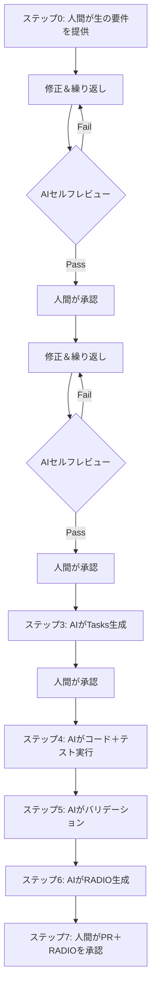

# AI-First、Spec-Driven プロジェクト管理プロセス

## 「Self-Driving Software Team」モデル

**バージョン:** 1.0
**作成者:** DungDV (Mr4) – Sabitech  
**対象:** AI-firstモデルへの移行を目指すソフトウェア開発組織  
**読者:** プロジェクトマネージャー、テックリード、デリバリーマネージャー、QA/テスター、BA、開発者

### 変更履歴

| バージョン | 日付 | 変更内容 | 担当 |
|-----------|------|---------|------|
| 1.0 | 2026-05-21 | 初版 | DungDV (Mr4) |

---

## 用語集

| 略語 | 正式名称 | 定義 |
|------|---------|------|
| **RACI** | Responsible, Accountable, Consulted, Informed | 責任分担マトリクス |
| **RADIO** | Review, Action, Difficulty, Information, Outcome | 5要素の進捗報告フレームワーク |
| **EARS** | Easy Approach to Requirements Syntax | 受入基準の構文（THE/WHEN/IF + SHALL） |
| **DoD** | Definition of Done | 各成果物/フェーズの完了基準 |
| **CR** | Change Request | クライアント/ステークホルダーからの変更要求 |
| **QA** | Question & Answer | プロジェクト内の確認質問 |
| **PBT** | Property-Based Testing | 不変プロパティに基づくテスト |
| **SAST** | Static Application Security Testing | 静的ソースコードセキュリティスキャン |
| **DAST** | Dynamic Application Security Testing | ランタイムセキュリティスキャン |
| **SLA** | Service Level Agreement | 応答/解決時間のコミットメント |
| **E2E** | End-to-End | 開始から終了までの全フローテスト |
| **CI/CD** | Continuous Integration / Continuous Delivery | 自動ビルド、テスト、デプロイパイプライン |
| **PR** | Pull Request | メインブランチへのコードマージ要求 |
| **ERD** | Entity Relationship Diagram | DBテーブル間の関係図 |
| **AC** | Acceptance Criteria | 要件の受入基準 |
| **5WHY** | Five Whys | 根本原因を見つけるために「なぜ？」を5回問う手法 |
| **IaC** | Infrastructure as Code | コードによるインフラ管理 |
| **MCP** | Model Context Protocol | AIと外部ツールを接続するプロトコル |

---

## 目次

| # | セクション | 説明 |
|---|-----------|------|
| 1 | [概要](#1-概要) | 4つのコアコンポーネント |
| 2 | [コンポーネント定義](#2-コンポーネント定義) | RACI、RADIO、Spec、AI Agent |
| 3 | [実行プロセス](#3-実行プロセスワークフロー) | ワークフロー、比較、テスト戦略 |
| 4 | [実例](#4-実例エンドツーエンド) | API Login、Dashboard UI、Bugfix |
| 5 | [導入レベル](#5-導入レベル) | Level 1–4 導入ロードマップ |
| 6 | [システムアーキテクチャ](#6-システムアーキテクチャ) | レイヤー図、OpenSpec構造 |
| 7 | [リスク管理](#7-リスク管理概要) | リスクマトリクス、プロセス例外、DoD |
| 8 | [メトリクス＆KPI](#8-メトリクスkpi) | 目標、ベースライン、測定、アラート |
| 9 | [役割と責任](#9-役割と責任) | RACIマトリクス、役割説明、エスカレーション |
| 10 | [変更要求管理](#10-変更要求管理cr) | CRライフサイクル、バックログ形式 |
| 11 | [リスク＆課題管理](#11-リスク課題管理) | Risk vs Issue、5WHY、ライフサイクル |
| 12 | [Q&A管理](#12-qa管理) | Q&Aインデックス、スレッド形式 |
| 13 | [制限事項＆成果物管理](#13-制限事項成果物管理) | 成果物トラッキング |
| 14 | [承認チェックリスト](#14-標準承認チェックリスト) | 全ゲートの承認チェックリスト |
| 15 | [導入チェックリスト](#15-導入チェックリスト) | 実装チェックリスト |
| 16 | [結論](#16-結論) | まとめ |
| A | [付録A](#付録a-機能スペックドキュメント構造) | Feature Spec構造 |
| B | [付録B](#付録b-バグ修正スペックドキュメント構造) | Bugfix Spec構造 |

**補足ドキュメント:**
- 📖 [`quick-start.md`](quick-start.md) – 15分で始めるガイド
- 🔧 [`toolchain.md`](toolchain.md) – ツール一覧＆統合ガイド
- 💬 [`prompt-templates.md`](prompt-templates.md) – 各フェーズ向けAIプロンプトテンプレート

---

## 1. 概要

本プロセスは4つのコンポーネントを組み合わせて次世代デリバリーシステムを構築します：

| コンポーネント | プロセスにおける役割 |
|--------------|-------------------|
| **RACI** | 責任分担 |
| **RADIO** | 標準化された進捗報告 |
| **Specification** | 唯一の真実の源（Single Source of Truth） |
| **AI Agent** | 自動実行レイヤー |

**コア原則：**

> 人間が承認し責任を負う。AIが定義、実行、報告する。

> 📖 **初めての方？** [`quick-start.md`](quick-start.md)で15分で試せます。  
> 🔧 **どのツールを使うべき？** [`toolchain.md`](toolchain.md)を参照。


---

## 2. コンポーネント定義

### 2.1 RACI – 責任分担マトリクス

| 役割 | 定義 | AI-firstモデルにおける実体 |
|------|------|--------------------------|
| **R** – Responsible | 作業を実行する | 🤖 AI Agent |
| **A** – Accountable | 最終責任を負う | 👤 Human（リード / PM） |
| **C** – Consulted | 決定前に相談される | AI + Human（QA、アーキテクト） |
| **I** – Informed | 結果を通知される | ステークホルダー、PM |

**ルール：**
- 各タスクには正確に1人のAccountable（人間）が必要。
- AI Agentは実行タスクのデフォルトResponsible。
- 人間はいつでもオーバーライド権限を保持。

---

### 2.2 RADIO – 進捗報告フレームワーク

| 記号 | 内容 | 説明 |
|------|------|------|
| **R** | Review | スペックに対する現在のステータス |
| **A** | Action | 現在実行中の作業 |
| **D** | Difficulty | ブロッカー、リスク、エスカレーションが必要な課題 |
| **I** | Information | 進捗に影響する追加情報 |
| **O** | Outcome | 達成した結果、具体的なメトリクス |

**AI-firstモデルでは：** RADIOは実行データ（コミット、テスト結果、スペック準拠）に基づいてAIが自動生成します。開発者の主観的な報告ではなくなります。

**ファイル場所：** `openspec/specs/{feature-name}/radio.md`（詳細フォーマットは付録A.5参照）

**RADIO更新頻度：**

| トリガー | タイミング | 必須 |
|---------|----------|------|
| タスク完了 | tasks.mdのタスクが`[x]`に変わるたび | ✅ |
| テスト失敗 | CI/CDがテスト失敗を報告した時 | ✅ |
| 新しいブロッカー | 新しいブロッカー/リスクが発見された時 | ✅ |
| 一日の終わり | 作業日の終わり（進捗がある場合） | ✅ |
| スプリント終了 | スプリント終了時のまとめ | ✅ |
| マイルストーン | タスク依存関係のwaveを完了した時 | 推奨 |
| 最低限 | アクティブに作業中なら1日1回以上 | ✅ |

---

### 2.3 Specification – 唯一の真実の源

スペックはAIが読み取り実行する技術ドキュメントです。有効なスペックの種類：

| スペック種類 | 例 | 目的 |
|------------|---|------|
| API Spec | OpenAPI / Swagger | エンドポイント、入出力の定義 |
| Business Rules | Decision table、BPMN | ビジネスロジック |
| Acceptance Criteria | Given-When-Then | 受入基準 |
| Data Schema | JSON Schema、DB Schema | データ構造 |
| UI Spec | Figma + annotation | インターフェースと動作 |

**スペック品質要件：**
- 明確で曖昧さがない（AIは実行時に「意図を推測」できない）
- バージョン管理されている
- AIが入力要件（会議、チケット、簡単な説明）からスペックを生成
- AI実行前に少なくとも1人の人間がレビュー・承認
- ハッピーパスとエラーケースの両方を含む

---

### 2.4 AI Agent – 実行レイヤー

> 💬 **AIに正しいフォーマットでプロンプトする方法は？** [`prompt-templates.md`](prompt-templates.md)で各フェーズのテンプレートを参照。

AI Agentが実行するタスク：

| タスク | 入力 | 出力 |
|--------|------|------|
| スペック生成 | 生の要件 / コンテキスト | 標準化されたスペック |
| 設計生成 | スペック（承認済み） | 完全な設計セット |
| タスク生成 | 設計（承認済み） | タスク分解 + RACI |
| コード生成 | タスク + 設計 + スペック | ソースコード |
| テスト作成 | スペック + コード | テストケース（ユニット、統合、E2E、手動） |
| バリデーション実行 | コード + テスト | テストレポート（全レベル） |
| RADIOレポート生成 | 実行データ | RADIOレポート |

**⚠️ 推奨：HTMLによるGUIプロトタイプ**

アプリケーションが**Web、モバイル、デスクトップ**のいずれ向けでも、GUIプロトタイプは静的ワイヤーフレームではなく**インタラクティブHTML**で作成すべきです。理由：

| 静的ワイヤーフレームの問題 | HTMLプロトタイプの利点 |
|--------------------------|---------------------|
| ラフなだけで実際のフローを想像しにくい | 画面遷移フローを完全にシミュレート |
| ステークホルダーが正確に確認しにくい | 直接クリックして早期に正確に確認 |
| インタラクション/トランジションを表現できない | ナビゲーション、トランジション、状態処理を含む |
| レビュー時に想像が必要 | WYSIWYG – 見たままが得られる |

---

## 3. 実行プロセス（ワークフロー）

### 3.1 メインフロー



**各ステップの詳細：**

**ステップ0：人間が生の要件を提供**
- 処理すべき機能/バグの簡潔な説明
- チケット、ミーティングノート、チャットでも可
- 標準フォーマット不要

**ステップ1：AIがSpec生成**（＋セルフチェックループ）
- AIが生の要件を分析 → 標準化されたスペックを生成
- 曖昧な場合はAIが確認を求める
- 🔄 ループ：AIがセルフレビュー（明確？完全？矛盾？リスク？曖昧さ？）→ 自己修正 → パスするまで繰り返し
- リスク検出時 → RISK-XXXを作成
- 曖昧さ検出時 → QA-XXXを作成
- ✅ 人間がレビュー＆承認 → ソース管理でバージョン管理

**ステップ2：AIがDesign生成**（＋セルフチェックループ）
- AIが承認済みスペックを読み取り → アーキテクチャ、GUI（HTMLプロトタイプ）、サイトマップ、DB設計、インフラ、コンポーネントを生成
- 🔄 ループ：AIがセルフレビュー → 自己修正 → パスするまで繰り返し
- ✅ 人間がレビュー＆承認

**ステップ3：AIがTasks生成**
- AIが設計を読み取り → 詳細なタスク分解 + RACI割り当てを生成
- ✅ 人間がレビュー＆承認

**ステップ4：AI実行**
- 設計＋スペックに基づきコード生成
- ユニットテスト＋統合テスト＋E2Eテスト作成
- 手動テストケース生成（QA向け）
- CI/CDパイプライン実行

**ステップ5：AIバリデーション**
- 全自動テスト実行（L1–L4、L6）
- スペック準拠チェック
- コードとスペック間のギャップ検出
- QAが手動テスト実行（L5）
- AIが結果を統合

**ステップ6：AIがRADIOレポート生成**
- 実行データから自動統合
- ブロッカー＆リスクをハイライト
- 次のアクションを提案

**ステップ7：人間が承認**
- RADIOレポート＋コード変更（PR）をレビュー
- 承認または変更を要求
- 最終責任を負う（Accountable）

### 3.2 従来プロセスとの比較

| ステップ | 従来 | AI-first |
|---------|------|----------|
| 要件分析 | BAが分析、ドキュメント作成 | AIが生の要件からスペック生成、人間が承認 |
| 設計 | アーキテクトが設計書作成 | AIがスペックから設計生成、人間が承認 |
| 作業分解 | リードが手動でタスク分割 | AIが設計からタスク生成、人間が承認 |
| 割り当て | リードが開発者にアサイン | AIが自己アサイン（R）、人間がAccountable |
| 実行 | 開発者が手動コーディング | AIが設計＋スペックからコード生成 |
| テスト | QAが手動テスト | AIがテスト生成＋自動実行；QAはUX/エッジケースの手動テスト |
| 報告 | 開発者が主観的レポート作成 | AIが実データからRADIO生成 |
| レビュー | リードがコードを読む | リードがPR＋RADIOを承認 |

---

### 3.3 テスト戦略 – テストレベル

| レベル | テスト種類 | 実行者 | ツール/フレームワーク | 実行タイミング |
|--------|----------|--------|-------------------|-------------|
| **L1** | ユニットテスト | AI Agent | Jest、PHPUnit、pytest... | 各コミット（CI） |
| **L2** | 統合テスト | AI Agent | Supertest、Laravel Feature Test... | 各PR |
| **L3** | E2E自動化（UI） | AI Agent | Selenium、Playwright、browser-use | 各PR / nightly |
| **L4** | デスクトップ/ネイティブ自動化 | AI Agent | AutoIt、RobotFramework | Nightly / リリース |
| **L5** | 手動テスト | QA/テスター（人間） | AIが生成したテストケース | リリース前 |
| **L6** | プロパティベーステスト | AI Agent | fast-check、Hypothesis... | 各PR（オプション） |


---

## 4. 実例（エンドツーエンド）

### 4.1 例：ログインAPI構築

**ステップ1 – Spec（AI生成、人間承認）：**

人間が生の要件を提供：*「ログインAPIが必要。email + passwordを受け取り、JWTトークンを返す。パスワード間違い、アカウントロック、タイムアウトのケースを処理。」*

AI がスペックを生成：

```yaml
endpoint: POST /api/v1/login
input:
  email: string (required, valid email format)
  password: string (required, min 8 chars)
output:
  success:
    token: JWT string
    expires_in: number (seconds)
  error:
    - code: INVALID_CREDENTIALS, message: "Email or password incorrect"
    - code: ACCOUNT_LOCKED, message: "Account locked after 5 attempts"
    - code: SERVICE_TIMEOUT, message: "Authentication service unavailable"
constraints:
  - Rate limit: 5 requests/minute per IP
  - Password not logged
  - Token expires in 3600s
```

**ステップ2 – Design（AI生成、人間承認）：**

AIが承認済みスペックから完全な設計セットを生成：

```yaml
architecture:
  pattern: Controller → Service → Repository
  auth_provider: JWT (RS256)
  rate_limiter: Sliding window (Redis)

sequence:
  1. Controllerがリクエストを受信、入力フォーマットをバリデーション
  2. ServiceがRepositoryを呼び出し認証情報を確認
  3. 5回間違い → アカウントロック（TTL 30分）
  4. 正しい場合 → JWTトークン生成（exp: 3600s）
  5. Rate limiterが処理前にチェック
```

**ステップ3 – Tasks（AI生成、人間承認）：**

| # | タスク | 見積もり | RACI (R/A) |
|---|--------|---------|------------|
| 1 | Rate limiterミドルウェアセットアップ（Redis） | 1h | AI / Tech Lead |
| 2 | LoginController + 入力バリデーション実装 | 1h | AI / Tech Lead |
| 3 | AuthService + 認証情報チェック実装 | 2h | AI / Tech Lead |
| 4 | アカウントロックロジック実装 | 1h | AI / Tech Lead |
| 5 | JWTトークン生成実装 | 1h | AI / Tech Lead |
| 6 | ユニットテスト作成（12ケース） | 1h | AI / Tech Lead |
| 7 | 統合テスト作成 | 1h | AI / Tech Lead |

**ステップ7 – RADIOレポート（AI生成）：**

```
R: API POST /login実装完了、12/12テストケースパス、スペック準拠100%
A: Rate limitingミドルウェア追加中（5 req/min/IP）
D: Auth serviceタイムアウト時のリトライ戦略がスペックで未定義
I: Auth serviceの平均レイテンシ200ms、ピーク800ms
O: コントラクトテストパス、統合テスト準備完了
```

---

### 4.2 例：アナリティクスダッシュボード構築（UI重視）

**ステップ0 – 生の要件：**

> 「ユーザー統計を表示するダッシュボードが必要：日別登録チャート、アクティブユーザーTop 10、月別総収益。日付範囲フィルター付き。モバイルレスポンシブ。」

**HTMLプロトタイプの価値：** コードを1行も書く前にステークホルダーがUIを確認。「作ってから間違いに気づく」ことがなくなる。

---

### 4.3 例：バグ修正フロー（エンドツーエンド）

**状況：** QAがバグ報告：「`test+alias@gmail.com`でユーザー登録するとリジェクトされるが、スペックでは許可されている。」

**AIが5WHYでdesign.mdを生成：**

```markdown
## 仮説的根本原因（5WHY）

- Why 1: なぜ「+」を含むメールがリジェクトされるのか？
  → 正規表現バリデーションが許可文字に「+」を含んでいないため
- Why 2: なぜ正規表現に「+」が含まれていないのか？
  → RFC 5322ではなく単純な正規表現`[a-zA-Z0-9._-]+@`を使用しているため
- Why 3: なぜ単純な正規表現を使用しているのか？
  → 開発者がバリデーション済みライブラリではなくカスタム正規表現を書いたため
- Why 4: なぜライブラリを使用しないのか？
  → バリデーションにライブラリ使用を義務付けるコーディング標準がないため
- Why 5: なぜコーディング標準がないのか？
  → 「カスタムメール正規表現禁止」を強制するlinterルールがないため

**根本原因:** CIにカスタムメール正規表現パターンを検出するSASTスキャンがない
**予防策:** カスタムメール正規表現を禁止するESLintルールを追加、validator.jsの使用を義務付け
```

---

## 5. 導入レベル

> **目的：** すべてのチームがいきなりAI-fullに移行できるわけではありません。このセクションでは段階的な移行ロードマップを説明します。

```
Level 1              Level 2              Level 3              Level 4
AI-Spec+Execute  →   AI-Managed       →   AI-Autonomous    →   AI-Full
─────────────────    ─────────────────    ─────────────────    ─────────────────
AIがスペック生成      AIがRADIO生成        AIがリスク自動検出    AIが全体管理
AIがコード+テスト    AIが品質レビュー      AIがQ&A自動作成      AIがCR自動管理
人間が全て承認       人間がレポート承認    AIが課題自動フラグ    人間はゲートのみ承認
```

### Level 1 – AI-Spec+Execute（第1–4週）

**目標：** AIがスペック生成＋コード実行＋テスト。人間が各ゲートで承認。管理（報告、リスク、Q&A）はまだ人間が手動。

### Level 2 – AI-Managed（第5–8週）

**目標：** AIが報告とレビューの管理を開始。RADIO自動化、AIがスペック品質をレビュー。

### Level 3 – AI-Autonomous（第9–12週）

**目標：** AIがリスク、課題、Q&Aを自己管理。AIが問題を自動検出しアイテムを作成。人間は確認のみ。

### Level 4 – AI-Full（第13週以降）

**目標：** AIがCR、成果物、制限事項を含むライフサイクル全体を管理。人間は重要なゲートでのみ承認。

**注意：** AIツールに経験のあるチームはLevel 3または4から直接開始可能。4レベルのロードマップは従来プロセスから段階的に移行するチーム向け。

---

## 6. システムアーキテクチャ

```
┌──────────────────────────────────────────────┐
│         SPEC管理レイヤー                      │
│   （Kiro/OpenSpec/Claude – Gitリポジトリ内）   │
│   管理：要件、設計、タスク、ステータス、        │
│   トレーサビリティ – すべてファイルとして       │
└──────────────────────┬───────────────────────┘
                       │
                       ▼
┌──────────────────────────────────────────────┐
│            SPECIFICATIONレイヤー              │
│    （OpenAPI、Business Rules、AC、Schema）    │
└──────────────────────┬───────────────────────┘
                       │
                       ▼
┌──────────────────────────────────────────────┐
│              AI実行レイヤー                    │
│  ┌───────────┐  ┌──────────┐  ┌──────────┐   │
│  │ LLM/Agent │  │ Code Gen │  │ Test Gen │   │
│  └───────────┘  └──────────┘  └──────────┘   │
└──────────────────────┬───────────────────────┘
                       │
                       ▼
┌──────────────────────────────────────────────┐
│           デリバリーパイプラインレイヤー        │
│        （Git / CI/CD / Test Automation）      │
└──────────────────────┬───────────────────────┘
                       │
                       ▼
┌──────────────────────────────────────────────┐
│            レポーティングレイヤー              │
│         （RADIO自動生成レポート）              │
└──────────────────────┬───────────────────────┘
                       │
                       ▼
┌──────────────────────────────────────────────┐
│           人間承認レイヤー                     │
│      （レビュー、承認、Accountable）           │
└──────────────────────────────────────────────┘
```

**なぜJira / Azure DevOpsではなくOpenSpecを使うのか？**

| 基準 | Jira / Azure DevOps | OpenSpec（リポジトリ内） |
|------|--------------------|-----------------------|
| AIが直接読み取り | ❌ API統合が必要 | ✅ ファイルを直接読み取り |
| 唯一の真実の源 | ❌ スペックはリポジトリ、タスクは別ツール | ✅ すべて1つのリポジトリ |
| バージョン管理 | ❌ 別々、追跡困難 | ✅ Git履歴、PRレビュー |
| コスト | ❌ ユーザーごとのライセンス | ✅ 無料（ファイルベース） |
| 同期オーバーヘッド | ❌ 双方向同期が必要 | ✅ 同期不要 |
| AIがステータス更新 | ❌ API呼び出しが必要 | ✅ ファイルを直接更新 |
| トレーサビリティ | ❌ 手動リンク | ✅ 自然なファイル参照 |


---

## 7. リスク管理（概要）

**AI-firstモデル導入時のトップリスク：**

| リスク | 重大度 | 管理措置 |
|--------|--------|---------|
| AIがスペックを誤解 | 高 | スペックはピアレビュー必須；マージ前にAIがスペックに対してバリデーション |
| 人間が読まずに承認 | 高 | 必須チェックリスト；レビュアーローテーション |
| スペックが曖昧/不完全 | 高 | AIが実行前に曖昧さをフラグ；スペック品質ゲート |
| AIがセキュリティ問題のあるコードを生成 | 中 | CIでSAST/DAST自動スキャン |
| 多数のエージェントスケール時の制御喪失 | 中 | ダッシュボードモニタリング；閾値超過時アラート |
| AIへの過度な依存 | 低 | 定期的な人間によるランダムサンプル監査 |

### 7.1 フルプロセスを使わない場合

| 状況 | 適用プロセス | 理由 |
|------|------------|------|
| **本番ホットフィックス**（30分未満、クリティカル） | 直接修正 → PR → 承認 → マージ。修正**後**にbugfix.md作成。 | アップタイム優先 |
| **設定変更**（環境変数、フィーチャーフラグ） | 直接PR → 承認。スペック不要。 | 新しいロジックなし |
| **タイポ/コピー変更** | 直接PR → 承認。スペック不要。 | 些細、ロジックに影響なし |
| **プロトタイプ/POC** | requirements.md（簡潔）のみ必要。設計＋タスクはスキップ。 | 探索目的 |
| **依存関係更新**（セキュリティパッチ） | PR＋テストパス → 承認。スペック不要。 | 動作変更なし |
| **小さなUI調整**（色変更、パディング） | 小さなCR：要件＋タスク。設計スキップ。 | 工数1時間未満 |

### 7.2 完了の定義（DoD）

| 成果物/フェーズ | 完了の定義 |
|---------------|-----------|
| **Spec** | ✅ 人間が承認 + ✅ バージョン管理 + ✅ 関連するオープンQAなし + ✅ EARS形式正確 |
| **Design** | ✅ 承認済み + ✅ GUIプロトタイプレビュー可能 + ✅ 全要件カバー + ✅ 関連するオープンRISKなし |
| **Tasks** | ✅ 承認済み + ✅ 各タスク4時間未満 + ✅ 依存関係明確 + ✅ トレーサビリティ完全 |
| **Feature** | ✅ 全タスク`[x]` + ✅ 全テストパス + ✅ スペック準拠≥95% + ✅ PRマージ済み + ✅ RADIOクリーン |
| **Bugfix** | ✅ 根本原因確認 + ✅ 修正マージ済み + ✅ リグレッションテストパス + ✅ 予防策適用済み |

---

## 8. メトリクス＆KPI

### 8.1 KPI表

| メトリクス | 目標 | 頻度 |
|-----------|------|------|
| スペック準拠率 | ≥ 95% | 各PR |
| RADIO正確性 | ≥ 90% | 各スプリント |
| AIタスク完了率 | ≥ 80% | 各スプリント |
| デリバリー時間 | ベースライン比50%削減 | 各機能 |
| 人間レビュー時間 | 30分未満/PR | 各PR |
| 欠陥エスケープ率 | < 5% | 各スプリント |
| テストカバレッジ | ≥ 80% | 各PR |
| リスク検出率 | ≥ 70% | 各スプリント |
| Q&A解決時間 | 48時間未満（High）、5日未満（Medium） | 各スプリント |
| CRスループット | 増加傾向 | 各スプリント |

### 8.2 ベースライン確立

1. **スプリント1–2：** 現状（AI導入前）で全メトリクスを測定
2. **ベースライン記録：** `openspec/deliverables/baseline.md`に保存
3. **比較：** スプリント3以降、各スプリントでベースラインと比較
4. **目標調整：** 3スプリント後、必要に応じて目標を調整（現実的に）

---

## 9. 役割と責任

### 9.1 詳細な役割説明

#### プロジェクトマネージャー / デリバリーマネージャー
- **責任：** ガバナンス、KPI、エスカレーション、CR承認
- **承認：** CR受入/却下、エスカレーション決定、クライアントへのQ&A送信
- **モニタリング：** RADIOレポート、リスクレジスター、プロジェクトタイムライン

#### テックリード
- **責任：** 技術的決定、アーキテクチャ品質、コード品質
- **承認：** スペック（要件＋設計）、タスク、PR、リスク軽減計画
- **レビュー：** アーキテクチャ、DB設計、インフラ、テストカバレッジ

#### BA（ビジネスアナリスト）
- **責任：** ビジネスロジックの正確性、要件の完全性
- **承認：** 要件（受入基準）、GUI/UX、ビジネスQ&Aの結論

#### QA / テスター
- **責任：** テスト品質、エッジケースカバレッジ、リグレッション防止、手動テスト
- **実行：** AIが生成したテストケースに基づく手動テスト

#### 開発者
- **責任：** 技術的コンサルテーション、必要時にAIをオーバーライド
- **オーバーライド：** AIが不正確または最適でないコードを生成した場合

#### AI Agent
- **責任：** 全実行（スペック、設計、タスク、コード、テスト、レポート生成）
- **自動：** リスク/課題検出、Q&A作成、RADIO生成、ステータス更新
- **しないこと：** 承認（常に人間の確認が必要）

---

### 9.4 エスカレーションマトリクス

| 重大度 | エスカレーション先 | 応答SLA | 解決SLA | チャネル |
|--------|-----------------|---------|---------|---------|
| **Critical** | PM + Tech Lead + ステークホルダー | 1時間 | 4時間 | Slack urgent + 電話 |
| **High** | Tech Lead + PM | 4時間 | 24時間 | Slackチャネル |
| **Medium** | Tech Lead | 24時間 | 3日 | Slack / Email |
| **Low** | 記録、帯域幅がある時に対応 | 48時間 | 次スプリント | Email / バックログ |

---

### 9.5 スペックバージョニング戦略

| 変更種類 | バージョン | 再承認必要？ | 例 |
|---------|----------|------------|---|
| **Major**（スコープ/ロジック変更） | v1.0 → v2.0 | ✅ 必須 | 新要件追加、アーキテクチャ変更 |
| **Minor**（詳細追加） | v1.0 → v1.1 | ✅ 必須 | エッジケース追加、AC明確化 |
| **Patch**（タイポ、フォーマット） | v1.0 → v1.0.1 | ❌ 不要 | タイポ修正、markdownフォーマット |

---

### 9.6 失敗処理＆ロールバック

#### リトライポリシー

```
試行1: AIがエラーメッセージ/フィードバックに基づき自己修正
試行2: AIが別のアプローチを試行（別のアルゴリズム、別のアーキテクチャ）
試行3: AIが全試行を統合＋根本原因分析 → 人間にエスカレーション
```

**3回失敗後：**
- AIは停止しなければならない
- AIがレポート生成：「3回試行失敗、根本原因：[X]、提案アプローチ：[Y]」
- タスクを人間オーバーライド（開発者ロール）に移管
- RADIO「D」に記録、必要に応じてISSUE-XXXを作成

---

### 9.7 コミュニケーションプロトコル

| コミュニケーション種類 | チャネル | 応答SLA | 例 |
|---------------------|---------|---------|---|
| **承認リクエスト** | Slack/Teams + ツール内通知 | 4時間（High）、24時間（Medium） | 「PRレビュー準備完了」 |
| **確認（Q&A）** | Slackスレッド + QAファイル | 24時間（High）、48時間（Medium） | 「スペック曖昧、確認必要」 |
| **エスカレーション** | Slack urgent / 電話（Critical） | 1時間（Critical）、4時間（High） | 「本番ダウン」 |
| **情報（FYI）** | Email / Slackチャネル | 応答不要 | 「新RADIOレポート」 |


---

## 10. 変更要求管理（CR）

### 10.1 概要

開発中、変更要求（CR）はクライアント、ステークホルダー、または内部チームから継続的に発生します。すべてのCRがすぐに実装されるわけではなく、バックログ管理、優先順位付け、トラッキングの仕組みが必要です。

### 10.2 CRライフサイクル

```
┌─────────┐     ┌──────────┐    ┌─────────────┐     ┌──────────┐    ┌──────┐
│ Pending │───▶│ Approved │───▶│ In Progress │───▶│ Review   │───▶│ Done │
└─────────┘     └──────────┘    └─────────────┘     └──────────┘    └──────┘
     │                                                                 
     ▼                                                                 
┌──────────┐                                                           
│ Rejected │                                                           
└──────────┘                                                           
```

| ステータス | 意味 | 決定者 |
|-----------|------|--------|
| **Pending** | 新しいCR受領、未評価 | — |
| **Approved** | 承認済み、スケジュール待ち | 人間（PM/リード） |
| **Rejected** | 却下、理由記録 | 人間（PM/リード） |
| **In Progress** | 実装中（AIがコーディング） | AI Agent |
| **Review** | AI完了、人間レビュー待ち | 人間（リード） |
| **Done** | 完了、マージ済み | 人間（リード） |

### 10.3 ルール

1. **全CRはバックログに記録：** 口頭のCRは不可 – すべて記録必須
2. **実行前に承認：** 未承認のCRをAIが実行してはならない
3. **大きなCRにはスペック：** 1日超の工数のCRには完全なスペック（要件＋設計＋タスク）が必要
4. **小さなCRは設計スキップ可：** 1日未満のCRは要件＋タスクのみで可
5. **トレーサビリティ：** 各CRに一意のID（CR-001、CR-002...）、スペックフォルダへのリンク

---

## 11. リスク＆課題管理

### 11.1 リスクと課題の区別

| | リスク | 課題（Issue） |
|--|--------|-------------|
| **定義** | 将来**発生する可能性がある**事象 | **すでに発生した**、現在影響を与えている事象 |
| **状態** | 未発生（潜在的） | 発生中（現在） |
| **アクション** | 予防（Prevention）＋ 軽減（Mitigation） | 解決（Resolution） |
| **例** | 「Auth serviceがピーク時にタイムアウトする可能性」 | 「Auth serviceがタイムアウト中、ユーザーがログインできない」 |

### 11.2 5WHY手法 – 根本原因の発見

**5WHY**は「なぜ？」を連続5回問い、表面的な症状から根本原因まで掘り下げる手法です。

**ルール：**
- 各「Why」は証拠のある具体的な回答に導く必要がある
- 症状で止まらない – 根本原因まで掘り下げる（通常Why 3–5）
- 根本原因は**修正可能なもの**でなければならない
- 解決計画は症状ではなく**根本原因**に対処する必要がある
- 予防策は課題の**再発を防ぐ**必要がある

### 11.3 AIによるリスク＆課題管理

| 活動 | AI（Responsible） | 人間（Approve） |
|------|-----------------|----------------|
| リスク検出 | AIがスペック分析、コードレビュー、依存関係スキャンから自動検出 | 人間が実際にリスクか確認 |
| 重大度評価 | AIが確率＋影響を自己評価 | 人間が確認/調整 |
| 予防策提案 | AIが予防アクションを自動記述 | 人間が計画を承認 |
| 課題検出 | AIがテスト失敗、CIエラー、モニタリングから自動検出 | 人間が重大度を確認 |
| 解決策提案 | AIが解決計画を自動記述 | 人間が承認＋アサイン |
| ステータス追跡 | AIが自動更新、RADIO「D」でフラグ | 人間が必要に応じてエスカレーション |

---

## 12. Q&A管理

### 12.1 概要

Q&Aはプロジェクトで継続的に発生します。各質問は結論に達するまで**複数回のやり取り**（フォローアップ）がある場合があります。そのため、Q&Aは1つのファイルではなくスレッドごとに分離して管理します。

### 12.2 ディレクトリ構造

```
📁 openspec/qa/
├── index.md               ← 全Q&Aのサマリーリスト
├── 📁 QA-001/
│   └── thread.md          ← QA-001の全会話
├── 📁 QA-002/
│   └── thread.md
└── ...
```

### 12.3 ルール

1. **Q&Aごとに1フォルダ：** 複数トピックを1スレッドに混ぜない
2. **AIが自動作成：** AIが曖昧なスペックを検出 → 自動でQA-XXX作成、ステータスOpen
3. **結論必須：** 回答済みの全QAに明確な結論セクションが必要
4. **アクションアイテム：** 結論は具体的なアクションに導く（スペック更新、CR作成...）
5. **双方向参照：** スペックがQAを参照（`QA-003参照`）、QAがスペックを参照
6. **High優先度の期限：** High QAは48時間以内に回答必須
7. **インデックス常に最新：** スレッドのステータス変更時 → index.mdを更新

---

## 13. 制限事項＆成果物管理

### 13.1 概要

プロジェクトまたはフェーズ終了時に明確な文書化が必要：
- **成果物（Deliverables）：** 実装、テスト、デプロイ済みのアイテム
- **制限事項（Limitations）：** 未実施、部分的実施、または技術的制約のあるアイテム

AIが実行データ（tasks.mdステータス、テスト結果、スペック準拠）から両方を自動統合。人間が確認。

### 13.2 制限事項の分類

| 種類 | 定義 | 例 |
|------|------|---|
| **Not Implemented** | 要件はあるが未実施 | 「管理者アンロック未実装（フェーズ2）」 |
| **Partial** | 実施済みだが不完全 | 「検索は完全一致のみ、ファジー未対応」 |
| **Technical Constraint** | 克服できない技術的制限 | 「WebSocketはIE11非対応」 |
| **Known Issue** | 既知のバグだが未修正 | 「1万件超エクスポート時にタイムアウト」 |

### 13.3 ルール

1. **AIが自動統合：** AIが全specs/tasks/RADIOをスキャンしてdeliverables.mdを生成
2. **人間が確認：** 全制限事項はクライアントに送信前に人間が確認必須
3. **各制限事項にID：** LIM-001、LIM-002...で参照しやすく
4. **計画必須：** 各制限事項に対処計画が必要（「Won't Fix」でも可）
5. **継続的更新：** プロジェクト終了時だけでなく、各スプリント/フェーズ終了時にAIが更新


---

## 14. 標準承認チェックリスト

> 以下のチェックリストは、人間がAI出力を承認する際に必須です。レビュアーは承認前に全項目をチェックする必要があります。パスしない項目がある場合 → 変更を要求。

### 14.1 チェックリスト：要件（Spec）承認

- [ ] **完全性：** 全ユーザーストーリーが要件の全スコープをカバー
- [ ] **明確性：** 各受入基準が曖昧でなく、解釈が1つのみ
- [ ] **EARS形式：** 全ACが正しいTHE/WHEN/IF + SHALLパターンを使用
- [ ] **テスト可能：** 各ACが具体的なテストケースに変換可能
- [ ] **矛盾なし：** AC間で競合がない
- [ ] **エッジケース：** エラーケース、境界条件を含む
- [ ] **用語集完全：** 全専門用語が定義されている
- [ ] **隠れた前提なし：** 全前提が明示的に記述
- [ ] **リスクフラグ済み：** 潜在リスクがある場合 → RISK-XXX作成済み
- [ ] **Q&A解決済み：** このスペックに関連するオープンQAなし

### 14.2 チェックリスト：設計承認

- [ ] **要件カバー：** 設計が全承認済み要件に対応
- [ ] **アーキテクチャ健全：** スケーラブル、保守可能、過剰設計でない
- [ ] **セキュリティ：** 明らかな脆弱性なし
- [ ] **パフォーマンス：** 明らかなボトルネックなし
- [ ] **DB設計：** 適切な正規化、合理的なインデックス、明確な関係
- [ ] **APIコントラクト：** 明確な入出力、完全なエラーコード
- [ ] **GUIプロトタイプ：** 全フローをクリックして確認、ナビゲーション正確
- [ ] **リスクフラグ済み：** 技術リスクにRISK-XXX作成済み

### 14.3 チェックリスト：タスク承認

- [ ] **設計カバー：** タスクが全承認済み設計をカバー
- [ ] **粒度：** 各タスクが追跡可能な大きさ（4時間未満）
- [ ] **依存関係明確：** 論理的な実行順序
- [ ] **要件参照：** 各タスクに`_Requirements: X.X_`
- [ ] **テスト可能な成果：** 各タスクに検証可能な期待結果
- [ ] **テストタスク含む：** ユニット、統合、E2Eテストのタスクあり

### 14.4 チェックリスト：PR（コード）承認

- [ ] **スペック準拠：** コードがスペック通りに実装
- [ ] **設計準拠：** コードがdesign.mdのアーキテクチャに従う
- [ ] **テストパス：** 全テストパス（ユニット＋統合＋E2E）
- [ ] **テストカバレッジ：** カバレッジが目標達成（≥ 80%）
- [ ] **セキュリティ：** ハードコードされたシークレット、SQLインジェクション、XSSなし
- [ ] **パフォーマンス：** N+1クエリ、メモリリーク、無限ループなし
- [ ] **コード品質：** クリーンコード、命名規則、デッドコードなし
- [ ] **エラーハンドリング：** エラーが正しく処理、例外の握りつぶしなし

### 14.5 チェックリスト：バグ修正承認

- [ ] **根本原因正確：** 仮説的根本原因が論理的、証拠あり
- [ ] **修正が外科的：** 必要な箇所のみ変更
- [ ] **変更しない動作：** 変更してはならないものを完全にリスト
- [ ] **リグレッションテスト：** リグレッションがないことを証明するテストあり
- [ ] **バグ再現：** 修正前にバグが存在したことを証明するテストあり
- [ ] **修正検証：** 修正が機能することを証明するテストあり

### 14.6 レビュアーローテーションルール

| ルール | 説明 |
|--------|------|
| 連続承認禁止 | 同一人物が同一機能の3つ以上連続PRを承認しない |
| クロスレビュー | スペックレビュアー ≠ PRレビュアー（チームに十分な人数がいる場合） |
| 専門性マッチ | レビュアーは適切な専門性を持つ必要あり |
| バックアップレビュアー | 各機能に少なくとも2人の承認資格者 |
| エスカレーション | レビュアーが不確かな場合 → シニア/アーキテクトにエスカレーション |

---

## 15. 導入チェックリスト

- [ ] チーム向けスペックテンプレートの標準化
- [ ] 各タスクタイプのRACIマトリクス確立
- [ ] RADIOレポート作成のチームトレーニング
- [ ] AI Agent（LLM＋ツール）のセットアップ
- [ ] CI/CDパイプラインへのAI統合
- [ ] モニタリングダッシュボードのセットアップ
- [ ] 承認ワークフローの定義
- [ ] 小さな機能1つでパイロット
- [ ] ベースラインメトリクスの測定
- [ ] 反復して段階的にスケール

---

## 16. 結論

AI-First、Spec-Drivenプロセスはソフトウェアプロジェクト管理を以下のように変革します：

```
「人が作業するのを管理する」→「AIシステムが作業を実行するのを管理する」
```

**4つの柱：**

| 柱 | 機能 |
|----|------|
| **RACI** | 人間とAI間の責任を明確に定義 |
| **RADIO** | 報告を標準化、AIが自動化 |
| **Spec** | 唯一の真実の源、AIへの入力 |
| **AI Agent** | 自動的に実行、検証、報告 |

**期待される結果：**
- デリバリー5–10倍加速
- 主観ではなく実データに基づくレポート
- ヘッドカウントを比例的に増やさずにチームをスケール
- 人間は実行ではなく意思決定に集中

### 次のステップ

| ステップ | アクション | 時間 | 出力 |
|---------|----------|------|------|
| 1 | [`quick-start.md`](quick-start.md)を読み、小さな機能1つを試す | 1日 | 基本フローの理解 |
| 2 | [`toolchain.md`](toolchain.md)に従いツールチェーンをセットアップ | 1–2日 | CI/CD + AI Agent準備完了 |
| 3 | `openspec/`フォルダを作成しLevel 1を実行（Section 5） | 1–2週間 | チームがワークフローに慣れる |
| 4 | ベースラインメトリクスを測定（Section 8.3） | 2スプリント | 比較数値を取得 |
| 5 | Level 2 → 3 → 4へ段階的に拡大 | 4–12週間 | AIがより多くを管理 |
| 6 | チーム向けにプロセスをレビュー＆カスタマイズ | 継続的 | 現実に合ったプロセス |

**最終注意：**
- 100%を一度に適用する必要はありません。小さく始めて反復。
- このプロセスは**リビングドキュメント** — チームが新しいことを学んだら更新。
- プロセス変更にもバージョン＋変更履歴を付ける（このドキュメント自体のように）。


---
---

# 付録A: 機能スペックドキュメント構造

## A.1 概要

各機能は4つのファイル＋GUIフォルダを含む1つのディレクトリとして構成されます：

```
📁 openspec/specs/{feature-name}/
├── requirements.md        ← 要件（何を作るか）
├── design.md              ← 設計（どう作るか）
├── tasks.md               ← 実装計画
├── radio.md               ← RADIOレポート（AI自動生成）
└── 📁 gui/               ← GUIプロトタイプ
    ├── index.html
    ├── dashboard.html
    ├── styles.css
    └── navigation.js
```

---

## A.2 requirements.md – 要件ドキュメント

### 目的
User StoryとEARS記法のAcceptance Criteriaを使用して、**システムが何をすべきか**（What）を定義。

### 必須構造

```markdown
# Requirements Document

## Introduction
[システム/機能の簡潔な説明、コンテキスト、スコープ]

## Glossary
- **Term1**: 用語1の定義
- **Term2**: 用語2の定義

---

## Requirements

### Requirement 1: [要件名]

**User Story:** As a [role], I want [feature], so that [benefit]

#### Acceptance Criteria

1. THE [Component] SHALL [behavior]
2. WHEN [condition] THE [Component] SHALL [behavior]
3. IF [condition] THEN THE [Component] SHALL [behavior]
```

### EARS記法

| パターン | 意味 |
|---------|------|
| **THE [Component] SHALL** | 必須動作（常に真） |
| **WHEN [condition] THE [Component] SHALL** | トリガー時の動作 |
| **IF [condition] THEN THE [Component] SHALL** | 条件付き動作 |
| **WHERE [constraint]** | スコープ制約 |

---

## A.3 design.md – 設計ドキュメント

### 目的
**システムがどのように構築されるか**（How）を定義。

### 機能サイズ別の必須セクション

| 機能サイズ | 例 | 必須セクション | オプションセクション |
|---|---|---|---|
| **Small**（1日未満） | フィールド追加、バリデーション変更 | Overview、Components & Interfaces、Testing Strategy | その他全て |
| **Medium**（1–5日） | 新API、CRUD機能、統合 | Overview、Architecture、Components、Data Models、Testing | Site Map、GUI、Infrastructure |
| **Large**（5日超） | 新モジュール、リデザイン | **全セクション** | — |

---

## A.4 tasks.md – 実装計画

### 目的
設計をチェックボックス形式の**個別タスク**に分解。

### 必須構造

```markdown
# Implementation Plan: [機能名]

## Overview
[アプローチの要約、優先順位]

## Tasks

- [ ] 1. [タスクグループ]
  - [ ] 1.1 [サブタスク]
    - [実装詳細]
    - _Requirements: X.X, Y.Y_

## Task Dependency Graph

```json
{
  "waves": [
    {"tasks": ["1"]},
    {"tasks": ["2", "3"]},
    {"tasks": ["4", "5"]}
  ]
}
```

## Notes
[技術的メモ]
```

---

## A.5 radio.md – RADIOレポート

### 目的
実行データに基づく自動進捗レポート。AIが生成し継続的に更新。

### 必須構造

```markdown
# RADIO Report: [機能名]

**最終更新:** YYYY-MM-DD
**Sprint/Phase:** [Sprint X]
**生成者:** AI Agent
**レビュー者:** [人間 – レビュー済みの場合]

---

## Latest Report

**R (Review):** [現在のステータス、X/Yタスク完了、スペック準拠%]
**A (Action):** [現在の作業、現在のタスク]
**D (Difficulty):** [ブロッカー、リスク、課題 – または「None」]
**I (Information):** [進捗に影響するコンテキスト – または「—」]
**O (Outcome):** [結果：テストパス、カバレッジ%、メトリクス]

---

## History

### [YYYY-MM-DD]
- R: [...]
- A: [...]
- D: [...]
- I: [...]
- O: [...]
```

---

## A.6 4ファイルの比較

| 基準 | requirements.md | design.md | tasks.md | radio.md |
|------|----------------|-----------|----------|----------|
| **見出し** | `# Requirements Document` | `# Design Document: [名前]` | `# Implementation Plan: [名前]` | `# RADIO Report: [名前]` |
| **回答（5W1H）** | What? + Why? | How? + Where? | When? + Who? | Status? |
| **フォーマット** | EARS + User Story | Mermaid + Tables | ネストチェックボックス | R/A/D/I/O |
| **更新** | AI生成 → 人間承認 | AI生成 → 人間承認 | AI生成＆`[x]`更新 | AI自動更新 |

---
---

# 付録B: バグ修正スペックドキュメント構造

## B.1 概要

Bugfix Specは複雑なバグ修正に使用：根本原因を特定し、正確に修正し、**変更してはならないものを明確に保持**。

```
📁 openspec/bugs/{bug-name}/
├── bugfix.md          ← バグ分析（requirements.mdの代わり）
├── design.md          ← 根本原因 + 修正アプローチ
└── tasks.md           ← 実装計画 + テスト
```

### いつ使うか？

| 状況 | Bugfix Specを使う？ |
|------|-------------------|
| 根本原因分析が必要な複雑なバグ | ✅ |
| クリティカルなコードパスのバグ | ✅ |
| 前回の修正がリグレッションを引き起こした | ✅ |
| タイポ、単純な1行エラー | ❌ 直接修正 |

---

## B.2 bugfix.md – バグ分析

### 必須構造

```markdown
# Bugfix Requirements Document

## Introduction
[バグの説明、コンテキスト、影響範囲]

## Bug Analysis

### Current Behavior (Defect)

1.1 WHEN [condition] THEN the system [incorrect behavior]

### Expected Behavior (Correct)

2.1 WHEN [condition] THE SYSTEM SHALL [correct behavior]

### Unchanged Behavior (Regression Prevention)

3.1 WHEN [condition] THE SYSTEM SHALL CONTINUE TO [existing behavior]
```

### 3種類のEARSステートメント

| 種類 | パターン | 目的 |
|------|---------|------|
| **Defect** | `WHEN...THEN the system [間違い]` | バグを記述 |
| **Correct** | `WHEN...THE SYSTEM SHALL [正しい]` | 修正を要求 |
| **Unchanged** | `WHEN...THE SYSTEM SHALL CONTINUE TO [維持]` | リグレッション防止 |

---

## B.3 バグ修正ルール

1. **外科的修正：** 可能な限り少ない変更
2. **Unchanged Behavior必須：** 変更してはならないものを明示的にリスト
3. **Bug Analysisの3セクション：** Defect → Correct → Unchanged
4. **5WHY必須：** 根本原因は5WHY手法を使用（5レベルのWhy → 根本原因 → 予防策）
5. **Files Changed必須：** 変更ファイルを明示的にリスト
6. **予防策必須：** 各バグ修正に再発防止アクションが必要
7. **Bugfix参照：** `_Requirements: X.X_`ではなく`_Bugfix: X.X_`を使用
