# 設計ドキュメント — SDLC AI Agents Platform

## Overview

**SDLC AI Agents** システムは、ソフトウェア開発ライフサイクル全体を支援するマルチエージェントプラットフォームであり、10以上の専門エージェント、パイプラインを調整するOrchestrator、artifact保存・共有システム、ナレッジベース、および自動プロジェクト管理ツールセットを含む。

### 設計目標

1. **Modularity**: 各agentは独立したpluginであり、標準化されたinterfaceを通じて通信する
2. **Scalability**: 50以上のagentの同時実行、10以上の並列pipelineをサポート
3. **Extensibility**: plugin mechanismを通じて新しいagent/modelを追加でき、coreを変更しない
4. **Observability**: すべての操作に対するStructured logging、distributed tracing、metrics
5. **Security**: 多段RBAC、TLS 1.2+暗号化、immutable audit log
6. **Reliability**: RTO ≤ 15分、RPO ≤ 1時間、uptime ≥ 99.5%

### スコープ

設計に含まれるもの:
- 全体アーキテクチャ（High-Level Architecture）
- 各コンポーネントの詳細設計（Low-Level Design）
- データモデル（Data Models）
- API Contracts
- テスト戦略（Testing Strategy）

---

## Architecture

### High-Level Architecture

```mermaid
graph TB
    subgraph "Presentation Layer"
        AdminPortal[Admin Portal - Web UI]
        API[REST/gRPC API Gateway]
        WebhookSvc[Webhook Service]
    end

    subgraph "Orchestration Layer"
        Orchestrator[Pipeline Orchestrator]
        Scheduler[Task Scheduler]
        ReviewGate[Review Gate Manager]
        ModeRouter[Interaction Mode Router]
    end

    subgraph "Agent Layer"
        ReqAgent[Requirements_Agent]
        DesignAgent[Design_Agent]
        UIUXAgent[UIUX_Agent]
        TaskAgent[Task_Agent]
        CodingAgent[Coding_Agent]
        TestAgent[Testing_Agent]
        DeployAgent[Deployment_Agent]
        OpsAgent[Operations_Agent]
        HealthAgent[ProjectHealth_Agent]
        SentimentAgent[Sentiment_Agent]
        PluginAgents[Custom Plugin Agents]
    end

    subgraph "AI Infrastructure Layer"
        ModelRouter[Model Router & Selection]
        InferenceCloud[Cloud AI Providers]
        InferenceSelf[Self-Hosted Models]
        EmbeddingService[Embedding Service]
    end

    subgraph "Data & Storage Layer"
        ContextStore[Context Store]
        KnowledgeStore[Knowledge Store - Vector DB]
        FAQStore[FAQ Store]
        ProjectBrain[Project Brain]
        TemplateRegistry[Template Registry]
        DocTemplateRegistry[Doc Template Registry]
        EvalStore[Eval Store]
    end

    subgraph "Support Services Layer"
        GitService[Git Integration Service]
        ValidationService[Output Validation Engine]
        SelfReviewEngine[Self-Review Loop Engine]
        RADIOGenerator[RADIO Report Generator]
        FeedbackService[Feedback & Rating Service]
        SentimentService[Sentiment Analysis Service]
        NotificationService[Notification & Communication]
        QuotaService[Rate Limiting & Quota]
    end

    subgraph "Observability Layer"
        LogService[Structured Logging]
        TraceService[Distributed Tracing]
        MetricsService[Metrics & Monitoring]
        AuditLog[Audit Log - Immutable]
        PromptLog[AI Interaction Log]
    end

    AdminPortal --> API
    API --> Orchestrator
    API --> ModeRouter
    ModeRouter --> Orchestrator

    Orchestrator --> Scheduler
    Orchestrator --> ReviewGate
    Scheduler --> ReqAgent
    Scheduler --> DesignAgent
    Scheduler --> UIUXAgent
    Scheduler --> TaskAgent
    Scheduler --> CodingAgent
    Scheduler --> TestAgent
    Scheduler --> DeployAgent
    Scheduler --> OpsAgent
    Scheduler --> HealthAgent
    Scheduler --> PluginAgents

    ReqAgent --> ModelRouter
    DesignAgent --> ModelRouter
    CodingAgent --> ModelRouter
    TestAgent --> ModelRouter
    SentimentAgent --> ModelRouter

    ModelRouter --> InferenceCloud
    ModelRouter --> InferenceSelf

    ReqAgent --> ContextStore
    DesignAgent --> ContextStore
    CodingAgent --> GitService
    TestAgent --> GitService

    ReqAgent --> KnowledgeStore
    DesignAgent --> KnowledgeStore
    ReqAgent --> ProjectBrain
    CodingAgent --> TemplateRegistry

    SentimentAgent --> SentimentService
    ValidationService --> ContextStore
    SelfReviewEngine --> ValidationService

    Orchestrator --> RADIOGenerator
    Orchestrator --> NotificationService
    API --> QuotaService

### Architectural Patterns

| Pattern | 適用先 | 理由 |
|---------|--------|------|
| **Event-Driven Architecture** | Orchestrator, Agent communication | 疎結合、非同期処理 |
| **Plugin Architecture** | Agent Layer | coreを変更せずに新しいagentを拡張（R32） |
| **CQRS** | Context Store | パフォーマンスのためにread/write pathを分離 |
| **Saga Pattern** | Pipeline execution | compensationを伴うロングランニングトランザクション |
| **Strategy Pattern** | Model Router | 実行時にmodel/deployment modeを選択 |
| **Chain of Responsibility** | Validation pipeline | Self-Review → Validation → Human Review |
| **Observer Pattern** | Notification, Sentiment | ノンブロッキング並列処理 |
| **Repository Pattern** | Data access layer | ストレージ実装の抽象化 |

### Deployment Architecture

```mermaid
graph LR
    subgraph "Load Balancer"
        LB[ALB/NLB]
    end

    subgraph "API Cluster"
        API1[API Instance 1]
        API2[API Instance 2]
        APIN[API Instance N]
    end

    subgraph "Worker Cluster"
        W1[Agent Worker 1]
        W2[Agent Worker 2]
        WN[Agent Worker N]
    end

    subgraph "Data Stores"
        PG[(PostgreSQL - Primary)]
        Redis[(Redis - Cache/Queue)]
        VectorDB[(Vector DB - Embeddings)]
        S3[(Object Storage - Artifacts)]
    end

    subgraph "Message Broker"
        MQ[RabbitMQ / Kafka]
    end

    LB --> API1
    LB --> API2
    LB --> APIN
    API1 --> MQ
    API2 --> MQ
    MQ --> W1
    MQ --> W2
    MQ --> WN
    W1 --> PG
    W1 --> Redis
    W1 --> VectorDB
    W1 --> S3
```

---

## Agent Processing Flows

このセクションでは、システム内の各専門AI Agentの処理フロー（processing flow）を詳細に記述する。input、内部処理ステップ、output、および他のコンポーネントとのインタラクションを含む。

### 汎用処理フロー（Generic Agent Processing Flow）

すべてのagentは、専門ロジックを実行する前に共通の処理フローに従う：

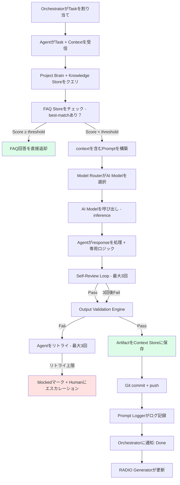

**並列処理**: Sentiment_Agentはprompt inputを受信するたびに並列でユーザー感情分析を実行する（メインフローをブロックしない）。

---

### Requirements_Agent — 処理フロー

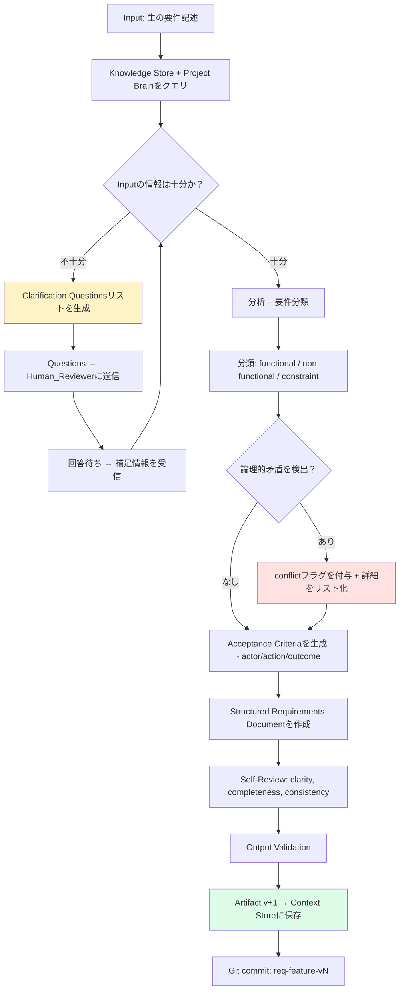

**Input**: ユーザー/BAからの生テキスト記述
**Output**: 構造化された要件（Markdown）：title, description, classification, acceptance criteria
**処理時間**: ≤ 60秒
**優先Model**: LLM（Claude/GPT-4o）— 推論が必要な複雑なタスク

---

### Design_Agent — 処理フロー

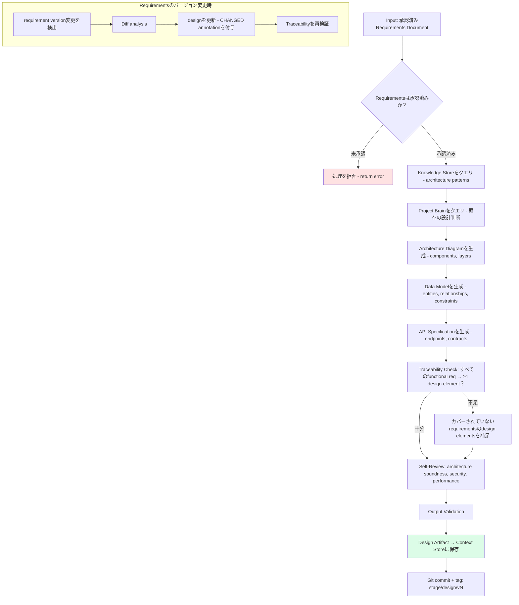

**Input**: 承認済みrequirements artifact（特定バージョン）
**Output**: 設計ドキュメント（Markdown + Mermaid diagrams）：architecture, data model, API spec
**処理時間**: ≤ 120秒
**優先Model**: LLM（GPT-4o）— architecture decisionsに複雑な推論が必要

---

### UIUX_Agent — 処理フロー

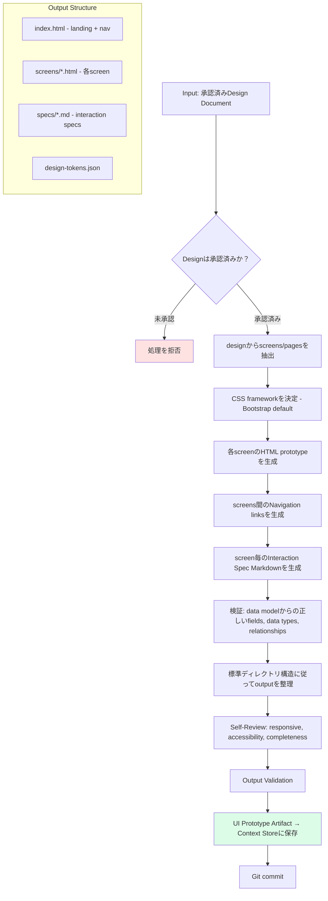

**Input**: 承認済みdesign artifact
**Output**: 静的HTML + CSS prototype（サーバー不要でブラウザで直接開ける）
**Format**: Bootstrap 5 responsive、navigation links、mock data
**優先Model**: LLM（Claude）— 正確なHTML/CSSコード生成が必要

---

### Task_Agent — 処理フロー

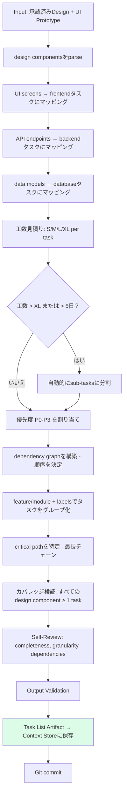

**Input**: 承認済みdesign artifact + UI prototype artifact
**Output**: タスクリスト（Markdown/YAML）：title, description, AC, effort, priority, dependencies, assignee role
**ロジック**: すべてのdesign componentは ≥ 1 taskでカバーされなければならない
**優先Model**: LLM（GPT-4o）— 見積りと依存関係分析に推論が必要

---

### Coding_Agent — 処理フロー

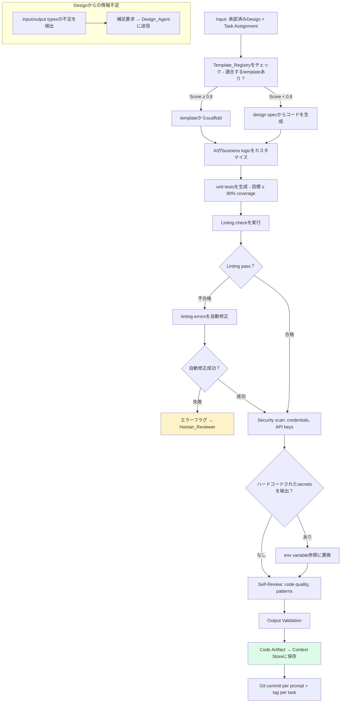

**Input**: 承認済みdesign artifact、タスクリストからの特定タスク、（オプション）template
**Output**: ソースコード + unit tests、Gitにコミット済み
**ロジック**: lintingの自動修正、credentials scan、template-firstアプローチ
**優先Model**: Code-specific model（CodeLlama）for linting + LLM（Claude）for generation

---

### Testing_Agent — 処理フロー

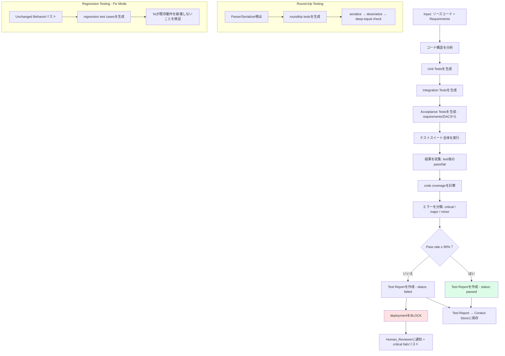

**Input**: ソースコードartifact + requirements artifact
**Output**: テストスイート + テストレポート（Markdown/JSON）
**品質ゲート**: Pass rate ≥ 90% → deploymentを許可; < 90% → BLOCK
**優先Model**: LLMでテスト生成 + Rule-basedで実行結果分析

---

### Deployment_Agent — 処理フロー

```mermaid
flowchart TD
    A[Input: Test Report - status passed] --> B{ターゲット環境？}
    B -->|development/staging| C[CI/CD pipelineを開始]
    B -->|production| D[Human_Reviewerの承認を要求]
    D --> E{60分以内に承認？}
    E -->|Timeout| F[deploymentをキャンセル + 通知]
    E -->|Approved| C
    E -->|Rejected| G[キャンセル + 理由をログ]
    C --> H[Build + Package]
    H --> I[Security Scan]
    I --> J[ターゲット環境にデプロイ]
    J --> K[Health Check Loop - 10秒毎, 最大300秒]
    K --> L{HTTP 200を受信？}
    L -->|あり - 少なくとも1回| M[Deployment SUCCESS]
    L -->|なし - 300秒経過| N[前バージョンにRollback]
    N --> O[rollback後のHealth Check]
    O --> P{Rollback healthy？}
    P -->|はい| Q[rollback成功をログ + 通知]
    P -->|いいえ| R[CRITICAL FAILURE - 緊急アラート]
    M --> S[Context Storeを更新: version, env, timestamp]
    S --> T[Git tag: deploy/{env}/vN]

    style M fill:#dcfce7
    style F fill:#fef3c7
    style R fill:#fee2e2
```

**Input**: テストレポートartifact（status: "passed"）
**Output**: Deploymentログ（JSON）、更新されたContext Store
**ロジック**: ProductionはHuman承認が必要（60分タイムアウト）、失敗時は自動rollback
**優先Model**: Rule-based engine for pipeline logic + LLM for troubleshooting

---

### Operations_Agent — 処理フロー

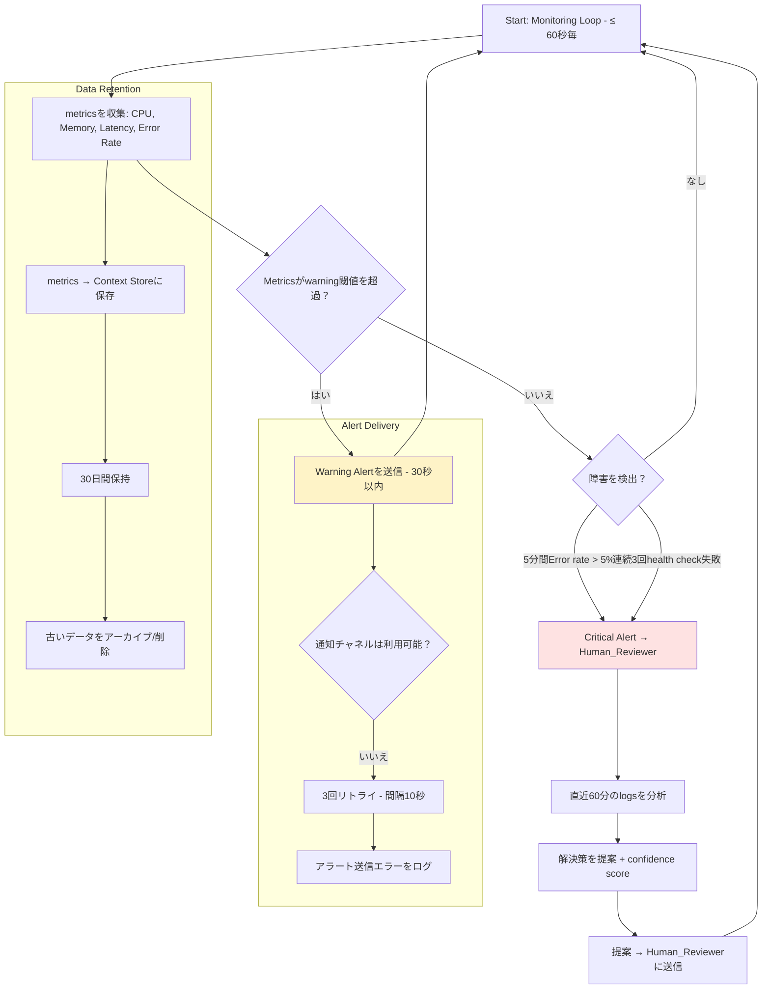

**Input**: 継続的モニタリング（pipelineからの明示的inputなし）
**Output**: アラート、インシデントレポート、metricsヒストリー
**サイクル**: ≤ 60秒毎にmetrics収集、閾値超過時30秒以内にアラート
**優先Model**: ML Classification for anomaly detection + LLM for root cause analysis

---

### ProjectHealth_Agent — 処理フロー

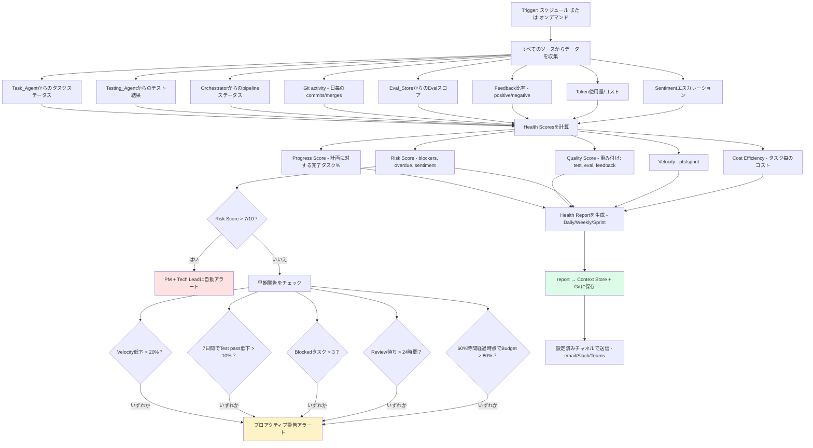

**Input**: すべてのサブシステムからの集約データ
**Output**: Health reports（Daily/Weekly/Sprint）、アラート、ダッシュボードデータ
**Trigger**: スケジュール（設定可能）または自然言語クエリ
**優先Model**: Rule-based for scoring + LLM for NL query responses

---

### Sentiment_Agent — 処理フロー

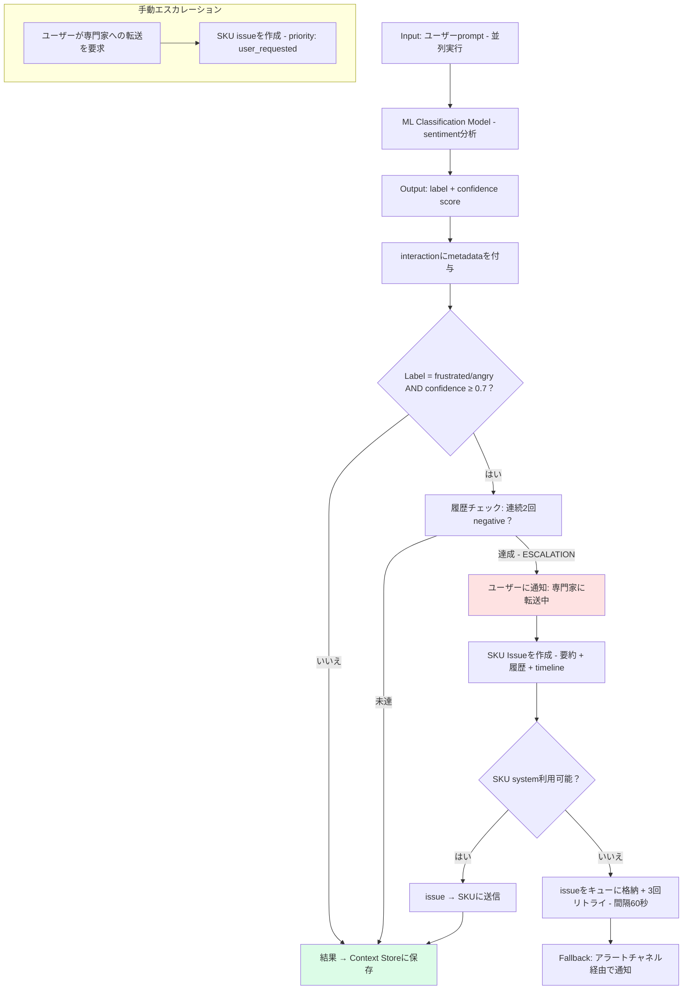

**Input**: ユーザーの各prompt input（並列実行、non-blocking）
**Output**: Sentiment label + confidence、エスカレーション判定
**Latency**: response timeに < 100ms追加
**優先Model**: ML Classification model（軽量、高速）— このタスクにLLMは使用しない

---

### Orchestrator — Pipeline調整フロー

```mermaid
flowchart TD
    A[ユーザーがMode選択 + 要件を送信] --> B[Mode Routerがpipeline configを決定]
    B --> C{Mode？}
    C -->|Spec| D[Full pipeline: Req → Design → UIUX → Task → Code → Test → Deploy]
    C -->|Fix| E[Fix pipeline: 5WHY → BugDoc → Code → Regression → Deploy]
    C -->|Vibe| F[Quick pipeline: Code → Basic Test]

    D --> G[OrchestratorがPipelineを初期化]
    E --> G
    F --> G
    G --> H[Gitにpipeline branchを作成]
    H --> I[最初のステップをスケジュール]
    
    I --> J[task → Agentに割り当て]
    J --> K[heartbeatをモニタリング - timeout 300秒]
    K --> L{Agentが応答？}
    L -->|Timeout| M[リトライ - 合計最大3回]
    M -->|リトライ上限| N[agent timeout + failedマーク]
    L -->|outputあり| O[Agentからoutputを受信]
    O --> P{ここにReview Gate？}
    P -->|あり| Q[pipelineを一時停止 + Humanに通知]
    P -->|なし| R[dependenciesをチェック → 次のステップをスケジュール]
    Q --> S{Humanの判断？}
    S -->|Approve| R
    S -->|Reject| T[feedback → Agentに差し戻し]
    T --> U{3回目のReject？}
    U -->|はい| V[Pipeline BLOCKED - 手動介入が必要]
    U -->|いいえ| J
    
    R --> W{次のステップあり？}
    W -->|あり| J
    W -->|なし| X[Pipeline COMPLETED]
    X --> Y[Pipeline Summary Reportを生成]
    Y --> Z[RADIO Report + Git tag: stage complete]
    N --> AA[RADIO "D" + Humanに通知]

    style X fill:#dcfce7
    style V fill:#fee2e2
    style N fill:#fee2e2
```

**Pipeline States**: Created → Running → Paused（review gate）→ Completed / Failed / Cancelled
**Retry Policy**: Heartbeat timeout 300秒 → 60秒間隔でリトライ → 最大3回 → failed
**Review Gates**: 任意のtransition pointに設定可能
**Mode Switch**: 途中でのmode切替を許可、作成済みartifactsは保持

---

### Agent間のインタラクション総合

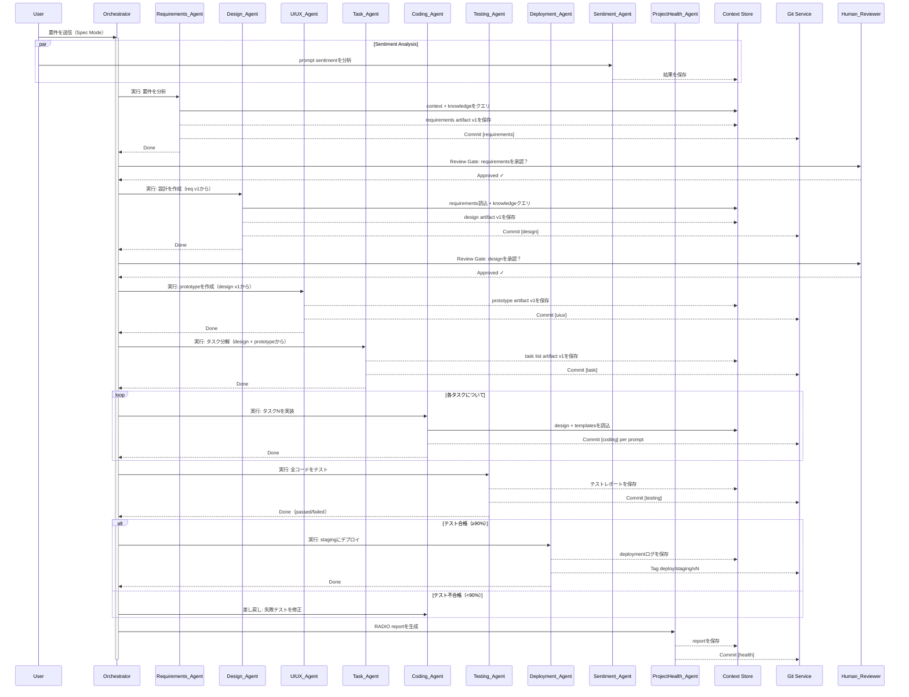

---

## Components and Interfaces

### 1. Agent Framework (Core)

#### Agent Base Interface

すべてのagentは共通のinterfaceを実装する：

```typescript
interface IAgent {
  agentId: string;
  name: string;
  role: AgentRole;
  status: AgentStatus;
  config: AgentConfig;

  // Lifecycle
  initialize(config: AgentConfig): Promise<void>;
  execute(task: AgentTask): Promise<AgentOutput>;
  handleFeedback(feedback: ReviewFeedback): Promise<AgentOutput>;
  shutdown(): Promise<void>;

  // Health
  heartbeat(): Promise<HealthStatus>;
}

type AgentRole =
  | 'requirements' | 'design' | 'uiux' | 'task'
  | 'coding' | 'testing' | 'deployment'
  | 'operations' | 'project_health' | 'sentiment'
  | string; // custom plugin roles

type AgentStatus = 'active' | 'inactive' | 'running' | 'error';

interface AgentConfig {
  modelId: string;
  temperature: number; // 0.0 - 2.0, default 0.7
  maxRetries: number;  // default 3
  timeoutMs: number;   // default 300000
  customParams?: Record<string, unknown>;
}

interface AgentTask {
  taskId: string;
  pipelineId: string;
  input: ArtifactReference[];
  context: ContextPayload;
  instructions: string;
}

interface AgentOutput {
  artifacts: Artifact[];
  metadata: OutputMetadata;
  selfReviewResult?: SelfReviewResult;
}
```

#### Agent Registry Service

```typescript
interface IAgentRegistry {
  register(config: AgentRegistrationRequest): Promise<RegisteredAgent>;
  deactivate(agentId: string): Promise<void>;
  updateConfig(agentId: string, config: Partial<AgentConfig>): Promise<void>;
  getAgent(agentId: string): Promise<RegisteredAgent>;
  listAgents(filter: AgentFilter): Promise<RegisteredAgent[]>;
}

interface AgentRegistrationRequest {
  name: string;           // max 100 chars
  role: AgentRole;
  modelId: string;
  temperature?: number;   // default 0.7
  customParams?: Record<string, unknown>;
}

// バリデーションルール（R1）:
// - name: 必須、最大100文字
// - role: 必須、有効なAgentRoleである必要
// - modelId: 必須、Model Registryに存在する必要
// - ユニーク制約: status = 'active'の場合、(name, role)ペア
```

### 2. Pipeline Orchestrator

```typescript
interface IPipelineOrchestrator {
  createPipeline(config: PipelineConfig): Promise<Pipeline>;
  startPipeline(pipelineId: string): Promise<void>;
  pausePipeline(pipelineId: string): Promise<void>;
  resumePipeline(pipelineId: string): Promise<void>;
  cancelPipeline(pipelineId: string): Promise<void>;
  getPipelineStatus(pipelineId: string): Promise<PipelineStatus>;
}

interface PipelineConfig {
  mode: InteractionMode;       // 'spec' | 'fix' | 'vibe'
  steps: PipelineStep[];
  executionMode: 'sequential' | 'conditional_parallel';
  conditions?: PipelineCondition[];
  reviewGates: ReviewGateConfig[];
}

interface PipelineStep {
  stepId: string;
  agentId: string;
  dependencies: string[];      // 先に完了する必要があるstepIds
  condition?: string;          // boolean expression
  timeout: number;             // ms
  retryPolicy: RetryPolicy;
}
```

#### Pipeline State Machine

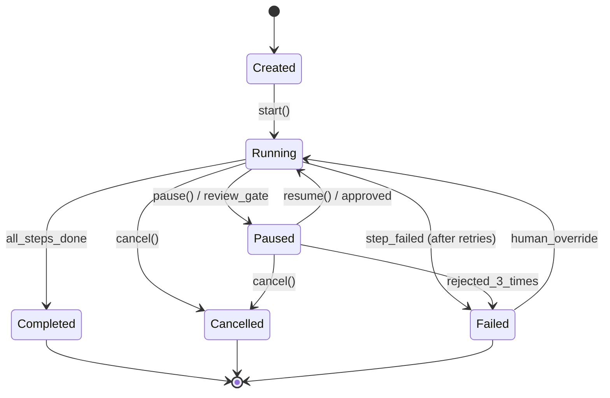

#### Interaction Mode Router (R13)

```typescript
interface IModeRouter {
  selectMode(sessionId: string, mode: InteractionMode): Promise<PipelineConfig>;
  switchMode(sessionId: string, newMode: InteractionMode): Promise<PipelineConfig>;
  getActiveMode(sessionId: string): InteractionMode;
}

type InteractionMode = 'spec' | 'fix' | 'vibe';

// Mode → Pipelineマッピング:
// spec: Requirements → Design → UIUX → Task → Coding → Testing → Deploy
// fix:  BugAnalysis(5WHY) → Design → Task → Coding → Testing
// vibe: Coding → Testing（基本的なvalidationのみ）
```

### 3. Context Store (R15)

```typescript
interface IContextStore {
  write(artifact: Artifact): Promise<ArtifactReference>;
  read(artifactId: string, version?: number): Promise<Artifact>;
  listVersions(artifactId: string): Promise<VersionInfo[]>;
  delete(artifactId: string, version: number): Promise<void>;
  query(filter: ArtifactQuery): Promise<Artifact[]>;
}

interface Artifact {
  artifactId: string;      // 1-128文字、ユニーク
  version: number;         // 正の整数
  type: ArtifactType;
  content: string | Buffer;
  metadata: ArtifactMetadata;
  gitCommitSha?: string;
}

interface ArtifactMetadata {
  createdBy: string;       // agent_id or user_id
  createdAt: string;       // ISO 8601
  pipelineId: string;
  stage: PipelineStage;
  status: ArtifactStatus;  // 'draft' | 'validated' | 'approved' | 'rejected'
  size: number;            // bytes
}

// 制約:
// - Read-after-write consistency（R15-C2）
// - artifact毎に最大100バージョン（FIFO eviction）（R15-C3）
// - Version conflict detection（R15-C4）
// - 認証必須（R15-C5）
// - Read < 500ms for < 50MB, Write < 2000ms（R28）
```

### 4. Model Router & AI Infrastructure (R39, R40)

```typescript
interface IModelRouter {
  route(request: InferenceRequest): Promise<InferenceResponse>;
  registerModel(model: ModelRegistration): Promise<void>;
  configureRouting(rules: RoutingRule[]): Promise<void>;
}

interface InferenceRequest {
  agentId: string;
  taskType: string;
  prompt: string;
  params: InferenceParams;
  dataSensitivity: DataSensitivity;
  costProfile: CostProfile;
}

interface ModelRegistration {
  modelId: string;
  modelType: ModelType;
  deploymentMode: DeploymentMode;
  connectionConfig: CloudConfig | SelfHostedConfig;
  capabilities: string[];
  costPerToken: number;
}

type ModelType = 'llm' | 'ml_classification' | 'embedding'
  | 'code_specific' | 'rule_based';
type DeploymentMode = 'cloud' | 'self_hosted';
type CostProfile = 'cost_optimized' | 'performance_optimized' | 'balanced';
type DataSensitivity = 'public' | 'internal' | 'confidential' | 'pii';

// ルーティングロジック（R39-C3, R40-C3）:
// 1. data sensitivityをチェック → confidential/piiの場合 → self-hostedのみ
// 2. task complexityをチェック → simpleの場合 → lightweight model
// 3. cost profileをチェック → それに応じてルーティング
// 4. Fallback: primaryが利用不可 → 代替deployment modeを試行
```

### 5. Knowledge Store & RAG (R17)

```typescript
interface IKnowledgeStore {
  ingest(document: IngestRequest): Promise<string>; // doc_idを返す
  search(query: SemanticQuery): Promise<SearchResult[]>;
  update(docId: string, content: string): Promise<void>;
  delete(docId: string): Promise<void>;
  configure(scope: KnowledgeScope): Promise<void>;
}

interface SemanticQuery {
  text: string;
  topK: number;          // default 5
  scope: KnowledgeScope;
  minScore?: number;     // 最小関連性閾値
}

interface SearchResult {
  docId: string;
  chunk: string;
  score: number;         // 0.0 - 1.0
  metadata: DocumentMetadata;
}

type KnowledgeScope = 'global' | 'organization' | 'project' | 'agent';
```

### 6. FAQ Store & Best-Match (R18)

```typescript
interface IFAQStore {
  create(faq: FAQEntry): Promise<string>;
  update(faqId: string, faq: Partial<FAQEntry>): Promise<void>;
  delete(faqId: string): Promise<void>;
  match(question: string, agentId?: string): Promise<FAQMatchResult>;
  list(filter: FAQFilter): Promise<FAQEntry[]>;
}

interface FAQEntry {
  faqId: string;
  question: string;
  answer: string;
  category: string;
  tags: string[];
  status: 'active' | 'inactive';
  createdAt: string;
  updatedAt: string;
}

interface FAQMatchResult {
  matched: boolean;
  faqId?: string;
  answer?: string;
  relevanceScore: number;  // 0.0 - 1.0
  source: 'faq_direct' | 'fallback_to_ai';
}

// マッチングロジック（R18-C3）:
// 1. inputと全アクティブFAQ間のsemantic similarityを計算
// 2. ベストマッチスコア >= confidence threshold（default 0.85）の場合 → FAQ回答を返却
// 3. それ以外 → AI agent処理にフォールバック
// レイテンシ要件: < 200ms（R18-C2）
```

### 7. Output Validation Engine (R22, R43)

```typescript
interface IValidationEngine {
  validate(output: AgentOutput, rules: ValidationRule[]): Promise<ValidationResult>;
  selfReview(output: AgentOutput, criteria: SelfReviewCriteria): Promise<SelfReviewResult>;
  getGuardrails(): Promise<GuardrailRule[]>;
}

interface ValidationRule {
  ruleId: string;
  type: 'schema' | 'required_sections' | 'regex' | 'guardrail';
  config: Record<string, unknown>;
  severity: 'error' | 'warning';
}

interface SelfReviewCriteria {
  clarity: boolean;
  completeness: boolean;
  consistency: boolean;
  compliance: boolean;
  riskDetection: boolean;
}

interface SelfReviewResult {
  passed: boolean;
  iterations: number;        // max 3
  issuesFound: Issue[];
  issuesFixed: Issue[];
  issuesRemaining: Issue[];
  confidenceScore: number;   // 0.0 - 1.0
}

// 処理チェーン: Agent Output → Self-Review（R43）→ Validation（R22）→ Human Review（R14）
// リトライ: ステージ毎に最大3回（R50）
```

### 8. Review Gate Manager (R14, R47)

```typescript
interface IReviewGateManager {
  createGate(config: ReviewGateConfig): Promise<string>;
  submitForReview(artifactId: string, gateId: string): Promise<ReviewRequest>;
  approve(requestId: string, checklist: ChecklistResult, comment?: string): Promise<void>;
  reject(requestId: string, feedback: string): Promise<void>;
  getChecklist(gateType: GateType): Promise<ChecklistItem[]>;
}

interface ReviewGateConfig {
  gateId: string;
  gateType: GateType;
  position: string;           // どのpipeline stepの後か
  requiredApprovers: number;  // default 1
  timeoutHours: number;       // default 48
  checklist: ChecklistItem[];
}

type GateType = 'approve_requirements' | 'approve_design'
  | 'approve_tasks' | 'approve_pr';

interface ChecklistItem {
  itemId: string;
  label: string;
  required: boolean;
  condition?: string;         // 条件付き表示（R47-C5）
}

interface ChecklistResult {
  items: { itemId: string; checked: boolean; comment?: string }[];
  allRequiredChecked: boolean;
}

// フロー: Artifact到着 → pipeline一時停止 → reviewerに通知 →
// リマインダー（24時間）→ エスカレーション（48時間）→ 3回reject → block（R14-C6）
```

### 9. Git Integration Service (R16)

```typescript
interface IGitService {
  commit(files: FileChange[], message: CommitMessage): Promise<string>; // sha
  createBranch(name: string, from?: string): Promise<void>;
  mergeBranch(source: string, target: string, message: string): Promise<string>;
  createTag(name: string, annotated: boolean, message?: string): Promise<void>;
  revert(commitSha: string): Promise<string>;
  push(branch: string): Promise<void>;
}

interface CommitMessage {
  subject: string;    // format: [agent_role] summary
  body?: string;      // pipeline_id, task_id, agent_id, prompt_log_id
}

// ブランチ戦略（R16-C6）:
// Pipeline: {mode}/{feature-slug}
// Stage:    {mode}/{feature-slug}/{stage}
// Task:     {mode}/{feature-slug}/{task-id}
// Sub-task: {mode}/{feature-slug}/{task-id}/{sub-task-id}
// マージフロー: sub-task → task → pipeline → main
```

### 10. Sentiment Analysis Service (R11)

```typescript
interface ISentimentService {
  analyze(input: SentimentInput): Promise<SentimentResult>;
  getEscalationConfig(agentId?: string): Promise<EscalationConfig>;
  manualEscalate(userId: string, sessionId: string): Promise<EscalationResult>;
}

interface SentimentInput {
  text: string;
  userId: string;
  sessionId: string;
  agentId: string;
}

interface SentimentResult {
  label: SentimentLabel;
  confidence: number;       // 0.0 - 1.0
  escalationTriggered: boolean;
}

type SentimentLabel = 'positive' | 'neutral' | 'frustrated' | 'angry';

interface EscalationConfig {
  consecutiveNegativeThreshold: number;  // default 2
  minConfidence: number;                 // default 0.7
  allowManualEscalation: boolean;        // default true
}

// Non-blocking: 並列実行、レイテンシ追加 < 100ms（R11-C2）
// エスカレーショントリガー: frustrated/angry >= 0.7 confidence、2回連続（R11-C3）
```

### 11. RADIO Report Generator (R42)

```typescript
interface IRADIOGenerator {
  generate(trigger: RADIOTrigger, context: RADIOContext): Promise<RADIOReport>;
  getHistory(featureName: string): Promise<RADIOReport[]>;
}

interface RADIOReport {
  reportId: string;
  featureName: string;
  timestamp: string;
  trigger: RADIOTrigger;
  review: string;       // R - 仕様に対する現状
  action: string;       // A - 実行中の作業
  difficulty: string;   // D - ブロッカー、リスク
  information: string;  // I - 追加情報
  outcome: string;      // O - 結果、メトリクス
  severity?: 'low' | 'medium' | 'high' | 'critical';
}

type RADIOTrigger = 'task_complete' | 'test_fail' | 'new_blocker'
  | 'end_of_day' | 'sprint_end' | 'wave_complete';

// 保存先: docs/specs/{feature-name}/radio.md in Git（R42-C4）
// アラート: D severity >= Highの場合 → Tech Lead + PMに通知（R42-C5）
```

### 12. Quota & Rate Limiting Service (R35)

```typescript
interface IQuotaService {
  checkQuota(request: QuotaCheckRequest): Promise<QuotaCheckResult>;
  consumeQuota(request: QuotaConsumeRequest): Promise<void>;
  getUsage(scope: QuotaScope): Promise<UsageReport>;
  configureQuota(config: QuotaConfig): Promise<void>;
}

interface QuotaConfig {
  scope: QuotaScope;
  limits: {
    tokensPerCycle: number;
    aiCallsPerCycle: number;
    concurrentPipelines: number;
  };
  cycle: 'daily' | 'weekly' | 'monthly';
  burstAllowance: number;    // default 20%
  burstDuration: number;     // default 3600000 ms（1時間）
}

type QuotaScope = {
  type: 'agent' | 'team' | 'project';
  id: string;
};

// アラート: 80% → warning、100% → hard block（実行中pipelineは完了まで継続）（R35-C2,C3）
```

### 13. Authorization & RBAC Service (R34)

```typescript
interface IAuthService {
  authenticate(credentials: Credentials): Promise<AuthToken>;
  authorize(token: AuthToken, action: Action, resource: Resource): Promise<boolean>;
  assignRole(userId: string, role: UserRole, scope: AccessScope): Promise<void>;
  delegate(from: string, to: string, duration: number): Promise<void>;
}

type UserRole = 'viewer' | 'developer' | 'tech_lead' | 'admin' | 'super_admin';

interface AccessScope {
  organizationId?: string;
  teamId?: string;
  projectId?: string;
}

// 階層構造: Organization → Team → Project
// データ分離: チーム間アクセスにはSuper Adminの明示的付与が必要（R34-C6）
// ロックアウト: 5分間に5回の認証失敗 → 15分間ロック（R33-C5）
```

### 14. Notification & Communication Service (R51)

```typescript
interface INotificationService {
  send(notification: Notification): Promise<void>;
  configureChannel(config: ChannelConfig): Promise<void>;
  getMetrics(): Promise<CommunicationMetrics>;
  delegate(userId: string, delegateTo: string, until: string): Promise<void>;
}

interface Notification {
  type: CommunicationType;
  priority: Priority;
  recipients: string[];
  channel: NotificationChannel;
  content: NotificationContent;
  slaHours?: number;
}

type CommunicationType = 'approve_request' | 'clarification_qa'
  | 'escalation' | 'information' | 'cr_notification';
type NotificationChannel = 'slack' | 'teams' | 'email' | 'in_app';
type Priority = 'critical' | 'high' | 'medium' | 'low';

// リマインダー戦略（R51-C3）:
// 即時 → 24時間リマインド → 48時間エスカレーション → 72時間タスク一時停止
```

### 15. Project Health Agent (R10)

```typescript
interface IProjectHealthAgent extends IAgent {
  generateDailyReport(projectId: string): Promise<HealthReport>;
  generateWeeklyReport(projectId: string): Promise<HealthReport>;
  generateSprintReport(projectId: string, sprintId: string): Promise<HealthReport>;
  queryHealth(projectId: string, question: string): Promise<string>;
  getDashboardData(projectId: string): Promise<DashboardData>;
}

interface HealthReport {
  reportType: 'daily' | 'weekly' | 'sprint';
  progressScore: number;     // 計画に対する完了タスク%
  qualityScore: number;      // 重み付け: test pass, eval, feedback
  riskScore: number;         // 0-10、blockers/overdue/sentimentに基づく
  velocity: number;          // sprint毎のtasks/story points
  costEfficiency: number;    // タスク毎のtoken cost
  alerts: HealthAlert[];
}

// Risk閾値: > 7/10 → PM + Tech Leadに自動アラート（R10-C4）
// 早期警告検出: velocity低下 > 20%、test pass低下 > 10%（R10-C5）
```

### 16. Spec Versioning Service (R52)

```typescript
interface ISpecVersioning {
  detectChangeType(diff: string): ChangeType;
  bumpVersion(specId: string, changeType: ChangeType): Promise<string>;
  requiresApproval(changeType: ChangeType): boolean;
  flagDownstream(specId: string): Promise<string[]>; // 影響を受けるartifact IDs
}

type ChangeType = 'major' | 'minor' | 'patch';

// ルール（R52）:
// Major（X.0）: scope/logic変更 → 再承認が必要
// Minor（X.Y）: 詳細追加 → 再承認が必要
// Patch（X.Y.Z）: typo/format → 自動承認
// 自動検出: add/remove requirement → Major、add AC → Minor、typo → Patch
```

### 17. Change Request Management (R44)

```typescript
interface ICRManager {
  create(cr: ChangeRequest): Promise<string>;  // CR-XXX
  approve(crId: string, approver: string): Promise<void>;
  reject(crId: string, reason: string): Promise<void>;
  startExecution(crId: string): Promise<void>;
  complete(crId: string): Promise<void>;
  impactAnalysis(crId: string): Promise<ImpactReport>;
  getDashboard(): Promise<CRDashboard>;
}

interface ChangeRequest {
  crId: string;              // CR-XXX
  title: string;
  description: string;
  source: 'client' | 'internal';
  priority: Priority;
  status: CRStatus;
  estimatedEffort: string;   // S/M/L/XL
  assignedSprint?: string;
}

type CRStatus = 'pending' | 'approved' | 'in_progress'
  | 'review' | 'done' | 'rejected';

// 小規模CR（< 1日）: designをスキップ、requirements + tasksのみ（R44-C5）
// 保存先: docs/change-request/CR-XXX/（R44-C3）
```

### 18. Definition of Done Enforcement (R48)

```typescript
interface IDoDEnforcer {
  check(artifactId: string, type: DoDType): Promise<DoDResult>;
  override(artifactId: string, reason: string, userId: string): Promise<void>;
  configure(projectId: string, dod: DoDConfig): Promise<void>;
}

type DoDType = 'spec' | 'design' | 'tasks' | 'feature' | 'bugfix';

interface DoDResult {
  passed: boolean;
  criteria: DoDCriterion[];
  failedCriteria: DoDCriterion[];
}

interface DoDCriterion {
  id: string;
  description: string;
  passed: boolean;
  details?: string;
}

// オーバーライド: Tech Leadのみ、理由付き → audit log + RADIO "I"（R48-C6）
```

### 19. Unified Failure Handling (R50)

```typescript
interface IFailureHandler {
  handleFailure(context: FailureContext): Promise<FailureResolution>;
  rollback(scope: RollbackScope): Promise<void>;
  override(taskId: string, guidance: string, userId: string): Promise<void>;
}

interface FailureContext {
  agentId: string;
  taskId: string;
  attempt: number;           // 1, 2, or 3
  error: AgentError;
  previousAttempts: AttemptLog[];
}

interface FailureResolution {
  action: 'retry' | 'blocked' | 'escalate';
  failureReport?: FailureReport;
}

// リトライポリシー（R50-C1）:
// 試行1: エラーメッセージに基づいたself-fix
// 試行2: 異なるアプローチを試行
// 試行3: root cause analysis + エスカレーションレポート
// 3回失敗後: タスクをblock、レポート生成、RADIO "D"、ISSUE-XXXを作成
```

### 20. Observability Stack (R24, R36)

```typescript
interface IPromptLogger {
  log(entry: PromptLogEntry): Promise<string>;  // log_id
  query(filter: PromptLogFilter): Promise<PromptLogEntry[]>;
  redact(entry: PromptLogEntry): PromptLogEntry;
}

interface PromptLogEntry {
  logId: string;
  agentId: string;
  pipelineId: string;
  timestamp: string;           // ISO 8601
  prompt: string;
  response: string;
  modelId: string;
  deploymentMode: DeploymentMode;
  params: InferenceParams;
  metrics: {
    inputTokens: number;
    outputTokens: number;
    latencyMs: number;
    estimatedCost: number;
  };
}

// Immutable（append-only）（R24-C5）
// 保持期間: 最低90日（R24-C3）
// PII/credentialsの自動リダクト（R24-C7）
// Verbosity: full | summary | metadata_only（R24-C4）
```

---

## Data Models

### Entity Relationship Diagram

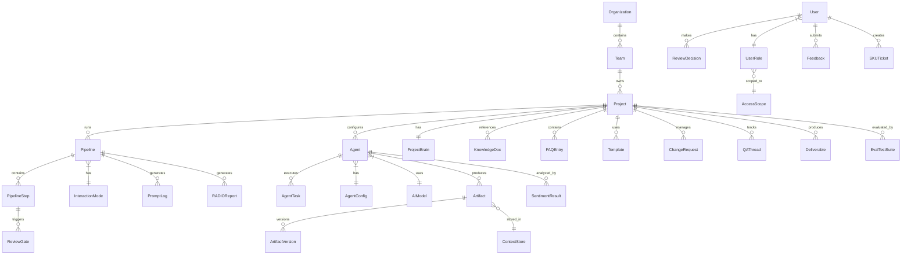

### コアデータベーステーブル

```sql
-- Organizations & Teams
CREATE TABLE organizations (
    id UUID PRIMARY KEY DEFAULT gen_random_uuid(),
    name VARCHAR(255) NOT NULL,
    created_at TIMESTAMPTZ DEFAULT NOW()
);

CREATE TABLE teams (
    id UUID PRIMARY KEY DEFAULT gen_random_uuid(),
    organization_id UUID REFERENCES organizations(id),
    name VARCHAR(255) NOT NULL,
    created_at TIMESTAMPTZ DEFAULT NOW()
);

CREATE TABLE projects (
    id UUID PRIMARY KEY DEFAULT gen_random_uuid(),
    team_id UUID REFERENCES teams(id),
    name VARCHAR(255) NOT NULL,
    config JSONB DEFAULT '{}',
    default_mode VARCHAR(20) DEFAULT 'spec',
    created_at TIMESTAMPTZ DEFAULT NOW()
);

-- Users & Authorization
CREATE TABLE users (
    id UUID PRIMARY KEY DEFAULT gen_random_uuid(),
    email VARCHAR(255) UNIQUE NOT NULL,
    name VARCHAR(255) NOT NULL,
    status VARCHAR(20) DEFAULT 'active',
    created_at TIMESTAMPTZ DEFAULT NOW()
);

CREATE TABLE user_roles (
    id UUID PRIMARY KEY DEFAULT gen_random_uuid(),
    user_id UUID REFERENCES users(id),
    role VARCHAR(50) NOT NULL,
    organization_id UUID REFERENCES organizations(id),
    team_id UUID REFERENCES teams(id),
    project_id UUID REFERENCES projects(id),
    granted_at TIMESTAMPTZ DEFAULT NOW(),
    expires_at TIMESTAMPTZ,
    CONSTRAINT valid_role CHECK (role IN (
        'viewer','developer','tech_lead','admin','super_admin'
    ))
);
```

```sql
-- Agents
CREATE TABLE agents (
    id UUID PRIMARY KEY DEFAULT gen_random_uuid(),
    name VARCHAR(100) NOT NULL,
    role VARCHAR(50) NOT NULL,
    model_id UUID NOT NULL REFERENCES ai_models(id),
    status VARCHAR(20) DEFAULT 'active',
    temperature DECIMAL(3,2) DEFAULT 0.7,
    config JSONB DEFAULT '{}',
    project_id UUID REFERENCES projects(id),
    created_at TIMESTAMPTZ DEFAULT NOW(),
    updated_at TIMESTAMPTZ DEFAULT NOW(),
    CONSTRAINT temp_range CHECK (temperature >= 0.0 AND temperature <= 2.0),
    CONSTRAINT unique_active_name_role UNIQUE (name, role, project_id)
        WHERE status = 'active'
);

-- AI Models
CREATE TABLE ai_models (
    id UUID PRIMARY KEY DEFAULT gen_random_uuid(),
    name VARCHAR(255) NOT NULL,
    model_type VARCHAR(50) NOT NULL,
    deployment_mode VARCHAR(20) NOT NULL,
    connection_config JSONB NOT NULL,
    capabilities TEXT[],
    cost_per_input_token DECIMAL(10,8),
    cost_per_output_token DECIMAL(10,8),
    status VARCHAR(20) DEFAULT 'active',
    created_at TIMESTAMPTZ DEFAULT NOW()
);

-- Pipelines
CREATE TABLE pipelines (
    id UUID PRIMARY KEY DEFAULT gen_random_uuid(),
    project_id UUID REFERENCES projects(id),
    mode VARCHAR(20) NOT NULL,
    status VARCHAR(20) DEFAULT 'created',
    config JSONB NOT NULL,
    started_at TIMESTAMPTZ,
    completed_at TIMESTAMPTZ,
    created_at TIMESTAMPTZ DEFAULT NOW(),
    CONSTRAINT valid_mode CHECK (mode IN ('spec','fix','vibe')),
    CONSTRAINT valid_status CHECK (status IN (
        'created','running','paused','completed','failed','cancelled'
    ))
);

CREATE TABLE pipeline_steps (
    id UUID PRIMARY KEY DEFAULT gen_random_uuid(),
    pipeline_id UUID REFERENCES pipelines(id),
    agent_id UUID REFERENCES agents(id),
    step_order INT NOT NULL,
    status VARCHAR(20) DEFAULT 'pending',
    dependencies UUID[],
    started_at TIMESTAMPTZ,
    completed_at TIMESTAMPTZ,
    error_message TEXT,
    retry_count INT DEFAULT 0,
    CONSTRAINT valid_step_status CHECK (status IN (
        'pending','running','completed','failed','timeout','skipped'
    ))
);

-- Artifacts
CREATE TABLE artifacts (
    id UUID PRIMARY KEY DEFAULT gen_random_uuid(),
    artifact_id VARCHAR(128) NOT NULL,
    version INT NOT NULL,
    type VARCHAR(50) NOT NULL,
    content_ref VARCHAR(512),   -- S3/storageリファレンス
    content_size BIGINT,
    status VARCHAR(20) DEFAULT 'draft',
    git_commit_sha VARCHAR(40),
    created_by UUID,
    pipeline_id UUID REFERENCES pipelines(id),
    metadata JSONB DEFAULT '{}',
    created_at TIMESTAMPTZ DEFAULT NOW(),
    CONSTRAINT unique_artifact_version UNIQUE (artifact_id, version),
    CONSTRAINT valid_artifact_status CHECK (status IN (
        'draft','validated','approved','rejected','validation_failed'
    ))
);
```

```sql
-- Review Gates & Decisions
CREATE TABLE review_gates (
    id UUID PRIMARY KEY DEFAULT gen_random_uuid(),
    pipeline_id UUID REFERENCES pipelines(id),
    gate_type VARCHAR(50) NOT NULL,
    artifact_id UUID REFERENCES artifacts(id),
    status VARCHAR(20) DEFAULT 'pending',
    reviewer_id UUID REFERENCES users(id),
    checklist_result JSONB,
    comment TEXT,
    decided_at TIMESTAMPTZ,
    created_at TIMESTAMPTZ DEFAULT NOW(),
    rejection_count INT DEFAULT 0
);

-- Prompt Logs（Immutable、append-only）
CREATE TABLE prompt_logs (
    id UUID PRIMARY KEY DEFAULT gen_random_uuid(),
    agent_id UUID NOT NULL,
    pipeline_id UUID,
    model_id UUID NOT NULL,
    deployment_mode VARCHAR(20),
    timestamp TIMESTAMPTZ DEFAULT NOW(),
    prompt TEXT,
    response TEXT,
    verbosity VARCHAR(20) DEFAULT 'full',
    input_tokens INT,
    output_tokens INT,
    latency_ms INT,
    estimated_cost DECIMAL(10,6),
    params JSONB,
    redacted BOOLEAN DEFAULT FALSE
);

-- Sentiment Analysis
CREATE TABLE sentiment_results (
    id UUID PRIMARY KEY DEFAULT gen_random_uuid(),
    user_id UUID NOT NULL,
    session_id UUID NOT NULL,
    agent_id UUID NOT NULL,
    timestamp TIMESTAMPTZ DEFAULT NOW(),
    label VARCHAR(20) NOT NULL,
    confidence DECIMAL(3,2) NOT NULL,
    escalation_triggered BOOLEAN DEFAULT FALSE,
    CONSTRAINT valid_label CHECK (label IN (
        'positive','neutral','frustrated','angry'
    ))
);

-- Knowledge Store
CREATE TABLE knowledge_documents (
    id UUID PRIMARY KEY DEFAULT gen_random_uuid(),
    scope VARCHAR(20) NOT NULL,
    scope_id UUID,
    title VARCHAR(512),
    content TEXT,
    format VARCHAR(20),
    chunk_count INT,
    embedding_status VARCHAR(20) DEFAULT 'pending',
    created_at TIMESTAMPTZ DEFAULT NOW(),
    updated_at TIMESTAMPTZ DEFAULT NOW()
);

-- FAQ Store
CREATE TABLE faq_entries (
    id UUID PRIMARY KEY DEFAULT gen_random_uuid(),
    question TEXT NOT NULL,
    answer TEXT NOT NULL,
    category VARCHAR(100),
    tags TEXT[],
    status VARCHAR(20) DEFAULT 'active',
    scope VARCHAR(20) DEFAULT 'global',
    scope_id UUID,
    created_at TIMESTAMPTZ DEFAULT NOW(),
    updated_at TIMESTAMPTZ DEFAULT NOW()
);

-- Feedback & Ratings
CREATE TABLE feedback (
    id UUID PRIMARY KEY DEFAULT gen_random_uuid(),
    user_id UUID REFERENCES users(id),
    agent_id UUID,
    pipeline_id UUID,
    artifact_id UUID,
    rating_stars INT CHECK (rating_stars BETWEEN 1 AND 5),
    thumbs VARCHAR(10),
    category VARCHAR(50),
    comment TEXT,
    status VARCHAR(20) DEFAULT 'new',
    prompt_log_id UUID,
    created_at TIMESTAMPTZ DEFAULT NOW()
);

-- SKU Tickets
CREATE TABLE sku_tickets (
    id UUID PRIMARY KEY DEFAULT gen_random_uuid(),
    ticket_id VARCHAR(20) UNIQUE NOT NULL,
    title VARCHAR(512) NOT NULL,
    source VARCHAR(50) NOT NULL,
    priority VARCHAR(20) NOT NULL,
    status VARCHAR(20) DEFAULT 'open',
    assignee_id UUID REFERENCES users(id),
    description TEXT,
    metadata JSONB,
    sla_first_response TIMESTAMPTZ,
    sla_resolution TIMESTAMPTZ,
    created_at TIMESTAMPTZ DEFAULT NOW(),
    resolved_at TIMESTAMPTZ
);

-- Quotas
CREATE TABLE quotas (
    id UUID PRIMARY KEY DEFAULT gen_random_uuid(),
    scope_type VARCHAR(20) NOT NULL,
    scope_id UUID NOT NULL,
    cycle VARCHAR(20) NOT NULL,
    token_limit BIGINT,
    ai_call_limit INT,
    concurrent_pipeline_limit INT,
    burst_allowance DECIMAL(3,2) DEFAULT 0.20,
    current_usage JSONB DEFAULT '{}',
    period_start TIMESTAMPTZ,
    period_end TIMESTAMPTZ
);

-- Audit Log（Immutable）
CREATE TABLE audit_logs (
    id UUID PRIMARY KEY DEFAULT gen_random_uuid(),
    actor_id UUID NOT NULL,
    actor_type VARCHAR(20) NOT NULL,
    action VARCHAR(100) NOT NULL,
    target_type VARCHAR(50),
    target_id UUID,
    result VARCHAR(20) NOT NULL,
    details JSONB,
    timestamp TIMESTAMPTZ DEFAULT NOW()
);
```

```sql
-- Change Requests
CREATE TABLE change_requests (
    id UUID PRIMARY KEY DEFAULT gen_random_uuid(),
    cr_id VARCHAR(20) UNIQUE NOT NULL,
    title VARCHAR(512) NOT NULL,
    description TEXT,
    source VARCHAR(20) NOT NULL,
    priority VARCHAR(20) NOT NULL,
    status VARCHAR(20) DEFAULT 'pending',
    estimated_effort VARCHAR(10),
    assigned_sprint VARCHAR(50),
    project_id UUID REFERENCES projects(id),
    created_at TIMESTAMPTZ DEFAULT NOW(),
    approved_at TIMESTAMPTZ,
    completed_at TIMESTAMPTZ,
    CONSTRAINT valid_cr_status CHECK (status IN (
        'pending','approved','in_progress','review','done','rejected'
    ))
);

-- Q&A Threads
CREATE TABLE qa_threads (
    id UUID PRIMARY KEY DEFAULT gen_random_uuid(),
    qa_id VARCHAR(20) UNIQUE NOT NULL,
    question TEXT NOT NULL,
    context_ref VARCHAR(512),
    priority VARCHAR(20) DEFAULT 'medium',
    target_user_id UUID,
    status VARCHAR(20) DEFAULT 'open',
    conclusion TEXT,
    action_items JSONB,
    deadline TIMESTAMPTZ,
    project_id UUID REFERENCES projects(id),
    created_at TIMESTAMPTZ DEFAULT NOW(),
    CONSTRAINT valid_qa_status CHECK (status IN (
        'open','in_discussion','answered','closed'
    ))
);

-- Evaluation
CREATE TABLE eval_test_suites (
    id UUID PRIMARY KEY DEFAULT gen_random_uuid(),
    name VARCHAR(255) NOT NULL,
    agent_id UUID REFERENCES agents(id),
    scope VARCHAR(20) DEFAULT 'agent_specific',
    test_cases JSONB NOT NULL,
    scoring_criteria JSONB NOT NULL,
    threshold INT DEFAULT 70,
    schedule VARCHAR(50),
    created_at TIMESTAMPTZ DEFAULT NOW()
);

CREATE TABLE eval_results (
    id UUID PRIMARY KEY DEFAULT gen_random_uuid(),
    suite_id UUID REFERENCES eval_test_suites(id),
    agent_id UUID REFERENCES agents(id),
    agent_config_snapshot JSONB,
    aggregate_score INT,
    criteria_scores JSONB,
    bottom_cases JSONB,
    delta_vs_previous DECIMAL(5,2),
    status VARCHAR(20),
    executed_at TIMESTAMPTZ DEFAULT NOW()
);

-- Templates
CREATE TABLE templates (
    id UUID PRIMARY KEY DEFAULT gen_random_uuid(),
    name VARCHAR(255) NOT NULL,
    type VARCHAR(50) NOT NULL,
    category VARCHAR(50),
    description TEXT,
    content TEXT NOT NULL,
    required_sections TEXT[],
    version INT DEFAULT 1,
    status VARCHAR(20) DEFAULT 'active',
    scope VARCHAR(20) DEFAULT 'global',
    scope_id UUID,
    parent_template_id UUID REFERENCES templates(id),
    tags TEXT[],
    verified BOOLEAN DEFAULT FALSE,
    created_at TIMESTAMPTZ DEFAULT NOW()
);

-- RADIO Reports
CREATE TABLE radio_reports (
    id UUID PRIMARY KEY DEFAULT gen_random_uuid(),
    pipeline_id UUID REFERENCES pipelines(id),
    feature_name VARCHAR(255),
    trigger VARCHAR(50) NOT NULL,
    review TEXT NOT NULL,
    action TEXT NOT NULL,
    difficulty TEXT,
    information TEXT,
    outcome TEXT NOT NULL,
    severity VARCHAR(20),
    created_at TIMESTAMPTZ DEFAULT NOW()
);

-- Project Brain
CREATE TABLE project_brain_entries (
    id UUID PRIMARY KEY DEFAULT gen_random_uuid(),
    project_id UUID REFERENCES projects(id),
    entry_type VARCHAR(50) NOT NULL,
    content TEXT NOT NULL,
    embedding VECTOR(1536),
    relationships JSONB,
    source_ref VARCHAR(512),
    is_deprecated BOOLEAN DEFAULT FALSE,
    retention_policy VARCHAR(20) DEFAULT 'permanent',
    created_at TIMESTAMPTZ DEFAULT NOW(),
    expires_at TIMESTAMPTZ
);
```

---

## Correctness Properties

*プロパティとは、システムのすべての有効な実行において真であるべき特性または動作のことであり、本質的にはシステムが何をすべきかについての形式的な記述である。プロパティは人間が読める仕様と機械検証可能な正確性保証の橋渡しとして機能する。*

### Property 1: Agent Registration Validation（Round-trip Completeness）

*任意の* `AgentRegistrationRequest` に対して、すべての必須フィールド（name ≤ 100文字、role、modelId）が存在し有効な場合に限り登録が成功する。欠落フィールドにより登録が失敗した場合、エラーメッセージは欠落/無効なフィールドの正確なセットをリスト表示しなければならない（SHALL）— それ以上でもそれ以下でもなく。

**検証対象: Requirements 1.1, 1.3**

### Property 2: Agent ID Uniqueness

*任意の* N個の正常に登録されたagentのセットに対して、割り当てられたすべての `agent_id` 値は互いに異なっていなければならない（SHALL）。

**検証対象: Requirements 1.2**

### Property 3: Active Agent Name-Role Uniqueness Constraint

*任意の* 同一（name, role）ペアを持つ2つの `AgentRegistrationRequest` に対して、最初のagentが"active"ステータスの場合、2番目の登録はconflictエラーで拒否されなければならない（SHALL）。

**検証対象: Requirements 1.6**

### Property 4: Temperature Configuration Bounds

*任意の* temperature値Tに対して、0.0 ≤ T ≤ 2.0の場合に限りシステムはTを受け入れなければならない（SHALL）。Tが指定されない場合、有効なtemperatureは0.7に等しくなければならない（SHALL）。

**検証対象: Requirements 1.7**

### Property 5: Artifact Version Monotonic Increment

Context_Store内の*任意の* artifactに対して、連続する各保存はバージョン番号を前のバージョンに対して正確に1だけインクリメントしなければならない（SHALL）。

**検証対象: Requirements 2.7, 15.1**

### Property 6: Context Store Read-After-Write Consistency（Round-trip）

Context_Storeに書き込まれた*任意の* artifactに対して、同一の（artifact_id, version）での即座の後続読み取りは、書き込まれた内容とバイト単位で同一のcontentを返さなければならない（SHALL）。

**検証対象: Requirements 15.2**

### Property 7: Context Store Version Limit Invariant

Context_Store内の*任意の* artifact_idに対して、保存されたバージョン数は100を超えてはならない（SHALL）。101番目のバージョンが書き込まれた場合、最も古いバージョンがevictされなければならない（SHALL）（FIFO）。

**検証対象: Requirements 15.3**

### Property 8: Context Store Version Conflict Detection

Context_Store内の*任意の* 既存（artifact_id, version）ペアに対して、同一の（artifact_id, version）での書き込み試行はversion conflictエラーで拒否されなければならない（SHALL）。

**検証対象: Requirements 15.4**

### Property 9: Sentiment Escalation Trigger Logic

セッション内のユーザーに対するsentiment分析結果の*任意の*シーケンスに対して、label ∈ {frustrated, angry}かつconfidence ≥ 設定閾値（default 0.7）の結果が2回連続で存在する場合に限りエスカレーションがトリガーされなければならない（SHALL）。

**検証対象: Requirements 11.3**

### Property 10: Pipeline Dependency Graph Failure Propagation

pipeline stepsの*任意の*有向非巡回グラフに対して、あるstepが失敗した場合：失敗したstepに対して直接的または推移的な依存関係を持つすべてのstepは停止されなければならず（SHALL）、失敗したstepに依存しないすべてのstepは実行を継続しなければならない（SHALL）。

**検証対象: Requirements 12.2**

### Property 11: Pipeline Agent Timeout State Machine

300秒以内にheartbeatの送信に失敗した*任意の* agentに対して、システムは以下の状態を遷移しなければならない（SHALL）：timeout → retry（60秒待機）→ retry → failed、failedとマークされるまで合計正確に3回の試行。

**検証対象: Requirements 12.5**

### Property 12: Review Gate Blocking After 3 Rejections

review gateにおける*任意の* artifactに対して、3回連続のrejectionが累積した場合、pipelineはそのstepで"blocked"ステータスに遷移しなければならない（SHALL）。

**検証対象: Requirements 14.6**

### Property 13: FAQ Threshold Routing Decision

relevance score SとconfiguredされたthresholdTを持つ*任意の* FAQマッチング結果に対して：S ≥ Tの場合、response sourceは"faq_direct"でなければならない（SHALL）（AIコールなし）。S < Tの場合、responseはAI処理にフォールバックしなければならない（SHALL）。

**検証対象: Requirements 18.3, 18.4**

### Property 14: Validation Retry Bounded Loop

validationに失敗した*任意の* agent outputに対して、システムは最大3回リトライしなければならない（SHALL）。3回の失敗リトライ後、artifactはstatus "draft"で"validation_failed"とマークされなければならない（SHALL）。

**検証対象: Requirements 22.3, 22.4**

### Property 15: Authentication Lockout Rule

同一エンティティからの認証試行の*任意の*シーケンスに対して、5分間のウィンドウ内で5回連続の失敗がある場合、アカウントは15分間ロックされなければならない（SHALL）。

**検証対象: Requirements 33.5**

### Property 16: Hierarchical RBAC Authorization

*任意の*（user, role, scope, action, resource）タプルに対して、マッチするscope（Organization → Team → Project）内のユーザーのroleがresourceに対するactionを許可する場合に限りアクセスが付与されなければならない（SHALL）。割り当てられたscope外のresourceへのアクセスは、Super Adminにより明示的に付与されない限り常に拒否されなければならない（SHALL）。

**検証対象: Requirements 34.2, 34.3, 34.6**

### Property 17: Quota Threshold Alerts and Blocking

*任意の*（usage, quota）ペアに対して：usageがquotaの80%以上の場合、warning alertが生成されなければならない（SHALL）。usageがquotaの100%以上の場合、新しいrequestはブロックされなければならない（SHALL）（実行中のpipelineは正常に完了する）。

**検証対象: Requirements 35.2, 35.3**

### Property 18: Model Routing — Data Sensitivity Constraint

*任意の* inference requestに対して、data sensitivityが"confidential"または"pii"の場合、もしくはプロジェクトに"data_local_only"ポリシーがある場合、model routerはself-hosted modelにのみルーティングしなければならない（SHALL）。self-hosted modelが利用不可かつデータポリシーがcloudを禁止している場合、requestはブロックされなければならない（SHALL）（cloudにルーティングしない）。

**検証対象: Requirements 39.3, 40.3, 40.6**

### Property 19: Self-Review Loop Termination

self-reviewを受ける*任意の* agent outputに対して、self-reviewループは問題が残存しているかどうかに関わらず最大3回のイテレーション後に終了しなければならない（SHALL）。残存する問題はHuman reviewのためのmetadataとして添付されなければならない（SHALL）。

**検証対象: Requirements 43.2, 43.4**

### Property 20: Approve Checklist Enforcement

*任意の* review gate承認試行に対して、すべての必須checklistアイテムがチェック（trueとマーク）されている場合に限り承認が成功しなければならない（SHALL）。必須アイテムが未チェックの場合、承認はブロックされなければならない（SHALL）。

**検証対象: Requirements 47.2**

### Property 21: Definition of Done Enforcement

"Done"としてマークされる*任意の* artifact/phaseに対して、DoDチェックはすべての設定された基準を検証しなければならない（SHALL）。いずれかの基準が失敗した場合、"Done"へのステータス遷移はブロックされ、失敗した基準のリストが返されなければならない（SHALL）。

**検証対象: Requirements 48.2, 48.3**

### Property 22: Unified Retry Escalation Path

*任意の* agentタスク失敗に対して、リトライ戦略は以下に従わなければならない（SHALL）：試行1 = エラーからのself-fix、試行2 = 代替アプローチ、試行3 = root cause analysis + エスカレーション。3回失敗後、タスクはfailure reportと共に"blocked"とマークされなければならない（SHALL）。

**検証対象: Requirements 50.1, 50.2**

### Property 23: Communication Reminder Escalation Timeline

Human応答を必要とする*任意の*保留中のcommunicationに対して：設定間隔でリマインダー → 2倍間隔でスーパーバイザーにエスカレーション → 3倍間隔でタスク一時停止。各ステップは正確に設定された時間オフセットで発生しなければならない（SHALL）。

**検証対象: Requirements 51.3**

### Property 24: Spec Versioning — Change Type Determines Approval Requirement

*任意の* specドキュメント変更に対して、システムはdiffをMajor（scope/logic変更）、Minor（詳細追加）、またはPatch（typo/format）として分類しなければならない（SHALL）。MajorおよびMinor変更は再承認を必要とする（SHALL）。Patch変更はHuman reviewなしで自動承認される（SHALL）。

**検証対象: Requirements 52.1, 52.2, 52.3**

### Property 25: Agent Deactivation Prevents New Task Assignment

"inactive"ステータスの*任意の* agentに対して、新しいタスクの割り当て試行は拒否されなければならない（SHALL）。非活性化時に既に実行中のタスクは正常に完了することが許可されなければならない（SHALL）。

**検証対象: Requirements 1.5**

---

## Error Handling

### 統一エラーハンドリング戦略

システムは階層型エラーハンドリング戦略を適用する（R50）：

```mermaid
graph TD
    A[Agent Output Error] --> B{Attempt 1}
    B -->|Self-fix| C{Success?}
    C -->|Yes| D[Continue Pipeline]
    C -->|No| E{Attempt 2}
    E -->|Different approach| F{Success?}
    F -->|Yes| D
    F -->|No| G{Attempt 3}
    G -->|Root cause analysis| H{Success?}
    H -->|Yes| D
    H -->|No| I[Block Task + Escalate]
    I --> J[Generate Failure Report]
    J --> K[RADIO "D" Entry]
    J --> L[Create ISSUE-XXX]
    J --> M[Notify Human]
```

### エラー分類

| エラー種別 | 重大度 | システム動作 |
|-----------|--------|-------------|
| Validation failure | Medium | 最大3回リトライ後、"validation_failed"マーク |
| Agent timeout | High | 2回リトライ（60秒間隔）後、"failed" |
| Model unavailable | High | 代替model/deploymentにフォールバック |
| Quota exceeded | Medium | 新規requestをブロック、実行中タスクは完了 |
| Pipeline step failure | High | 依存stepを停止、独立stepは継続 |
| Auth failure（5x） | High | アカウントを15分間ロック |
| Critical failure（deployment） | Critical | Rollback + 緊急アラート |
| Self-review loop exhausted | Medium | issuesを添付してHumanに転送 |

### Rollback Strategy (R50-C4)

| スコープ | Rollbackアクション |
|---------|-------------------|
| コードの誤り | 特定commitの `git revert` |
| spec/designの誤り | 前のartifactバージョンにrevert |
| 機能全体の誤り | branchをrevert + spec phaseに戻る |
| Deployment失敗 | 前バージョンへの自動rollback |
| Rollbackも失敗 | "critical_failure"マーク + 緊急アラート |

### Circuit Breaker Pattern

外部サービスコール（AI providers、Git、Notificationチャネル）に適用：
- **Closed**: 通常動作
- **Open**: 5回連続失敗後 → コール停止、cached/fallbackを返却
- **Half-Open**: 60秒後 → 単一requestを試行、成功 → Close; 失敗 → Open

### Error Response Format

```typescript
interface SystemError {
  code: string;              // 機械可読エラーコード
  message: string;           // 人間可読な説明
  details?: ErrorDetail[];   // 特定フィールド/ルール違反
  retryable: boolean;
  suggestedAction?: string;
}

interface ErrorDetail {
  field?: string;
  rule?: string;
  expected?: string;
  actual?: string;
}
```

---

## Testing Strategy

### 概要

システムは多層テスト戦略を組み合わせて使用する：
- **Property-Based Testing (PBT)**: 多数のランダムinputに対する論理不変条件（invariants）を検証
- **Unit Testing**: 各function/componentの具体的な検証
- **Integration Testing**: コンポーネント間のインタラクションを検証
- **End-to-End Testing**: 完全なpipelineフローを検証

### Property-Based Testing

**PBTライブラリ**: `fast-check`（TypeScript/JavaScript）

**設定**: propertyテスト毎に最低100イテレーション

各property testは設計ドキュメント内の対応するCorrectness Propertyを参照する：

```typescript
// Tag format: Feature: sdlc-ai-agents, Property {N}: {title}
```

**PBTでテストされるProperties（25 properties）：**

| Property | パターン種別 | 概要 |
|----------|-------------|------|
| P1 | Invariant | Agent registration validation |
| P2 | Invariant | Agent ID uniqueness |
| P3 | Invariant | Name-role uniqueness constraint |
| P4 | Invariant | Temperature bounds |
| P5 | Invariant | Version monotonic increment |
| P6 | Round-trip | Read-after-write consistency |
| P7 | Invariant | Version count limit（≤ 100） |
| P8 | Invariant | Version conflict detection |
| P9 | State machine | Sentiment escalation trigger |
| P10 | Graph property | DAGにおけるFailure propagation |
| P11 | State machine | Timeout → retry → failed |
| P12 | Counter/threshold | 3 rejections → blocked |
| P13 | Threshold routing | FAQスコアベースの判定 |
| P14 | Bounded loop | Validation retry（max 3） |
| P15 | Counter/threshold | Auth lockout（5分間に5回） |
| P16 | Hierarchical logic | RBAC authorization |
| P17 | Threshold | Quota alert/block |
| P18 | Routing constraint | Data sensitivity routing |
| P19 | Bounded loop | Self-review termination |
| P20 | Predicate | Checklist enforcement |
| P21 | Predicate | DoD enforcement |
| P22 | State machine | Retry escalation path |
| P23 | Timeline logic | Reminder escalation |
| P24 | Classification | Specバージョン変更タイプ |
| P25 | State transition | Deactivationによる割り当て防止 |

### Unit Testing

**フォーカス領域:**
- 各componentの具体的なexamples
- Edge cases: 空のinput、最大長文字列、境界値
- エラー条件: 無効な状態、不正なデータ
- data modelsのSerialization/deserialization round-trips

**カバレッジ目標**: 全business logicで ≥ 80% code coverage

### Integration Testing

**フォーカス領域:**
- Agent → Model Router → AI Providerフロー
- Agent → Context Store → Git同期
- Orchestrator → Agent → Review Gateフロー
- Knowledge Store ingestion → embedding → semantic search
- 各チャネルへのNotification delivery
- End-to-end pipeline実行（Spec → Deploy）

**数量**: integration point毎に2-3の代表的examples

### End-to-End Testing

**テストシナリオ:**
1. Full Spec Mode pipeline: requirements → design → UIUX → tasks → code → test → deploy
2. Fix Mode pipeline: bug report → 5WHY → fix → regression test
3. Vibe Mode pipeline: prompt → code → basic validation
4. セッション途中のMode切替
5. Multi-agent concurrent pipeline実行
6. Review gate承認/却下フロー
7. エスカレーションシナリオ（sentiment、timeout、quota）

### Performance Testing

**目標（R28より）:**
- 10 concurrent pipelines、レイテンシ劣化 ≤ 20%
- Context Store read < 500ms（< 50MB）
- Context Store write < 2000ms（< 50MB）
- Pipeline initialization < 5秒
- API 95th percentile < 1000ms
- Knowledge Store search < 200ms
- FAQ matching < 200ms

### Security Testing

**SAST**: credentials leak、SQL injection、XSSに対するstatic analysis
**DAST**: API endpointsに対するruntime security scanning
**Access control testing**: RBAC境界、チーム間分離の検証
**Audit log verification**: Immutability、completeness

---

## GUI Reference Prototype

HTMLプロトタイプが同specディレクトリ内の `gui/` に作成されており、Admin Portalおよびシステム全体のインターフェースの視覚的参照として機能する。プロトタイプはブラウザで直接開ける（静的HTML + Bootstrap 5.3、サーバー不要）。

### GUI構造

```
gui/
├── index.html                      — 総合ダッシュボード（stats, active pipeline, mode selector, agent status）
├── assets/                         — Images, icons（placeholder）
└── screens/
    ├── pipeline.html               — Pipeline管理（Orchestrator view, pipeline flow, review gates）
    ├── agents.html                 — Agent管理（register, configure, status, quality scores）
    ├── artifacts.html              — Context Store（artifact list, version history, git commit mapping）
    ├── requirements.html           — Requirements Agent（raw input → structured output, clarification Q&A）
    ├── design.html                 — Design Agent（architecture diagram, data model, API spec, review）
    ├── tasks.html                  — Task Agent（Kanban board, priority, dependencies, effort estimation）
    ├── testing.html                — Testing Agent（test report, coverage, quality gate, severity）
    ├── deployment.html             — Deployment & Operations（CI/CD pipeline, health check, monitoring）
    ├── knowledge.html              — Knowledge Store + Project Brain + FAQ（semantic search, documents）
    ├── project-health.html         — Project Healthダッシュボード（RADIO report, metrics, risk alerts）
    ├── sentiment.html              — Sentiment Analysis（distribution, escalation, SKU integration）
    ├── admin.html                  — Admin Portal（system health, AI models, quota, settings, tiles）
    ├── users.html                  — Users & Roles（RBAC, org hierarchy, permissions, lockout）
    └── feedback.html               — Feedback & SKU Tickets（ratings, bug reports, ticket management）
```

### GUI → Design ComponentsのMapping

| GUI Screen | 参照するDesign Components | Requirements |
|------------|---------------------------|--------------|
| `index.html` | Orchestrator, ModeRouter, Agent Registry | R12, R13, R1 |
| `pipeline.html` | IPipelineOrchestrator, PipelineStep, ReviewGateManager | R12, R14, R13 |
| `agents.html` | IAgentRegistry, AgentConfig, ModelRouter | R1, R39 |
| `artifacts.html` | IContextStore, Artifact, IGitService | R15, R16 |
| `requirements.html` | Requirements_Agent, IValidationEngine | R2, R22, R43 |
| `design.html` | Design_Agent, IContextStore | R3, R15 |
| `tasks.html` | Task_Agent, dependency graph | R5 |
| `testing.html` | Testing_Agent, IDoDEnforcer | R7, R48 |
| `deployment.html` | Deployment_Agent, Operations_Agent | R8, R9 |
| `knowledge.html` | IKnowledgeStore, Project Brain, IFAQStore | R17, R21, R18 |
| `project-health.html` | ProjectHealth_Agent, IRADIOGenerator | R10, R42 |
| `sentiment.html` | ISentimentService, SKU integration | R11, R27 |
| `admin.html` | Admin Portal, IQuotaService, Model Registry | R38, R35, R39, R40 |
| `users.html` | IAuthService, RBAC hierarchy | R34, R33 |
| `feedback.html` | Feedback Service, SKU Tickets, ICRManager | R25, R26, R27, R44 |

### 設計ノート

- **Navigation**: すべてのscreensで一貫したsidebar、モジュール間の移動を可能にする
- **Responsive**: Bootstrap 5.3 grid system、mobile/tablet/desktop breakpoints
- **Mock Data**: 各screenは設計のdata modelを正確に反映するリアルなサンプルデータを含む
- **No JS complexity**: 静的HTML + CSSのみ、Gitでのdiffが可能（R16-C2 compliance）
- **Review Flow**: review gate screens（requirements, design, deployment）にApprove/Rejectボタンが表示
- **Interaction Modes**: Dashboardにmode selector（Spec/Fix/Vibe）と短い説明を表示

---

## 設計判断（Design Decisions）

| # | 判断 | 理由 | 検討した代替案 |
|---|------|------|---------------|
| D1 | agent communicationにEvent-Driven Architecture | 疎結合、非同期処理、スケールが容易 | Direct RPCコール（密結合） |
| D2 | primary databaseとしてPostgreSQL | JSONB support、ACID、成熟したエコシステム | MongoDB（schema-lessだが制約の適用が困難） |
| D3 | Knowledge Store用に独立したVector DB（Qdrant/Pinecone） | similarity searchに最適化 | PostgreSQL pgvector（大規模時のパフォーマンスが劣る） |
| D4 | caching + rate limitingにRedis | Sub-msレイテンシ、atomic operations | Memcached（persistenceなし） |
| D5 | message brokerとしてRabbitMQ/Kafka | Reliable delivery、dead letter queues | In-process queue（スケールしない） |
| D6 | agentsにPlugin architecture | 拡張性（R32）、coreを変更せずにagentを追加 | Monolithic（拡張が困難） |
| D7 | 全artifactsのsource-of-truthとしてGit | Version control、diff、コラボレーション、R16 compliance | Database-only（version historyを失う） |
| D8 | PBTに`fast-check` | TypeScript native、良好なgenerator API | Hypothesis（Python only） |
| D9 | pipelineにSaga pattern | compensationが必要なlong-running transactions | 2PC（ブロッキング、分散に不適合） |
| D10 | Model RouterにStrategy pattern | Runtime switching、複数models | Hard-coded routing（柔軟性なし） |
