# Tài liệu Thiết kế — SDLC AI Agents Platform

## Overview

Hệ thống **SDLC AI Agents** là nền tảng đa agent phục vụ toàn bộ vòng đời phát triển phần mềm, bao gồm 10+ agent chuyên biệt, Orchestrator điều phối pipeline, hệ thống lưu trữ/chia sẻ artifact, cơ sở tri thức, và bộ công cụ quản lý dự án tự động.

### Mục tiêu thiết kế

1. **Modularity**: Mỗi agent là một plugin độc lập, giao tiếp qua interface chuẩn hóa
2. **Scalability**: Hỗ trợ 50+ agent đồng thời, 10+ pipeline song song
3. **Extensibility**: Thêm agent/model mới qua plugin mechanism, không sửa core
4. **Observability**: Structured logging, distributed tracing, metrics cho mọi thao tác
5. **Security**: RBAC đa cấp, mã hóa TLS 1.2+, audit log immutable
6. **Reliability**: RTO ≤ 15 phút, RPO ≤ 1 giờ, uptime ≥ 99.5%

### Phạm vi

Thiết kế bao gồm:
- Kiến trúc tổng thể (High-Level Architecture)
- Thiết kế chi tiết từng thành phần (Low-Level Design)
- Mô hình dữ liệu (Data Models)
- API Contracts
- Chiến lược Testing

---

## Architecture

### High-Level Architecture

```mermaid
graph TB
    subgraph "Presentation Layer"
        AdminPortal[Admin Portal - Web UI]
        API[REST/gRPC API Gateway]
        WebhookSvc[Webhook Service]
    end

    subgraph "Orchestration Layer"
        Orchestrator[Pipeline Orchestrator]
        Scheduler[Task Scheduler]
        ReviewGate[Review Gate Manager]
        ModeRouter[Interaction Mode Router]
    end

    subgraph "Agent Layer"
        ReqAgent[Requirements_Agent]
        DesignAgent[Design_Agent]
        UIUXAgent[UIUX_Agent]
        TaskAgent[Task_Agent]
        CodingAgent[Coding_Agent]
        TestAgent[Testing_Agent]
        DeployAgent[Deployment_Agent]
        OpsAgent[Operations_Agent]
        HealthAgent[ProjectHealth_Agent]
        SentimentAgent[Sentiment_Agent]
        PluginAgents[Custom Plugin Agents]
    end

    subgraph "AI Infrastructure Layer"
        ModelRouter[Model Router & Selection]
        InferenceCloud[Cloud AI Providers]
        InferenceSelf[Self-Hosted Models]
        EmbeddingService[Embedding Service]
    end

    subgraph "Data & Storage Layer"
        ContextStore[Context Store]
        KnowledgeStore[Knowledge Store - Vector DB]
        FAQStore[FAQ Store]
        ProjectBrain[Project Brain]
        TemplateRegistry[Template Registry]
        DocTemplateRegistry[Doc Template Registry]
        EvalStore[Eval Store]
    end

    subgraph "Support Services Layer"
        GitService[Git Integration Service]
        ValidationService[Output Validation Engine]
        SelfReviewEngine[Self-Review Loop Engine]
        RADIOGenerator[RADIO Report Generator]
        FeedbackService[Feedback & Rating Service]
        SentimentService[Sentiment Analysis Service]
        NotificationService[Notification & Communication]
        QuotaService[Rate Limiting & Quota]
    end

    subgraph "Observability Layer"
        LogService[Structured Logging]
        TraceService[Distributed Tracing]
        MetricsService[Metrics & Monitoring]
        AuditLog[Audit Log - Immutable]
        PromptLog[AI Interaction Log]
    end

    AdminPortal --> API
    API --> Orchestrator
    API --> ModeRouter
    ModeRouter --> Orchestrator

    Orchestrator --> Scheduler
    Orchestrator --> ReviewGate
    Scheduler --> ReqAgent
    Scheduler --> DesignAgent
    Scheduler --> UIUXAgent
    Scheduler --> TaskAgent
    Scheduler --> CodingAgent
    Scheduler --> TestAgent
    Scheduler --> DeployAgent
    Scheduler --> OpsAgent
    Scheduler --> HealthAgent
    Scheduler --> PluginAgents

    ReqAgent --> ModelRouter
    DesignAgent --> ModelRouter
    CodingAgent --> ModelRouter
    TestAgent --> ModelRouter
    SentimentAgent --> ModelRouter

    ModelRouter --> InferenceCloud
    ModelRouter --> InferenceSelf

    ReqAgent --> ContextStore
    DesignAgent --> ContextStore
    CodingAgent --> GitService
    TestAgent --> GitService

    ReqAgent --> KnowledgeStore
    DesignAgent --> KnowledgeStore
    ReqAgent --> ProjectBrain
    CodingAgent --> TemplateRegistry

    SentimentAgent --> SentimentService
    ValidationService --> ContextStore
    SelfReviewEngine --> ValidationService

    Orchestrator --> RADIOGenerator
    Orchestrator --> NotificationService
    API --> QuotaService

### Architectural Patterns

| Pattern | Áp dụng cho | Lý do |
|---------|-------------|-------|
| **Event-Driven Architecture** | Orchestrator, Agent communication | Loose coupling, async processing |
| **Plugin Architecture** | Agent Layer | Mở rộng agent mới không sửa core (R32) |
| **CQRS** | Context Store | Tách read/write path cho hiệu năng |
| **Saga Pattern** | Pipeline execution | Long-running transactions với compensation |
| **Strategy Pattern** | Model Router | Chọn model/deployment mode runtime |
| **Chain of Responsibility** | Validation pipeline | Self-Review → Validation → Human Review |
| **Observer Pattern** | Notification, Sentiment | Non-blocking parallel processing |
| **Repository Pattern** | Data access layer | Abstract storage implementation |

### Deployment Architecture

```mermaid
graph LR
    subgraph "Load Balancer"
        LB[ALB/NLB]
    end

    subgraph "API Cluster"
        API1[API Instance 1]
        API2[API Instance 2]
        APIN[API Instance N]
    end

    subgraph "Worker Cluster"
        W1[Agent Worker 1]
        W2[Agent Worker 2]
        WN[Agent Worker N]
    end

    subgraph "Data Stores"
        PG[(PostgreSQL - Primary)]
        Redis[(Redis - Cache/Queue)]
        VectorDB[(Vector DB - Embeddings)]
        S3[(Object Storage - Artifacts)]
    end

    subgraph "Message Broker"
        MQ[RabbitMQ / Kafka]
    end

    LB --> API1
    LB --> API2
    LB --> APIN
    API1 --> MQ
    API2 --> MQ
    MQ --> W1
    MQ --> W2
    MQ --> WN
    W1 --> PG
    W1 --> Redis
    W1 --> VectorDB
    W1 --> S3
```

---

## Agent Processing Flows

Phần này mô tả chi tiết luồng xử lý (processing flow) của từng AI Agent chuyên biệt trong hệ thống, bao gồm: input, các bước xử lý nội bộ, output, và tương tác với các thành phần khác.

### Luồng xử lý chung (Generic Agent Processing Flow)

Tất cả agent đều tuân theo luồng xử lý chung trước khi thực hiện logic chuyên biệt:

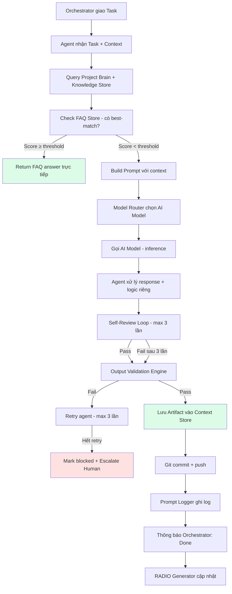

**Song song**: Sentiment_Agent chạy song song phân tích cảm xúc user mỗi khi nhận prompt input (không blocking luồng chính).

---

### Requirements_Agent — Luồng xử lý

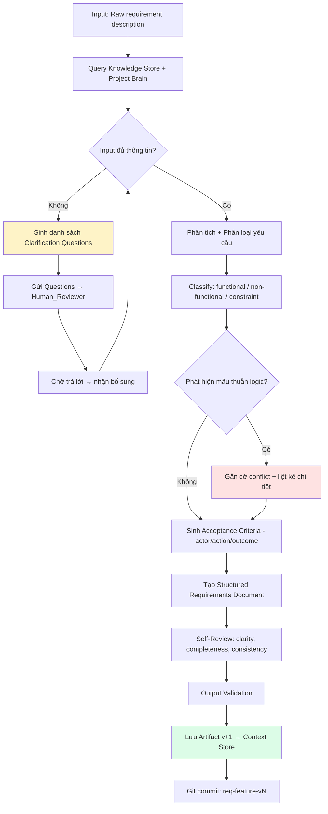

**Input**: Raw text description từ user/BA
**Output**: Structured requirements (Markdown) gồm: title, description, classification, acceptance criteria
**Thời gian**: ≤ 60 giây
**Model ưu tiên**: LLM (Claude/GPT-4o) — task phức tạp cần reasoning

---

### Design_Agent — Luồng xử lý

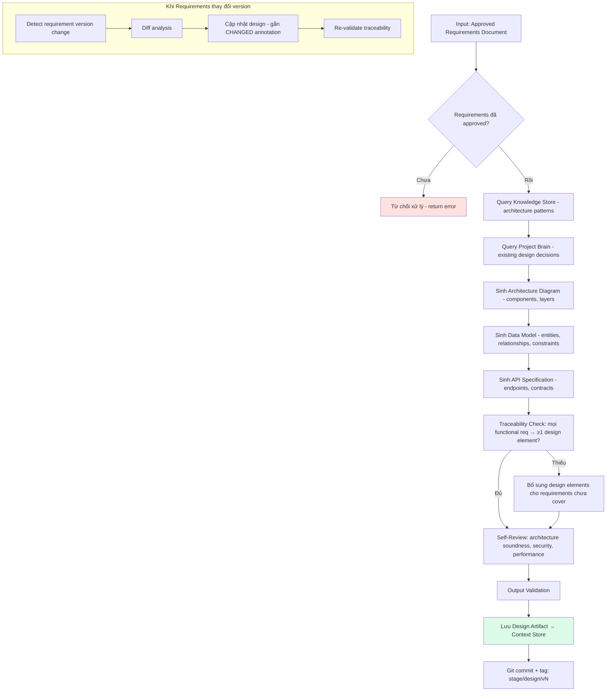

**Input**: Approved requirements artifact (version cụ thể)
**Output**: Design document (Markdown + Mermaid diagrams) gồm: architecture, data model, API spec
**Thời gian**: ≤ 120 giây
**Model ưu tiên**: LLM (GPT-4o) — cần reasoning phức tạp cho architecture decisions

---

### UIUX_Agent — Luồng xử lý

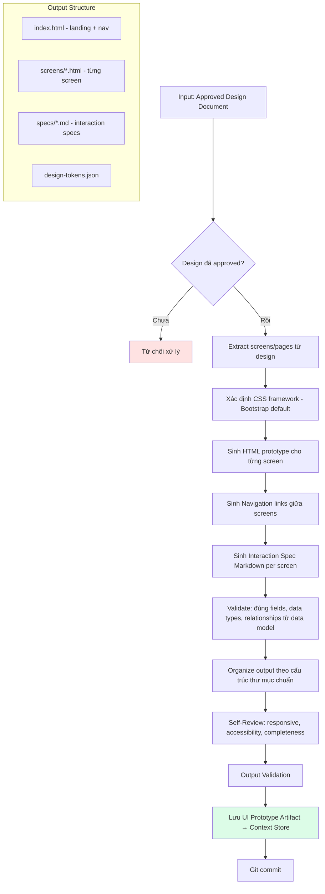

**Input**: Approved design artifact
**Output**: Static HTML + CSS prototype (mở trực tiếp browser, không cần server)
**Format**: Bootstrap 5 responsive, navigation links, mock data
**Model ưu tiên**: LLM (Claude) — cần sinh code HTML/CSS chính xác

---

### Task_Agent — Luồng xử lý

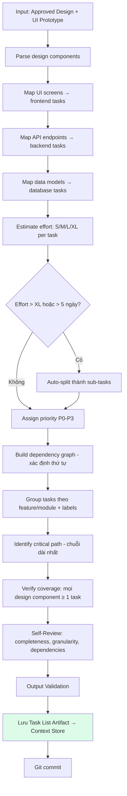

**Input**: Approved design artifact + UI prototype artifact
**Output**: Task list (Markdown/YAML) gồm: title, description, AC, effort, priority, dependencies, assignee role
**Logic**: Mọi design component PHẢI được cover bởi ≥ 1 task
**Model ưu tiên**: LLM (GPT-4o) — cần reasoning cho estimation và dependency analysis

---

### Coding_Agent — Luồng xử lý

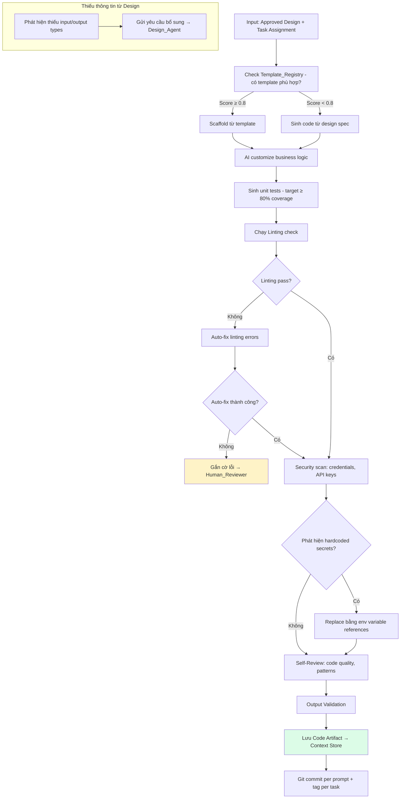

**Input**: Approved design artifact, specific task from task list, (optional) template
**Output**: Source code + unit tests, committed to Git
**Logic**: Auto-fix linting, scan credentials, template-first approach
**Model ưu tiên**: Code-specific model (CodeLlama) cho linting + LLM (Claude) cho generation

---

### Testing_Agent — Luồng xử lý

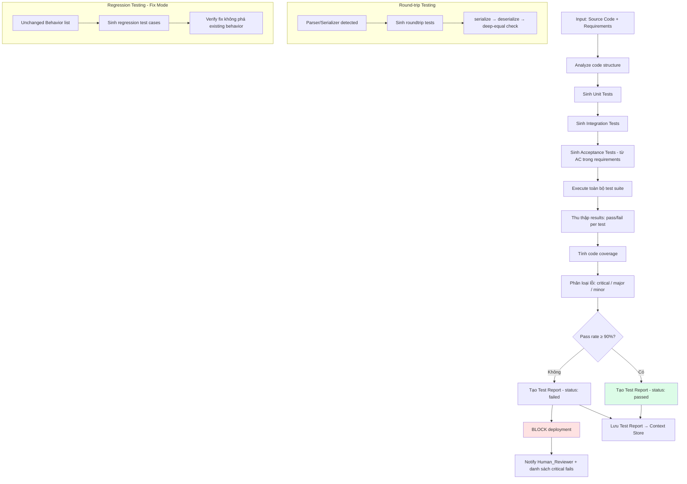

**Input**: Source code artifact + requirements artifact
**Output**: Test suite + test report (Markdown/JSON)
**Quality Gate**: Pass rate ≥ 90% → allow deployment; < 90% → BLOCK
**Model ưu tiên**: LLM cho sinh test + Rule-based cho execution analysis

---

### Deployment_Agent — Luồng xử lý

```mermaid
flowchart TD
    A[Input: Test Report - status passed] --> B{Môi trường target?}
    B -->|development/staging| C[Khởi động CI/CD pipeline]
    B -->|production| D[Yêu cầu Human_Reviewer approval]
    D --> E{Approval trong 60 phút?}
    E -->|Timeout| F[Hủy deployment + notify]
    E -->|Approved| C
    E -->|Rejected| G[Cancel + log reason]
    C --> H[Build + Package]
    H --> I[Security Scan]
    I --> J[Deploy to target environment]
    J --> K[Health Check Loop - every 10s, max 300s]
    K --> L{HTTP 200 received?}
    L -->|Có - ít nhất 1 lần| M[Deployment SUCCESS]
    L -->|Không - hết 300s| N[Rollback to previous version]
    N --> O[Health Check sau rollback]
    O --> P{Rollback healthy?}
    P -->|Có| Q[Log rollback success + notify]
    P -->|Không| R[CRITICAL FAILURE - emergency alert]
    M --> S[Cập nhật Context Store: version, env, timestamp]
    S --> T[Git tag: deploy/{env}/vN]

    style M fill:#dcfce7
    style F fill:#fef3c7
    style R fill:#fee2e2
```

**Input**: Test report artifact (status: "passed")
**Output**: Deployment log (JSON), updated Context Store
**Logic**: Production requires Human approval (60 min timeout), auto-rollback on failure
**Model ưu tiên**: Rule-based engine cho pipeline logic + LLM cho troubleshooting

---

### Operations_Agent — Luồng xử lý

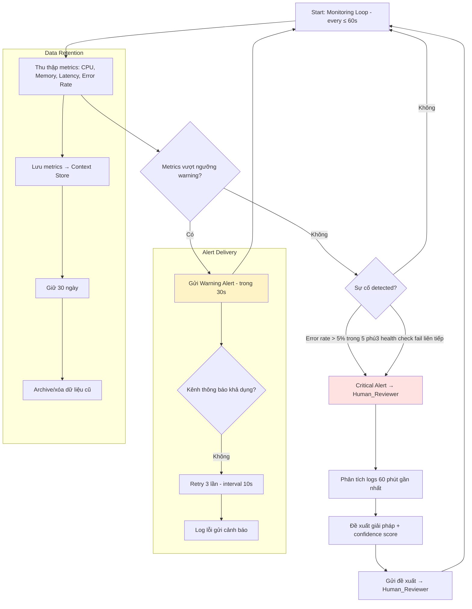

**Input**: Continuous monitoring (không có explicit input từ pipeline)
**Output**: Alerts, incident reports, metrics history
**Cycle**: Thu thập metrics mỗi ≤ 60 giây, cảnh báo trong 30 giây khi vượt ngưỡng
**Model ưu tiên**: ML Classification cho anomaly detection + LLM cho root cause analysis

---

### ProjectHealth_Agent — Luồng xử lý

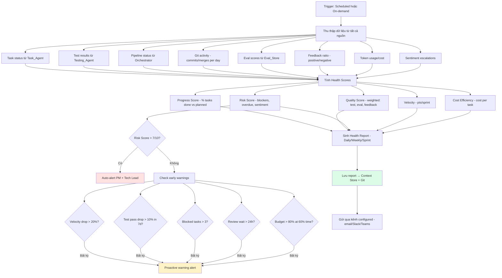

**Input**: Aggregated data từ tất cả hệ thống con
**Output**: Health reports (Daily/Weekly/Sprint), alerts, dashboard data
**Trigger**: Scheduled (configurable) hoặc natural language query
**Model ưu tiên**: Rule-based cho scoring + LLM cho NL query responses

---

### Sentiment_Agent — Luồng xử lý

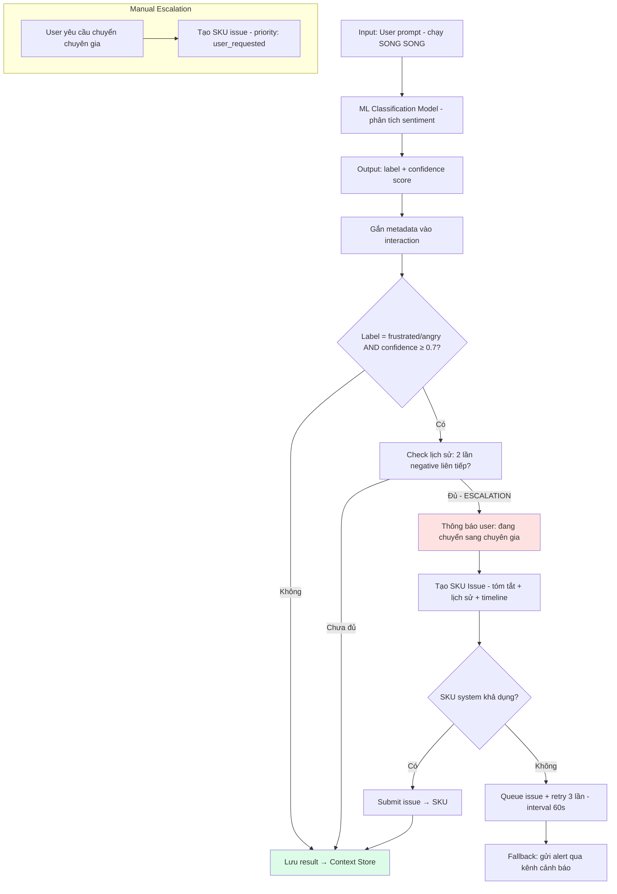

**Input**: Mỗi prompt input của user (chạy song song, non-blocking)
**Output**: Sentiment label + confidence, escalation decision
**Latency**: Thêm < 100ms vào response time
**Model ưu tiên**: ML Classification model (nhẹ, nhanh) — KHÔNG dùng LLM cho task này

---

### Orchestrator — Luồng điều phối Pipeline

```mermaid
flowchart TD
    A[User chọn Mode + submit yêu cầu] --> B[Mode Router xác định pipeline config]
    B --> C{Mode?}
    C -->|Spec| D[Full pipeline: Req → Design → UIUX → Task → Code → Test → Deploy]
    C -->|Fix| E[Fix pipeline: 5WHY → BugDoc → Code → Regression → Deploy]
    C -->|Vibe| F[Quick pipeline: Code → Basic Test]

    D --> G[Orchestrator khởi tạo Pipeline]
    E --> G
    F --> G
    G --> H[Tạo pipeline branch trên Git]
    H --> I[Schedule bước đầu tiên]
    
    I --> J[Giao task → Agent]
    J --> K[Monitor heartbeat - timeout 300s]
    K --> L{Agent phản hồi?}
    L -->|Timeout| M[Retry - max 3 lần total]
    M -->|Hết retry| N[Mark agent timeout + failed]
    L -->|Có output| O[Nhận output từ Agent]
    O --> P{Review Gate tại đây?}
    P -->|Có| Q[Pause pipeline + notify Human]
    P -->|Không| R[Check dependencies → schedule bước tiếp]
    Q --> S{Human decision?}
    S -->|Approve| R
    S -->|Reject| T[Gửi feedback → Agent rework]
    T --> U{Reject lần thứ 3?}
    U -->|Có| V[Pipeline BLOCKED - cần can thiệp thủ công]
    U -->|Không| J
    
    R --> W{Còn bước tiếp?}
    W -->|Có| J
    W -->|Không| X[Pipeline COMPLETED]
    X --> Y[Sinh Pipeline Summary Report]
    Y --> Z[RADIO Report + Git tag: stage complete]
    N --> AA[RADIO "D" + Notify Human]

    style X fill:#dcfce7
    style V fill:#fee2e2
    style N fill:#fee2e2
```

**Pipeline States**: Created → Running → Paused (review gate) → Completed / Failed / Cancelled
**Retry Policy**: Heartbeat timeout 300s → retry 60s interval → max 3 attempts → failed
**Review Gates**: Configurable tại bất kỳ transition point nào
**Mode Switch**: Cho phép chuyển mode giữa chừng, giữ nguyên artifacts đã tạo

---

### Tổng hợp tương tác giữa các Agent

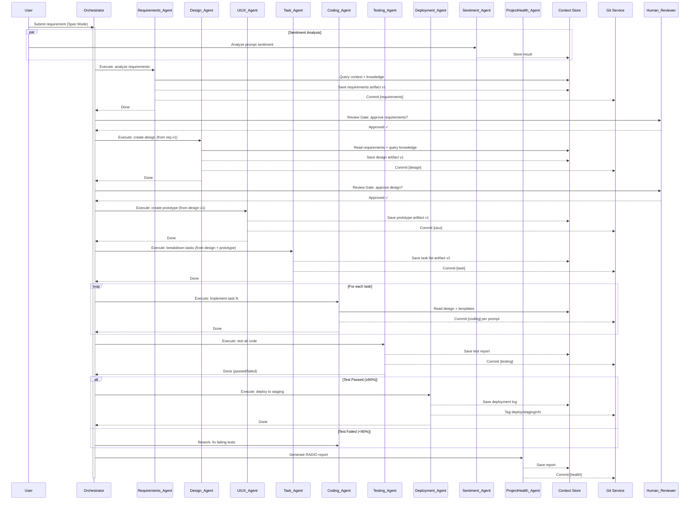

---

## Components and Interfaces

### 1. Agent Framework (Core)

#### Agent Base Interface

Mọi agent đều implement interface chung:

```typescript
interface IAgent {
  agentId: string;
  name: string;
  role: AgentRole;
  status: AgentStatus;
  config: AgentConfig;

  // Lifecycle
  initialize(config: AgentConfig): Promise<void>;
  execute(task: AgentTask): Promise<AgentOutput>;
  handleFeedback(feedback: ReviewFeedback): Promise<AgentOutput>;
  shutdown(): Promise<void>;

  // Health
  heartbeat(): Promise<HealthStatus>;
}

type AgentRole =
  | 'requirements' | 'design' | 'uiux' | 'task'
  | 'coding' | 'testing' | 'deployment'
  | 'operations' | 'project_health' | 'sentiment'
  | string; // custom plugin roles

type AgentStatus = 'active' | 'inactive' | 'running' | 'error';

interface AgentConfig {
  modelId: string;
  temperature: number; // 0.0 - 2.0, default 0.7
  maxRetries: number;  // default 3
  timeoutMs: number;   // default 300000
  customParams?: Record<string, unknown>;
}

interface AgentTask {
  taskId: string;
  pipelineId: string;
  input: ArtifactReference[];
  context: ContextPayload;
  instructions: string;
}

interface AgentOutput {
  artifacts: Artifact[];
  metadata: OutputMetadata;
  selfReviewResult?: SelfReviewResult;
}
```

#### Agent Registry Service

```typescript
interface IAgentRegistry {
  register(config: AgentRegistrationRequest): Promise<RegisteredAgent>;
  deactivate(agentId: string): Promise<void>;
  updateConfig(agentId: string, config: Partial<AgentConfig>): Promise<void>;
  getAgent(agentId: string): Promise<RegisteredAgent>;
  listAgents(filter: AgentFilter): Promise<RegisteredAgent[]>;
}

interface AgentRegistrationRequest {
  name: string;           // max 100 chars
  role: AgentRole;
  modelId: string;
  temperature?: number;   // default 0.7
  customParams?: Record<string, unknown>;
}

// Validation rules (R1):
// - name: required, max 100 chars
// - role: required, must be valid AgentRole
// - modelId: required, must exist in Model Registry
// - Unique constraint: (name, role) pair when status = 'active'
```

### 2. Pipeline Orchestrator

```typescript
interface IPipelineOrchestrator {
  createPipeline(config: PipelineConfig): Promise<Pipeline>;
  startPipeline(pipelineId: string): Promise<void>;
  pausePipeline(pipelineId: string): Promise<void>;
  resumePipeline(pipelineId: string): Promise<void>;
  cancelPipeline(pipelineId: string): Promise<void>;
  getPipelineStatus(pipelineId: string): Promise<PipelineStatus>;
}

interface PipelineConfig {
  mode: InteractionMode;       // 'spec' | 'fix' | 'vibe'
  steps: PipelineStep[];
  executionMode: 'sequential' | 'conditional_parallel';
  conditions?: PipelineCondition[];
  reviewGates: ReviewGateConfig[];
}

interface PipelineStep {
  stepId: string;
  agentId: string;
  dependencies: string[];      // stepIds that must complete first
  condition?: string;          // boolean expression
  timeout: number;             // ms
  retryPolicy: RetryPolicy;
}
```

#### Pipeline State Machine

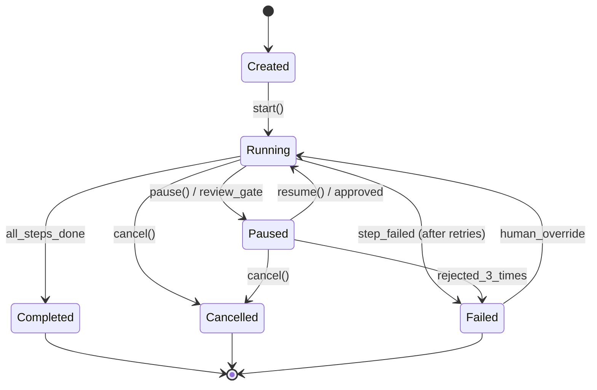

#### Interaction Mode Router (R13)

```typescript
interface IModeRouter {
  selectMode(sessionId: string, mode: InteractionMode): Promise<PipelineConfig>;
  switchMode(sessionId: string, newMode: InteractionMode): Promise<PipelineConfig>;
  getActiveMode(sessionId: string): InteractionMode;
}

type InteractionMode = 'spec' | 'fix' | 'vibe';

// Mode → Pipeline mapping:
// spec: Requirements → Design → UIUX → Task → Coding → Testing → Deploy
// fix:  BugAnalysis(5WHY) → Design → Task → Coding → Testing
// vibe: Coding → Testing (basic validation only)
```

### 3. Context Store (R15)

```typescript
interface IContextStore {
  write(artifact: Artifact): Promise<ArtifactReference>;
  read(artifactId: string, version?: number): Promise<Artifact>;
  listVersions(artifactId: string): Promise<VersionInfo[]>;
  delete(artifactId: string, version: number): Promise<void>;
  query(filter: ArtifactQuery): Promise<Artifact[]>;
}

interface Artifact {
  artifactId: string;      // 1-128 chars, unique
  version: number;         // positive integer
  type: ArtifactType;
  content: string | Buffer;
  metadata: ArtifactMetadata;
  gitCommitSha?: string;
}

interface ArtifactMetadata {
  createdBy: string;       // agent_id or user_id
  createdAt: string;       // ISO 8601
  pipelineId: string;
  stage: PipelineStage;
  status: ArtifactStatus;  // 'draft' | 'validated' | 'approved' | 'rejected'
  size: number;            // bytes
}

// Constraints:
// - Read-after-write consistency (R15-C2)
// - Max 100 versions per artifact (FIFO eviction) (R15-C3)
// - Version conflict detection (R15-C4)
// - Authentication required (R15-C5)
// - Read < 500ms for < 50MB, Write < 2000ms (R28)
```

### 4. Model Router & AI Infrastructure (R39, R40)

```typescript
interface IModelRouter {
  route(request: InferenceRequest): Promise<InferenceResponse>;
  registerModel(model: ModelRegistration): Promise<void>;
  configureRouting(rules: RoutingRule[]): Promise<void>;
}

interface InferenceRequest {
  agentId: string;
  taskType: string;
  prompt: string;
  params: InferenceParams;
  dataSensitivity: DataSensitivity;
  costProfile: CostProfile;
}

interface ModelRegistration {
  modelId: string;
  modelType: ModelType;
  deploymentMode: DeploymentMode;
  connectionConfig: CloudConfig | SelfHostedConfig;
  capabilities: string[];
  costPerToken: number;
}

type ModelType = 'llm' | 'ml_classification' | 'embedding'
  | 'code_specific' | 'rule_based';
type DeploymentMode = 'cloud' | 'self_hosted';
type CostProfile = 'cost_optimized' | 'performance_optimized' | 'balanced';
type DataSensitivity = 'public' | 'internal' | 'confidential' | 'pii';

// Routing logic (R39-C3, R40-C3):
// 1. Check data sensitivity → if confidential/pii → self-hosted only
// 2. Check task complexity → simple → lightweight model
// 3. Check cost profile → route accordingly
// 4. Fallback: if primary unavailable → try alternative deployment mode
```

### 5. Knowledge Store & RAG (R17)

```typescript
interface IKnowledgeStore {
  ingest(document: IngestRequest): Promise<string>; // returns doc_id
  search(query: SemanticQuery): Promise<SearchResult[]>;
  update(docId: string, content: string): Promise<void>;
  delete(docId: string): Promise<void>;
  configure(scope: KnowledgeScope): Promise<void>;
}

interface SemanticQuery {
  text: string;
  topK: number;          // default 5
  scope: KnowledgeScope;
  minScore?: number;     // minimum relevance threshold
}

interface SearchResult {
  docId: string;
  chunk: string;
  score: number;         // 0.0 - 1.0
  metadata: DocumentMetadata;
}

type KnowledgeScope = 'global' | 'organization' | 'project' | 'agent';
```

### 6. FAQ Store & Best-Match (R18)

```typescript
interface IFAQStore {
  create(faq: FAQEntry): Promise<string>;
  update(faqId: string, faq: Partial<FAQEntry>): Promise<void>;
  delete(faqId: string): Promise<void>;
  match(question: string, agentId?: string): Promise<FAQMatchResult>;
  list(filter: FAQFilter): Promise<FAQEntry[]>;
}

interface FAQEntry {
  faqId: string;
  question: string;
  answer: string;
  category: string;
  tags: string[];
  status: 'active' | 'inactive';
  createdAt: string;
  updatedAt: string;
}

interface FAQMatchResult {
  matched: boolean;
  faqId?: string;
  answer?: string;
  relevanceScore: number;  // 0.0 - 1.0
  source: 'faq_direct' | 'fallback_to_ai';
}

// Matching logic (R18-C3):
// 1. Compute semantic similarity between input and all active FAQs
// 2. If best match score >= confidence threshold (default 0.85) → return FAQ answer
// 3. Else → fallback to AI agent processing
// Latency requirement: < 200ms (R18-C2)
```

### 7. Output Validation Engine (R22, R43)

```typescript
interface IValidationEngine {
  validate(output: AgentOutput, rules: ValidationRule[]): Promise<ValidationResult>;
  selfReview(output: AgentOutput, criteria: SelfReviewCriteria): Promise<SelfReviewResult>;
  getGuardrails(): Promise<GuardrailRule[]>;
}

interface ValidationRule {
  ruleId: string;
  type: 'schema' | 'required_sections' | 'regex' | 'guardrail';
  config: Record<string, unknown>;
  severity: 'error' | 'warning';
}

interface SelfReviewCriteria {
  clarity: boolean;
  completeness: boolean;
  consistency: boolean;
  compliance: boolean;
  riskDetection: boolean;
}

interface SelfReviewResult {
  passed: boolean;
  iterations: number;        // max 3
  issuesFound: Issue[];
  issuesFixed: Issue[];
  issuesRemaining: Issue[];
  confidenceScore: number;   // 0.0 - 1.0
}

// Processing chain: Agent Output → Self-Review (R43) → Validation (R22) → Human Review (R14)
// Retry: max 3 times per stage (R50)
```

### 8. Review Gate Manager (R14, R47)

```typescript
interface IReviewGateManager {
  createGate(config: ReviewGateConfig): Promise<string>;
  submitForReview(artifactId: string, gateId: string): Promise<ReviewRequest>;
  approve(requestId: string, checklist: ChecklistResult, comment?: string): Promise<void>;
  reject(requestId: string, feedback: string): Promise<void>;
  getChecklist(gateType: GateType): Promise<ChecklistItem[]>;
}

interface ReviewGateConfig {
  gateId: string;
  gateType: GateType;
  position: string;           // after which pipeline step
  requiredApprovers: number;  // default 1
  timeoutHours: number;       // default 48
  checklist: ChecklistItem[];
}

type GateType = 'approve_requirements' | 'approve_design'
  | 'approve_tasks' | 'approve_pr';

interface ChecklistItem {
  itemId: string;
  label: string;
  required: boolean;
  condition?: string;         // conditional display (R47-C5)
}

interface ChecklistResult {
  items: { itemId: string; checked: boolean; comment?: string }[];
  allRequiredChecked: boolean;
}

// Flow: Artifact arrives → pause pipeline → notify reviewer →
// reminder (24h) → escalate (48h) → if rejected 3x → block (R14-C6)
```

### 9. Git Integration Service (R16)

```typescript
interface IGitService {
  commit(files: FileChange[], message: CommitMessage): Promise<string>; // sha
  createBranch(name: string, from?: string): Promise<void>;
  mergeBranch(source: string, target: string, message: string): Promise<string>;
  createTag(name: string, annotated: boolean, message?: string): Promise<void>;
  revert(commitSha: string): Promise<string>;
  push(branch: string): Promise<void>;
}

interface CommitMessage {
  subject: string;    // format: [agent_role] summary
  body?: string;      // pipeline_id, task_id, agent_id, prompt_log_id
}

// Branching strategy (R16-C6):
// Pipeline: {mode}/{feature-slug}
// Stage:    {mode}/{feature-slug}/{stage}
// Task:     {mode}/{feature-slug}/{task-id}
// Sub-task: {mode}/{feature-slug}/{task-id}/{sub-task-id}
// Merge flow: sub-task → task → pipeline → main
```

### 10. Sentiment Analysis Service (R11)

```typescript
interface ISentimentService {
  analyze(input: SentimentInput): Promise<SentimentResult>;
  getEscalationConfig(agentId?: string): Promise<EscalationConfig>;
  manualEscalate(userId: string, sessionId: string): Promise<EscalationResult>;
}

interface SentimentInput {
  text: string;
  userId: string;
  sessionId: string;
  agentId: string;
}

interface SentimentResult {
  label: SentimentLabel;
  confidence: number;       // 0.0 - 1.0
  escalationTriggered: boolean;
}

type SentimentLabel = 'positive' | 'neutral' | 'frustrated' | 'angry';

interface EscalationConfig {
  consecutiveNegativeThreshold: number;  // default 2
  minConfidence: number;                 // default 0.7
  allowManualEscalation: boolean;        // default true
}

// Non-blocking: runs parallel, adds < 100ms latency (R11-C2)
// Escalation trigger: frustrated/angry >= 0.7 confidence, 2x consecutive (R11-C3)
```

### 11. RADIO Report Generator (R42)

```typescript
interface IRADIOGenerator {
  generate(trigger: RADIOTrigger, context: RADIOContext): Promise<RADIOReport>;
  getHistory(featureName: string): Promise<RADIOReport[]>;
}

interface RADIOReport {
  reportId: string;
  featureName: string;
  timestamp: string;
  trigger: RADIOTrigger;
  review: string;       // R - current status vs spec
  action: string;       // A - work being performed
  difficulty: string;   // D - blockers, risks
  information: string;  // I - additional info
  outcome: string;      // O - results, metrics
  severity?: 'low' | 'medium' | 'high' | 'critical';
}

type RADIOTrigger = 'task_complete' | 'test_fail' | 'new_blocker'
  | 'end_of_day' | 'sprint_end' | 'wave_complete';

// Storage: docs/specs/{feature-name}/radio.md in Git (R42-C4)
// Alert: if D severity >= High → notify Tech Lead + PM (R42-C5)
```

### 12. Quota & Rate Limiting Service (R35)

```typescript
interface IQuotaService {
  checkQuota(request: QuotaCheckRequest): Promise<QuotaCheckResult>;
  consumeQuota(request: QuotaConsumeRequest): Promise<void>;
  getUsage(scope: QuotaScope): Promise<UsageReport>;
  configureQuota(config: QuotaConfig): Promise<void>;
}

interface QuotaConfig {
  scope: QuotaScope;
  limits: {
    tokensPerCycle: number;
    aiCallsPerCycle: number;
    concurrentPipelines: number;
  };
  cycle: 'daily' | 'weekly' | 'monthly';
  burstAllowance: number;    // default 20%
  burstDuration: number;     // default 3600000 ms (1 hour)
}

type QuotaScope = {
  type: 'agent' | 'team' | 'project';
  id: string;
};

// Alerts: 80% → warning, 100% → hard block (running pipelines complete) (R35-C2,C3)
```

### 13. Authorization & RBAC Service (R34)

```typescript
interface IAuthService {
  authenticate(credentials: Credentials): Promise<AuthToken>;
  authorize(token: AuthToken, action: Action, resource: Resource): Promise<boolean>;
  assignRole(userId: string, role: UserRole, scope: AccessScope): Promise<void>;
  delegate(from: string, to: string, duration: number): Promise<void>;
}

type UserRole = 'viewer' | 'developer' | 'tech_lead' | 'admin' | 'super_admin';

interface AccessScope {
  organizationId?: string;
  teamId?: string;
  projectId?: string;
}

// Hierarchy: Organization → Team → Project
// Data isolation: cross-team requires Super Admin explicit grant (R34-C6)
// Lockout: 5 failed auth in 5 min → lock 15 min (R33-C5)
```

### 14. Notification & Communication Service (R51)

```typescript
interface INotificationService {
  send(notification: Notification): Promise<void>;
  configureChannel(config: ChannelConfig): Promise<void>;
  getMetrics(): Promise<CommunicationMetrics>;
  delegate(userId: string, delegateTo: string, until: string): Promise<void>;
}

interface Notification {
  type: CommunicationType;
  priority: Priority;
  recipients: string[];
  channel: NotificationChannel;
  content: NotificationContent;
  slaHours?: number;
}

type CommunicationType = 'approve_request' | 'clarification_qa'
  | 'escalation' | 'information' | 'cr_notification';
type NotificationChannel = 'slack' | 'teams' | 'email' | 'in_app';
type Priority = 'critical' | 'high' | 'medium' | 'low';

// Reminder strategy (R51-C3):
// Immediate → 24h remind → 48h escalate → 72h pause task
```

### 15. Project Health Agent (R10)

```typescript
interface IProjectHealthAgent extends IAgent {
  generateDailyReport(projectId: string): Promise<HealthReport>;
  generateWeeklyReport(projectId: string): Promise<HealthReport>;
  generateSprintReport(projectId: string, sprintId: string): Promise<HealthReport>;
  queryHealth(projectId: string, question: string): Promise<string>;
  getDashboardData(projectId: string): Promise<DashboardData>;
}

interface HealthReport {
  reportType: 'daily' | 'weekly' | 'sprint';
  progressScore: number;     // % tasks done vs planned
  qualityScore: number;      // weighted: test pass, eval, feedback
  riskScore: number;         // 0-10, based on blockers/overdue/sentiment
  velocity: number;          // tasks/story points per sprint
  costEfficiency: number;    // token cost per task
  alerts: HealthAlert[];
}

// Risk threshold: > 7/10 → auto-alert PM + Tech Lead (R10-C4)
// Early warning detection: velocity drop > 20%, test pass drop > 10% (R10-C5)
```

### 16. Spec Versioning Service (R52)

```typescript
interface ISpecVersioning {
  detectChangeType(diff: string): ChangeType;
  bumpVersion(specId: string, changeType: ChangeType): Promise<string>;
  requiresApproval(changeType: ChangeType): boolean;
  flagDownstream(specId: string): Promise<string[]>; // affected artifact IDs
}

type ChangeType = 'major' | 'minor' | 'patch';

// Rules (R52):
// Major (X.0): scope/logic change → requires re-approval
// Minor (X.Y): detail addition → requires re-approval
// Patch (X.Y.Z): typo/format → auto-approve
// Auto-detection: add/remove requirement → Major, add AC → Minor, typo → Patch
```

### 17. Change Request Management (R44)

```typescript
interface ICRManager {
  create(cr: ChangeRequest): Promise<string>;  // CR-XXX
  approve(crId: string, approver: string): Promise<void>;
  reject(crId: string, reason: string): Promise<void>;
  startExecution(crId: string): Promise<void>;
  complete(crId: string): Promise<void>;
  impactAnalysis(crId: string): Promise<ImpactReport>;
  getDashboard(): Promise<CRDashboard>;
}

interface ChangeRequest {
  crId: string;              // CR-XXX
  title: string;
  description: string;
  source: 'client' | 'internal';
  priority: Priority;
  status: CRStatus;
  estimatedEffort: string;   // S/M/L/XL
  assignedSprint?: string;
}

type CRStatus = 'pending' | 'approved' | 'in_progress'
  | 'review' | 'done' | 'rejected';

// Small CR (< 1 day): skip design, only requirements + tasks (R44-C5)
// Storage: docs/change-request/CR-XXX/ (R44-C3)
```

### 18. Definition of Done Enforcement (R48)

```typescript
interface IDoDEnforcer {
  check(artifactId: string, type: DoDType): Promise<DoDResult>;
  override(artifactId: string, reason: string, userId: string): Promise<void>;
  configure(projectId: string, dod: DoDConfig): Promise<void>;
}

type DoDType = 'spec' | 'design' | 'tasks' | 'feature' | 'bugfix';

interface DoDResult {
  passed: boolean;
  criteria: DoDCriterion[];
  failedCriteria: DoDCriterion[];
}

interface DoDCriterion {
  id: string;
  description: string;
  passed: boolean;
  details?: string;
}

// Override: Tech Lead only, with reason → audit log + RADIO "I" (R48-C6)
```

### 19. Unified Failure Handling (R50)

```typescript
interface IFailureHandler {
  handleFailure(context: FailureContext): Promise<FailureResolution>;
  rollback(scope: RollbackScope): Promise<void>;
  override(taskId: string, guidance: string, userId: string): Promise<void>;
}

interface FailureContext {
  agentId: string;
  taskId: string;
  attempt: number;           // 1, 2, or 3
  error: AgentError;
  previousAttempts: AttemptLog[];
}

interface FailureResolution {
  action: 'retry' | 'blocked' | 'escalate';
  failureReport?: FailureReport;
}

// Retry policy (R50-C1):
// Attempt 1: self-fix based on error message
// Attempt 2: try different approach
// Attempt 3: root cause analysis + escalation report
// After 3 fails: block task, generate report, RADIO "D", create ISSUE-XXX
```

### 20. Observability Stack (R24, R36)

```typescript
interface IPromptLogger {
  log(entry: PromptLogEntry): Promise<string>;  // log_id
  query(filter: PromptLogFilter): Promise<PromptLogEntry[]>;
  redact(entry: PromptLogEntry): PromptLogEntry;
}

interface PromptLogEntry {
  logId: string;
  agentId: string;
  pipelineId: string;
  timestamp: string;           // ISO 8601
  prompt: string;
  response: string;
  modelId: string;
  deploymentMode: DeploymentMode;
  params: InferenceParams;
  metrics: {
    inputTokens: number;
    outputTokens: number;
    latencyMs: number;
    estimatedCost: number;
  };
}

// Immutable (append-only) (R24-C5)
// Retention: min 90 days (R24-C3)
// Auto-redact PII/credentials (R24-C7)
// Verbosity: full | summary | metadata_only (R24-C4)
```

---

## Data Models

### Entity Relationship Diagram

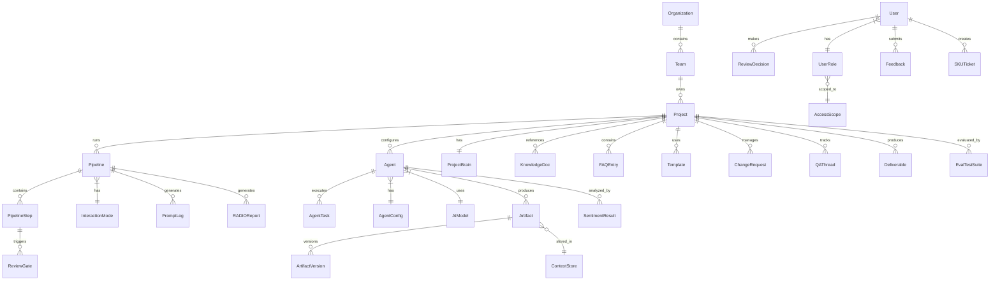

### Core Database Tables

```sql
-- Organizations & Teams
CREATE TABLE organizations (
    id UUID PRIMARY KEY DEFAULT gen_random_uuid(),
    name VARCHAR(255) NOT NULL,
    created_at TIMESTAMPTZ DEFAULT NOW()
);

CREATE TABLE teams (
    id UUID PRIMARY KEY DEFAULT gen_random_uuid(),
    organization_id UUID REFERENCES organizations(id),
    name VARCHAR(255) NOT NULL,
    created_at TIMESTAMPTZ DEFAULT NOW()
);

CREATE TABLE projects (
    id UUID PRIMARY KEY DEFAULT gen_random_uuid(),
    team_id UUID REFERENCES teams(id),
    name VARCHAR(255) NOT NULL,
    config JSONB DEFAULT '{}',
    default_mode VARCHAR(20) DEFAULT 'spec',
    created_at TIMESTAMPTZ DEFAULT NOW()
);

-- Users & Authorization
CREATE TABLE users (
    id UUID PRIMARY KEY DEFAULT gen_random_uuid(),
    email VARCHAR(255) UNIQUE NOT NULL,
    name VARCHAR(255) NOT NULL,
    status VARCHAR(20) DEFAULT 'active',
    created_at TIMESTAMPTZ DEFAULT NOW()
);

CREATE TABLE user_roles (
    id UUID PRIMARY KEY DEFAULT gen_random_uuid(),
    user_id UUID REFERENCES users(id),
    role VARCHAR(50) NOT NULL,
    organization_id UUID REFERENCES organizations(id),
    team_id UUID REFERENCES teams(id),
    project_id UUID REFERENCES projects(id),
    granted_at TIMESTAMPTZ DEFAULT NOW(),
    expires_at TIMESTAMPTZ,
    CONSTRAINT valid_role CHECK (role IN (
        'viewer','developer','tech_lead','admin','super_admin'
    ))
);
```

```sql
-- Agents
CREATE TABLE agents (
    id UUID PRIMARY KEY DEFAULT gen_random_uuid(),
    name VARCHAR(100) NOT NULL,
    role VARCHAR(50) NOT NULL,
    model_id UUID NOT NULL REFERENCES ai_models(id),
    status VARCHAR(20) DEFAULT 'active',
    temperature DECIMAL(3,2) DEFAULT 0.7,
    config JSONB DEFAULT '{}',
    project_id UUID REFERENCES projects(id),
    created_at TIMESTAMPTZ DEFAULT NOW(),
    updated_at TIMESTAMPTZ DEFAULT NOW(),
    CONSTRAINT temp_range CHECK (temperature >= 0.0 AND temperature <= 2.0),
    CONSTRAINT unique_active_name_role UNIQUE (name, role, project_id)
        WHERE status = 'active'
);

-- AI Models
CREATE TABLE ai_models (
    id UUID PRIMARY KEY DEFAULT gen_random_uuid(),
    name VARCHAR(255) NOT NULL,
    model_type VARCHAR(50) NOT NULL,
    deployment_mode VARCHAR(20) NOT NULL,
    connection_config JSONB NOT NULL,
    capabilities TEXT[],
    cost_per_input_token DECIMAL(10,8),
    cost_per_output_token DECIMAL(10,8),
    status VARCHAR(20) DEFAULT 'active',
    created_at TIMESTAMPTZ DEFAULT NOW()
);

-- Pipelines
CREATE TABLE pipelines (
    id UUID PRIMARY KEY DEFAULT gen_random_uuid(),
    project_id UUID REFERENCES projects(id),
    mode VARCHAR(20) NOT NULL,
    status VARCHAR(20) DEFAULT 'created',
    config JSONB NOT NULL,
    started_at TIMESTAMPTZ,
    completed_at TIMESTAMPTZ,
    created_at TIMESTAMPTZ DEFAULT NOW(),
    CONSTRAINT valid_mode CHECK (mode IN ('spec','fix','vibe')),
    CONSTRAINT valid_status CHECK (status IN (
        'created','running','paused','completed','failed','cancelled'
    ))
);

CREATE TABLE pipeline_steps (
    id UUID PRIMARY KEY DEFAULT gen_random_uuid(),
    pipeline_id UUID REFERENCES pipelines(id),
    agent_id UUID REFERENCES agents(id),
    step_order INT NOT NULL,
    status VARCHAR(20) DEFAULT 'pending',
    dependencies UUID[],
    started_at TIMESTAMPTZ,
    completed_at TIMESTAMPTZ,
    error_message TEXT,
    retry_count INT DEFAULT 0,
    CONSTRAINT valid_step_status CHECK (status IN (
        'pending','running','completed','failed','timeout','skipped'
    ))
);

-- Artifacts
CREATE TABLE artifacts (
    id UUID PRIMARY KEY DEFAULT gen_random_uuid(),
    artifact_id VARCHAR(128) NOT NULL,
    version INT NOT NULL,
    type VARCHAR(50) NOT NULL,
    content_ref VARCHAR(512),   -- S3/storage reference
    content_size BIGINT,
    status VARCHAR(20) DEFAULT 'draft',
    git_commit_sha VARCHAR(40),
    created_by UUID,
    pipeline_id UUID REFERENCES pipelines(id),
    metadata JSONB DEFAULT '{}',
    created_at TIMESTAMPTZ DEFAULT NOW(),
    CONSTRAINT unique_artifact_version UNIQUE (artifact_id, version),
    CONSTRAINT valid_artifact_status CHECK (status IN (
        'draft','validated','approved','rejected','validation_failed'
    ))
);
```

```sql
-- Review Gates & Decisions
CREATE TABLE review_gates (
    id UUID PRIMARY KEY DEFAULT gen_random_uuid(),
    pipeline_id UUID REFERENCES pipelines(id),
    gate_type VARCHAR(50) NOT NULL,
    artifact_id UUID REFERENCES artifacts(id),
    status VARCHAR(20) DEFAULT 'pending',
    reviewer_id UUID REFERENCES users(id),
    checklist_result JSONB,
    comment TEXT,
    decided_at TIMESTAMPTZ,
    created_at TIMESTAMPTZ DEFAULT NOW(),
    rejection_count INT DEFAULT 0
);

-- Prompt Logs (Immutable, append-only)
CREATE TABLE prompt_logs (
    id UUID PRIMARY KEY DEFAULT gen_random_uuid(),
    agent_id UUID NOT NULL,
    pipeline_id UUID,
    model_id UUID NOT NULL,
    deployment_mode VARCHAR(20),
    timestamp TIMESTAMPTZ DEFAULT NOW(),
    prompt TEXT,
    response TEXT,
    verbosity VARCHAR(20) DEFAULT 'full',
    input_tokens INT,
    output_tokens INT,
    latency_ms INT,
    estimated_cost DECIMAL(10,6),
    params JSONB,
    redacted BOOLEAN DEFAULT FALSE
);

-- Sentiment Analysis
CREATE TABLE sentiment_results (
    id UUID PRIMARY KEY DEFAULT gen_random_uuid(),
    user_id UUID NOT NULL,
    session_id UUID NOT NULL,
    agent_id UUID NOT NULL,
    timestamp TIMESTAMPTZ DEFAULT NOW(),
    label VARCHAR(20) NOT NULL,
    confidence DECIMAL(3,2) NOT NULL,
    escalation_triggered BOOLEAN DEFAULT FALSE,
    CONSTRAINT valid_label CHECK (label IN (
        'positive','neutral','frustrated','angry'
    ))
);

-- Knowledge Store
CREATE TABLE knowledge_documents (
    id UUID PRIMARY KEY DEFAULT gen_random_uuid(),
    scope VARCHAR(20) NOT NULL,
    scope_id UUID,
    title VARCHAR(512),
    content TEXT,
    format VARCHAR(20),
    chunk_count INT,
    embedding_status VARCHAR(20) DEFAULT 'pending',
    created_at TIMESTAMPTZ DEFAULT NOW(),
    updated_at TIMESTAMPTZ DEFAULT NOW()
);

-- FAQ Store
CREATE TABLE faq_entries (
    id UUID PRIMARY KEY DEFAULT gen_random_uuid(),
    question TEXT NOT NULL,
    answer TEXT NOT NULL,
    category VARCHAR(100),
    tags TEXT[],
    status VARCHAR(20) DEFAULT 'active',
    scope VARCHAR(20) DEFAULT 'global',
    scope_id UUID,
    created_at TIMESTAMPTZ DEFAULT NOW(),
    updated_at TIMESTAMPTZ DEFAULT NOW()
);

-- Feedback & Ratings
CREATE TABLE feedback (
    id UUID PRIMARY KEY DEFAULT gen_random_uuid(),
    user_id UUID REFERENCES users(id),
    agent_id UUID,
    pipeline_id UUID,
    artifact_id UUID,
    rating_stars INT CHECK (rating_stars BETWEEN 1 AND 5),
    thumbs VARCHAR(10),
    category VARCHAR(50),
    comment TEXT,
    status VARCHAR(20) DEFAULT 'new',
    prompt_log_id UUID,
    created_at TIMESTAMPTZ DEFAULT NOW()
);

-- SKU Tickets
CREATE TABLE sku_tickets (
    id UUID PRIMARY KEY DEFAULT gen_random_uuid(),
    ticket_id VARCHAR(20) UNIQUE NOT NULL,
    title VARCHAR(512) NOT NULL,
    source VARCHAR(50) NOT NULL,
    priority VARCHAR(20) NOT NULL,
    status VARCHAR(20) DEFAULT 'open',
    assignee_id UUID REFERENCES users(id),
    description TEXT,
    metadata JSONB,
    sla_first_response TIMESTAMPTZ,
    sla_resolution TIMESTAMPTZ,
    created_at TIMESTAMPTZ DEFAULT NOW(),
    resolved_at TIMESTAMPTZ
);

-- Quotas
CREATE TABLE quotas (
    id UUID PRIMARY KEY DEFAULT gen_random_uuid(),
    scope_type VARCHAR(20) NOT NULL,
    scope_id UUID NOT NULL,
    cycle VARCHAR(20) NOT NULL,
    token_limit BIGINT,
    ai_call_limit INT,
    concurrent_pipeline_limit INT,
    burst_allowance DECIMAL(3,2) DEFAULT 0.20,
    current_usage JSONB DEFAULT '{}',
    period_start TIMESTAMPTZ,
    period_end TIMESTAMPTZ
);

-- Audit Log (Immutable)
CREATE TABLE audit_logs (
    id UUID PRIMARY KEY DEFAULT gen_random_uuid(),
    actor_id UUID NOT NULL,
    actor_type VARCHAR(20) NOT NULL,
    action VARCHAR(100) NOT NULL,
    target_type VARCHAR(50),
    target_id UUID,
    result VARCHAR(20) NOT NULL,
    details JSONB,
    timestamp TIMESTAMPTZ DEFAULT NOW()
);
```

```sql
-- Change Requests
CREATE TABLE change_requests (
    id UUID PRIMARY KEY DEFAULT gen_random_uuid(),
    cr_id VARCHAR(20) UNIQUE NOT NULL,
    title VARCHAR(512) NOT NULL,
    description TEXT,
    source VARCHAR(20) NOT NULL,
    priority VARCHAR(20) NOT NULL,
    status VARCHAR(20) DEFAULT 'pending',
    estimated_effort VARCHAR(10),
    assigned_sprint VARCHAR(50),
    project_id UUID REFERENCES projects(id),
    created_at TIMESTAMPTZ DEFAULT NOW(),
    approved_at TIMESTAMPTZ,
    completed_at TIMESTAMPTZ,
    CONSTRAINT valid_cr_status CHECK (status IN (
        'pending','approved','in_progress','review','done','rejected'
    ))
);

-- Q&A Threads
CREATE TABLE qa_threads (
    id UUID PRIMARY KEY DEFAULT gen_random_uuid(),
    qa_id VARCHAR(20) UNIQUE NOT NULL,
    question TEXT NOT NULL,
    context_ref VARCHAR(512),
    priority VARCHAR(20) DEFAULT 'medium',
    target_user_id UUID,
    status VARCHAR(20) DEFAULT 'open',
    conclusion TEXT,
    action_items JSONB,
    deadline TIMESTAMPTZ,
    project_id UUID REFERENCES projects(id),
    created_at TIMESTAMPTZ DEFAULT NOW(),
    CONSTRAINT valid_qa_status CHECK (status IN (
        'open','in_discussion','answered','closed'
    ))
);

-- Evaluation
CREATE TABLE eval_test_suites (
    id UUID PRIMARY KEY DEFAULT gen_random_uuid(),
    name VARCHAR(255) NOT NULL,
    agent_id UUID REFERENCES agents(id),
    scope VARCHAR(20) DEFAULT 'agent_specific',
    test_cases JSONB NOT NULL,
    scoring_criteria JSONB NOT NULL,
    threshold INT DEFAULT 70,
    schedule VARCHAR(50),
    created_at TIMESTAMPTZ DEFAULT NOW()
);

CREATE TABLE eval_results (
    id UUID PRIMARY KEY DEFAULT gen_random_uuid(),
    suite_id UUID REFERENCES eval_test_suites(id),
    agent_id UUID REFERENCES agents(id),
    agent_config_snapshot JSONB,
    aggregate_score INT,
    criteria_scores JSONB,
    bottom_cases JSONB,
    delta_vs_previous DECIMAL(5,2),
    status VARCHAR(20),
    executed_at TIMESTAMPTZ DEFAULT NOW()
);

-- Templates
CREATE TABLE templates (
    id UUID PRIMARY KEY DEFAULT gen_random_uuid(),
    name VARCHAR(255) NOT NULL,
    type VARCHAR(50) NOT NULL,
    category VARCHAR(50),
    description TEXT,
    content TEXT NOT NULL,
    required_sections TEXT[],
    version INT DEFAULT 1,
    status VARCHAR(20) DEFAULT 'active',
    scope VARCHAR(20) DEFAULT 'global',
    scope_id UUID,
    parent_template_id UUID REFERENCES templates(id),
    tags TEXT[],
    verified BOOLEAN DEFAULT FALSE,
    created_at TIMESTAMPTZ DEFAULT NOW()
);

-- RADIO Reports
CREATE TABLE radio_reports (
    id UUID PRIMARY KEY DEFAULT gen_random_uuid(),
    pipeline_id UUID REFERENCES pipelines(id),
    feature_name VARCHAR(255),
    trigger VARCHAR(50) NOT NULL,
    review TEXT NOT NULL,
    action TEXT NOT NULL,
    difficulty TEXT,
    information TEXT,
    outcome TEXT NOT NULL,
    severity VARCHAR(20),
    created_at TIMESTAMPTZ DEFAULT NOW()
);

-- Project Brain
CREATE TABLE project_brain_entries (
    id UUID PRIMARY KEY DEFAULT gen_random_uuid(),
    project_id UUID REFERENCES projects(id),
    entry_type VARCHAR(50) NOT NULL,
    content TEXT NOT NULL,
    embedding VECTOR(1536),
    relationships JSONB,
    source_ref VARCHAR(512),
    is_deprecated BOOLEAN DEFAULT FALSE,
    retention_policy VARCHAR(20) DEFAULT 'permanent',
    created_at TIMESTAMPTZ DEFAULT NOW(),
    expires_at TIMESTAMPTZ
);
```

---

## Correctness Properties

*A property is a characteristic or behavior that should hold true across all valid executions of a system — essentially, a formal statement about what the system should do. Properties serve as the bridge between human-readable specifications and machine-verifiable correctness guarantees.*

### Property 1: Agent Registration Validation (Round-trip Completeness)

*For any* `AgentRegistrationRequest`, registration succeeds if and only if all required fields (name ≤ 100 chars, role, modelId) are present and valid; when registration fails due to missing fields, the error message SHALL list exactly the set of missing/invalid fields — no more, no less.

**Validates: Requirements 1.1, 1.3**

### Property 2: Agent ID Uniqueness

*For any* set of N successfully registered agents, all assigned `agent_id` values SHALL be distinct from each other.

**Validates: Requirements 1.2**

### Property 3: Active Agent Name-Role Uniqueness Constraint

*For any* two `AgentRegistrationRequest` objects with identical (name, role) pair, if the first agent is in "active" status, the second registration SHALL be rejected with a conflict error.

**Validates: Requirements 1.6**

### Property 4: Temperature Configuration Bounds

*For any* temperature value T, the system SHALL accept T if and only if 0.0 ≤ T ≤ 2.0; when T is not specified, the effective temperature SHALL equal 0.7.

**Validates: Requirements 1.7**

### Property 5: Artifact Version Monotonic Increment

*For any* artifact in Context_Store, each successive save SHALL increment the version number by exactly 1 relative to the previous version.

**Validates: Requirements 2.7, 15.1**

### Property 6: Context Store Read-After-Write Consistency (Round-trip)

*For any* artifact written to Context_Store, an immediate subsequent read with the same (artifact_id, version) SHALL return content byte-for-byte identical to what was written.

**Validates: Requirements 15.2**

### Property 7: Context Store Version Limit Invariant

*For any* artifact_id in Context_Store, the number of stored versions SHALL never exceed 100; when a 101st version is written, the oldest version SHALL be evicted (FIFO).

**Validates: Requirements 15.3**

### Property 8: Context Store Version Conflict Detection

*For any* existing (artifact_id, version) pair in Context_Store, a write attempt with the same (artifact_id, version) SHALL be rejected with a version conflict error.

**Validates: Requirements 15.4**

### Property 9: Sentiment Escalation Trigger Logic

*For any* sequence of sentiment analysis results for a user within a session, escalation SHALL be triggered if and only if there exist 2 consecutive results with label ∈ {frustrated, angry} AND confidence ≥ configured threshold (default 0.7).

**Validates: Requirements 11.3**

### Property 10: Pipeline Dependency Graph Failure Propagation

*For any* directed acyclic graph of pipeline steps, when a step fails: all steps with direct or transitive dependency on the failed step SHALL be stopped, AND all steps without dependency on the failed step SHALL continue executing.

**Validates: Requirements 12.2**

### Property 11: Pipeline Agent Timeout State Machine

*For any* agent that fails to send heartbeat within 300 seconds, the system SHALL transition through states: timeout → retry (wait 60s) → retry → failed, with exactly 3 total attempts before marking as "failed".

**Validates: Requirements 12.5**

### Property 12: Review Gate Blocking After 3 Rejections

*For any* artifact at a review gate, if it accumulates 3 consecutive rejections, the pipeline SHALL transition to "blocked" status at that step.

**Validates: Requirements 14.6**

### Property 13: FAQ Threshold Routing Decision

*For any* FAQ matching result with relevance score S and configured threshold T: if S ≥ T then the response source SHALL be "faq_direct" (no AI call); if S < T then the response SHALL fall back to AI processing.

**Validates: Requirements 18.3, 18.4**

### Property 14: Validation Retry Bounded Loop

*For any* agent output that fails validation, the system SHALL retry up to 3 times; after 3 failed retries, the artifact SHALL be marked "validation_failed" with status "draft".

**Validates: Requirements 22.3, 22.4**

### Property 15: Authentication Lockout Rule

*For any* sequence of authentication attempts from the same entity, if there are 5 consecutive failures within a 5-minute window, the account SHALL be locked for 15 minutes.

**Validates: Requirements 33.5**

### Property 16: Hierarchical RBAC Authorization

*For any* (user, role, scope, action, resource) tuple, access SHALL be granted if and only if the user's role within the matching scope (Organization → Team → Project) permits the action on the resource; access to resources outside the assigned scope SHALL always be denied unless explicitly granted by Super Admin.

**Validates: Requirements 34.2, 34.3, 34.6**

### Property 17: Quota Threshold Alerts and Blocking

*For any* (usage, quota) pair: when usage ≥ 80% of quota, a warning alert SHALL be generated; when usage ≥ 100% of quota, new requests SHALL be blocked (running pipelines complete normally).

**Validates: Requirements 35.2, 35.3**

### Property 18: Model Routing — Data Sensitivity Constraint

*For any* inference request, if the data sensitivity is "confidential" or "pii" or the project has policy "data_local_only", the model router SHALL route exclusively to a self-hosted model; if no self-hosted model is available AND data policy prohibits cloud, the request SHALL be blocked (not routed to cloud).

**Validates: Requirements 39.3, 40.3, 40.6**

### Property 19: Self-Review Loop Termination

*For any* agent output undergoing self-review, the self-review loop SHALL terminate after at most 3 iterations regardless of whether issues remain; remaining issues SHALL be attached as metadata for Human review.

**Validates: Requirements 43.2, 43.4**

### Property 20: Approve Checklist Enforcement

*For any* review gate approval attempt, approval SHALL succeed if and only if ALL required checklist items have been checked (marked true); if any required item is unchecked, approval SHALL be blocked.

**Validates: Requirements 47.2**

### Property 21: Definition of Done Enforcement

*For any* artifact/phase being marked as "Done", the DoD check SHALL verify all configured criteria; if any criterion fails, the status transition to "Done" SHALL be blocked and the list of failing criteria SHALL be returned.

**Validates: Requirements 48.2, 48.3**

### Property 22: Unified Retry Escalation Path

*For any* agent task failure, the retry strategy SHALL follow: attempt 1 = self-fix from error, attempt 2 = alternative approach, attempt 3 = root cause analysis + escalation; after 3 failures the task SHALL be marked "blocked" with a failure report.

**Validates: Requirements 50.1, 50.2**

### Property 23: Communication Reminder Escalation Timeline

*For any* pending communication requiring Human response: reminder at configured interval → escalation to supervisor at 2× interval → task pause at 3× interval. Each step SHALL occur at exactly the configured time offset.

**Validates: Requirements 51.3**

### Property 24: Spec Versioning — Change Type Determines Approval Requirement

*For any* spec document change, the system SHALL classify the diff as Major (scope/logic change), Minor (detail addition), or Patch (typo/format); Major and Minor changes SHALL require re-approval; Patch changes SHALL auto-approve without Human review.

**Validates: Requirements 52.1, 52.2, 52.3**

### Property 25: Agent Deactivation Prevents New Task Assignment

*For any* agent in "inactive" status, any attempt to assign a new task SHALL be rejected; tasks already running at deactivation time SHALL be allowed to complete normally.

**Validates: Requirements 1.5**

---

## Error Handling

### Chiến lược Xử lý Lỗi Thống nhất

Hệ thống áp dụng chiến lược xử lý lỗi phân cấp (R50):

```mermaid
graph TD
    A[Agent Output Error] --> B{Attempt 1}
    B -->|Self-fix| C{Success?}
    C -->|Yes| D[Continue Pipeline]
    C -->|No| E{Attempt 2}
    E -->|Different approach| F{Success?}
    F -->|Yes| D
    F -->|No| G{Attempt 3}
    G -->|Root cause analysis| H{Success?}
    H -->|Yes| D
    H -->|No| I[Block Task + Escalate]
    I --> J[Generate Failure Report]
    J --> K[RADIO "D" Entry]
    J --> L[Create ISSUE-XXX]
    J --> M[Notify Human]
```

### Phân loại Lỗi

| Loại lỗi | Mức nghiêm trọng | Hành vi hệ thống |
|-----------|-------------------|------------------|
| Validation failure | Medium | Retry max 3 lần, rồi mark "validation_failed" |
| Agent timeout | High | Retry 2 lần (60s interval), rồi "failed" |
| Model unavailable | High | Fallback sang alternative model/deployment |
| Quota exceeded | Medium | Block new requests, complete running tasks |
| Pipeline step failure | High | Stop dependents, continue independents |
| Auth failure (5x) | High | Lock account 15 phút |
| Critical failure (deployment) | Critical | Rollback + emergency alert |
| Self-review loop exhausted | Medium | Forward to Human with issues attached |

### Rollback Strategy (R50-C4)

| Scope | Rollback action |
|-------|----------------|
| Wrong code | `git revert` specific commit |
| Wrong spec/design | Revert to previous artifact version |
| Entire feature wrong | Revert branch + return to spec phase |
| Deployment failure | Auto-rollback to previous version |
| Rollback also fails | Mark "critical_failure" + emergency alert |

### Circuit Breaker Pattern

Áp dụng cho external service calls (AI providers, Git, Notification channels):
- **Closed**: Normal operation
- **Open**: After 5 consecutive failures → stop calling, return cached/fallback
- **Half-Open**: After 60s → try single request, if success → Close; if fail → Open

### Error Response Format

```typescript
interface SystemError {
  code: string;              // Machine-readable error code
  message: string;           // Human-readable description
  details?: ErrorDetail[];   // Specific field/rule violations
  retryable: boolean;
  suggestedAction?: string;
}

interface ErrorDetail {
  field?: string;
  rule?: string;
  expected?: string;
  actual?: string;
}
```

---

## Testing Strategy

### Tổng quan

Hệ thống sử dụng chiến lược kiểm thử đa tầng kết hợp:
- **Property-Based Testing (PBT)**: Kiểm tra các bất biến logic (invariants) trên nhiều input ngẫu nhiên
- **Unit Testing**: Kiểm tra cụ thể từng function/component
- **Integration Testing**: Kiểm tra tương tác giữa các thành phần
- **End-to-End Testing**: Kiểm tra full pipeline flow

### Property-Based Testing

**Thư viện PBT**: `fast-check` (TypeScript/JavaScript)

**Cấu hình**: Minimum 100 iterations per property test

Mỗi property test tham chiếu đến Correctness Property tương ứng trong design document:

```typescript
// Tag format: Feature: sdlc-ai-agents, Property {N}: {title}
```

**Properties được test bằng PBT (25 properties):**

| Property | Loại Pattern | Mô tả ngắn |
|----------|-------------|-------------|
| P1 | Invariant | Agent registration validation |
| P2 | Invariant | Agent ID uniqueness |
| P3 | Invariant | Name-role uniqueness constraint |
| P4 | Invariant | Temperature bounds |
| P5 | Invariant | Version monotonic increment |
| P6 | Round-trip | Read-after-write consistency |
| P7 | Invariant | Version count limit (≤ 100) |
| P8 | Invariant | Version conflict detection |
| P9 | State machine | Sentiment escalation trigger |
| P10 | Graph property | Failure propagation in DAG |
| P11 | State machine | Timeout → retry → failed |
| P12 | Counter/threshold | 3 rejections → blocked |
| P13 | Threshold routing | FAQ score-based decision |
| P14 | Bounded loop | Validation retry (max 3) |
| P15 | Counter/threshold | Auth lockout (5 in 5 min) |
| P16 | Hierarchical logic | RBAC authorization |
| P17 | Threshold | Quota alert/block |
| P18 | Routing constraint | Data sensitivity routing |
| P19 | Bounded loop | Self-review termination |
| P20 | Predicate | Checklist enforcement |
| P21 | Predicate | DoD enforcement |
| P22 | State machine | Retry escalation path |
| P23 | Timeline logic | Reminder escalation |
| P24 | Classification | Spec version change type |
| P25 | State transition | Deactivation prevents assignment |

### Unit Testing

**Focus areas:**
- Specific examples cho từng component
- Edge cases: empty inputs, max-length strings, boundary values
- Error conditions: invalid states, malformed data
- Serialization/deserialization round-trips cho data models

**Coverage target**: ≥ 80% code coverage trên toàn bộ business logic

### Integration Testing

**Focus areas:**
- Agent → Model Router → AI Provider flow
- Agent → Context Store → Git synchronization
- Orchestrator → Agent → Review Gate flow
- Knowledge Store ingestion → embedding → semantic search
- Notification delivery across channels
- End-to-end pipeline execution (Spec → Deploy)

**Số lượng**: 2-3 representative examples per integration point

### End-to-End Testing

**Test scenarios:**
1. Full Spec Mode pipeline: requirements → design → UIUX → tasks → code → test → deploy
2. Fix Mode pipeline: bug report → 5WHY → fix → regression test
3. Vibe Mode pipeline: prompt → code → basic validation
4. Mode switching mid-session
5. Multi-agent concurrent pipeline execution
6. Review gate approval/rejection flows
7. Escalation scenarios (sentiment, timeout, quota)

### Performance Testing

**Targets (từ R28):**
- 10 concurrent pipelines, ≤ 20% latency degradation
- Context Store read < 500ms (< 50MB)
- Context Store write < 2000ms (< 50MB)
- Pipeline initialization < 5s
- API 95th percentile < 1000ms
- Knowledge Store search < 200ms
- FAQ matching < 200ms

### Security Testing

**SAST**: Static analysis cho credentials leak, SQL injection, XSS
**DAST**: Runtime security scanning cho API endpoints
**Access control testing**: Verify RBAC boundaries, cross-team isolation
**Audit log verification**: Immutability, completeness

---

## GUI Reference Prototype

Bộ HTML prototype đã được tạo tại `gui/` trong cùng thư mục spec, phục vụ làm tham chiếu trực quan cho Admin Portal và toàn bộ giao diện hệ thống. Prototype có thể mở trực tiếp trên browser (static HTML + Bootstrap 5.3, không cần server).

### Cấu trúc GUI

```
gui/
├── index.html                      — Dashboard tổng quan (stats, active pipeline, mode selector, agent status)
├── assets/                         — Images, icons (placeholder)
└── screens/
    ├── pipeline.html               — Pipeline Management (Orchestrator view, pipeline flow, review gates)
    ├── agents.html                 — Agent Management (register, configure, status, quality scores)
    ├── artifacts.html              — Context Store (artifact list, version history, git commit mapping)
    ├── requirements.html           — Requirements Agent (raw input → structured output, clarification Q&A)
    ├── design.html                 — Design Agent (architecture diagram, data model, API spec, review)
    ├── tasks.html                  — Task Agent (Kanban board, priority, dependencies, effort estimation)
    ├── testing.html                — Testing Agent (test report, coverage, quality gate, severity)
    ├── deployment.html             — Deployment & Operations (CI/CD pipeline, health check, monitoring)
    ├── knowledge.html              — Knowledge Store + Project Brain + FAQ (semantic search, documents)
    ├── project-health.html         — Project Health Dashboard (RADIO report, metrics, risk alerts)
    ├── sentiment.html              — Sentiment Analysis (distribution, escalation, SKU integration)
    ├── admin.html                  — Admin Portal (system health, AI models, quota, settings, tiles)
    ├── users.html                  — Users & Roles (RBAC, org hierarchy, permissions, lockout)
    └── feedback.html               — Feedback & SKU Tickets (ratings, bug reports, ticket management)
```

### Mapping GUI → Design Components

| GUI Screen | Design Components Referenced | Requirements |
|------------|---------------------------|--------------|
| `index.html` | Orchestrator, ModeRouter, Agent Registry | R12, R13, R1 |
| `pipeline.html` | IPipelineOrchestrator, PipelineStep, ReviewGateManager | R12, R14, R13 |
| `agents.html` | IAgentRegistry, AgentConfig, ModelRouter | R1, R39 |
| `artifacts.html` | IContextStore, Artifact, IGitService | R15, R16 |
| `requirements.html` | Requirements_Agent, IValidationEngine | R2, R22, R43 |
| `design.html` | Design_Agent, IContextStore | R3, R15 |
| `tasks.html` | Task_Agent, dependency graph | R5 |
| `testing.html` | Testing_Agent, IDoDEnforcer | R7, R48 |
| `deployment.html` | Deployment_Agent, Operations_Agent | R8, R9 |
| `knowledge.html` | IKnowledgeStore, Project Brain, IFAQStore | R17, R21, R18 |
| `project-health.html` | ProjectHealth_Agent, IRADIOGenerator | R10, R42 |
| `sentiment.html` | ISentimentService, SKU integration | R11, R27 |
| `admin.html` | Admin Portal, IQuotaService, Model Registry | R38, R35, R39, R40 |
| `users.html` | IAuthService, RBAC hierarchy | R34, R33 |
| `feedback.html` | Feedback Service, SKU Tickets, ICRManager | R25, R26, R27, R44 |

### Design Notes

- **Navigation**: Sidebar nhất quán trên tất cả screens, cho phép di chuyển giữa các module
- **Responsive**: Bootstrap 5.3 grid system, mobile/tablet/desktop breakpoints
- **Mock Data**: Mỗi screen chứa dữ liệu mẫu thực tế phản ánh đúng data model trong design
- **No JS complexity**: Static HTML + CSS only, diff-able trên Git (R16-C2 compliance)
- **Review Flow**: Approve/Reject buttons xuất hiện tại các review gate screens (requirements, design, deployment)
- **Interaction Modes**: Dashboard hiển thị mode selector (Spec/Fix/Vibe) với mô tả ngắn

---

## Quyết định Thiết kế (Design Decisions)

| # | Quyết định | Lý do | Thay thế đã xem xét |
|---|-----------|-------|---------------------|
| D1 | Event-Driven Architecture cho agent communication | Loose coupling, async processing, dễ scale | Direct RPC calls (tight coupling) |
| D2 | PostgreSQL làm primary database | JSONB support, ACID, mature ecosystem | MongoDB (schema-less nhưng khó enforce constraints) |
| D3 | Vector DB riêng (Qdrant/Pinecone) cho Knowledge Store | Optimized cho similarity search | PostgreSQL pgvector (performance kém hơn ở scale lớn) |
| D4 | Redis cho caching + rate limiting | Sub-ms latency, atomic operations | Memcached (thiếu persistence) |
| D5 | RabbitMQ/Kafka cho message broker | Reliable delivery, dead letter queues | In-process queue (không scale) |
| D6 | Plugin architecture cho agents | Extensibility (R32), add agents without core changes | Monolithic (khó mở rộng) |
| D7 | Git-as-source-of-truth cho all artifacts | Version control, diff, collaboration, R16 compliance | Database-only (mất version history) |
| D8 | fast-check cho PBT | TypeScript native, good generator API | Hypothesis (Python only) |
| D9 | Saga pattern cho pipeline | Long-running transactions cần compensation | 2PC (blocking, không phù hợp distributed) |
| D10 | Strategy pattern cho Model Router | Runtime switching, multiple models | Hard-coded routing (inflexible) |
