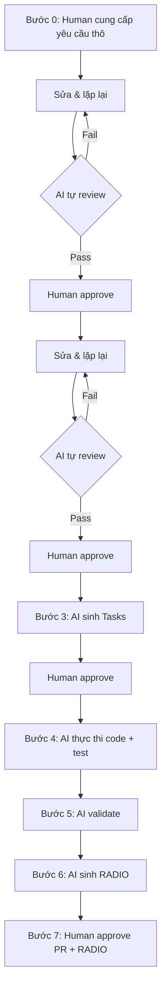

# Quy trình Quản lý Dự án AI-First, Spec-Driven

## Mô hình "Self-Driving Software Team"

**Phiên bản:** 1.0
**Người tạo:** DungDV (Mr4) – Sabitech  
**Áp dụng cho:** Các tổ chức phát triển phần mềm muốn chuyển đổi sang mô hình AI-first  
**Đối tượng:** Project Manager, Tech Lead, Delivery Manager, QA/Tester, BA, Developer

### Change Log

| Version | Ngày | Thay đổi | Bởi |
|---------|------|----------|-----|
| 1.0 | 2026-05-21 | Initial version | DungDV (Mr4) |

---

## Glossary (Thuật ngữ)

| Viết tắt | Đầy đủ | Định nghĩa |
|----------|--------|-----------|
| **RACI** | Responsible, Accountable, Consulted, Informed | Ma trận phân quyền trách nhiệm |
| **RADIO** | Review, Action, Difficulty, Information, Outcome | Khung báo cáo tiến độ 5 thành phần |
| **EARS** | Easy Approach to Requirements Syntax | Cú pháp viết acceptance criteria (THE/WHEN/IF + SHALL) |
| **DoD** | Definition of Done | Tiêu chí hoàn thành cho mỗi artifact/phase |
| **CR** | Change Request | Yêu cầu thay đổi từ KH/stakeholder |
| **QA** | Question & Answer | Câu hỏi clarification trong dự án |
| **PBT** | Property-Based Testing | Test dựa trên thuộc tính bất biến |
| **SAST** | Static Application Security Testing | Quét bảo mật mã nguồn tĩnh |
| **DAST** | Dynamic Application Security Testing | Quét bảo mật runtime |
| **SLA** | Service Level Agreement | Cam kết thời gian phản hồi/xử lý |
| **E2E** | End-to-End | Test toàn bộ luồng từ đầu đến cuối |
| **CI/CD** | Continuous Integration / Continuous Delivery | Pipeline tự động build, test, deploy |
| **PR** | Pull Request | Yêu cầu merge code vào branch chính |
| **ERD** | Entity Relationship Diagram | Sơ đồ quan hệ giữa các bảng DB |
| **AC** | Acceptance Criteria | Tiêu chí chấp nhận cho requirement |
| **5WHY** | Five Whys | Phương pháp hỏi 5 lần "Tại sao?" để tìm root cause |
| **IaC** | Infrastructure as Code | Quản lý hạ tầng bằng code |
| **MCP** | Model Context Protocol | Giao thức kết nối AI với tools bên ngoài |

---

## Mục lục

| # | Section | Mô tả |
|---|---------|--------|
| 1 | [Tổng quan](#1-tổng-quan) | 4 thành phần cốt lõi |
| 2 | [Định nghĩa các thành phần](#2-định-nghĩa-các-thành-phần) | RACI, RADIO, Spec, AI Agent |
| 3 | [Quy trình thực thi](#3-quy-trình-thực-thi-workflow) | Workflow, so sánh, testing strategy |
| 4 | [Ví dụ thực tế](#4-ví-dụ-thực-tế-end-to-end) | API Login, Dashboard UI, Bugfix |
| 5 | [Cấp độ áp dụng](#5-các-cấp-độ-áp-dụng-adoption-levels) | Level 1–4 adoption roadmap |
| 6 | [Kiến trúc hệ thống](#6-kiến-trúc-hệ-thống) | Layer diagram, OpenSpec structure |
| 7 | [Quản lý rủi ro](#7-quản-lý-rủi-ro-tổng-quan) | Risk matrix, ngoại lệ quy trình, Definition of Done |
| 8 | [Metrics & KPIs](#8-metrics--kpis) | Targets, baseline, cách đo, alerts |
| 9 | [Vai trò và trách nhiệm](#9-vai-trò-và-trách-nhiệm) | RACI matrix, role descriptions, escalation, versioning, failure handling, communication |
| 10 | [Quản lý Change Request](#10-quản-lý-change-request-cr) | CR lifecycle, backlog format |
| 11 | [Quản lý Rủi ro & Vấn đề](#11-quản-lý-rủi-ro--vấn-đề-risk--issue-management) | Risk vs Issue, 5WHY, lifecycle |
| 12 | [Quản lý Q&A](#12-quản-lý-qa-question--answer) | Q&A index, thread format |
| 13 | [Limitations & Deliverables](#13-quản-lý-limitations--deliverables) | Deliverables tracking |
| 14 | [Checklist Approve](#14-checklist-approve-tiêu-chuẩn) | Approve checklists cho mọi gate |
| 15 | [Checklist triển khai](#15-checklist-triển-khai) | Implementation checklist |
| 16 | [Kết luận](#16-kết-luận) | Tóm tắt |
| A | [Phụ lục A](#phụ-lục-a-cấu-trúc-tài-liệu-feature-spec) | Feature Spec structure |
| B | [Phụ lục B](#phụ-lục-b-cấu-trúc-tài-liệu-bugfix-spec) | Bugfix Spec structure |

**Tài liệu bổ sung:**
- 📖 [`quick-start.md`](quick-start.md) – Hướng dẫn bắt đầu trong 15 phút
- 🔧 [`toolchain.md`](toolchain.md) – Danh sách công cụ & cách integrate
- 💬 [`prompt-templates.md`](prompt-templates.md) – Prompt mẫu cho AI ở từng phase

---

## 1. Tổng quan

Quy trình này kết hợp 4 thành phần để tạo thành hệ thống delivery thế hệ mới:

| Thành phần | Vai trò trong quy trình |
|------------|------------------------|
| **RACI** | Phân quyền trách nhiệm |
| **RADIO** | Chuẩn hóa báo cáo tiến độ |
| **Specification** | Nguồn sự thật duy nhất (single source of truth) |
| **AI Agent** | Tầng thực thi tự động |

**Nguyên tắc cốt lõi:**

> Con người phê duyệt và chịu trách nhiệm. AI định nghĩa, thực thi và báo cáo.

> 📖 **Mới bắt đầu?** Xem [`quick-start.md`](quick-start.md) để chạy thử trong 15 phút.  
> 🔧 **Cần biết dùng tool gì?** Xem [`toolchain.md`](toolchain.md).

---

## 2. Định nghĩa các thành phần

### 2.1 RACI – Ma trận phân quyền

| Vai trò | Định nghĩa | Thực thể trong mô hình AI-first |
|---------|-------------|----------------------------------|
| **R** – Responsible | Thực thi công việc | 🤖 AI Agent |
| **A** – Accountable | Chịu trách nhiệm cuối cùng | 👤 Human (Lead / PM) |
| **C** – Consulted | Được tham vấn trước khi quyết định | AI + Human (QA, Architect) |
| **I** – Informed | Được thông báo kết quả | Stakeholder, PM |

**Quy tắc:**
- Mỗi task phải có đúng 1 người Accountable (human).
- AI Agent là Responsible mặc định cho các task thực thi.
- Human vẫn giữ quyền override bất kỳ lúc nào.

---

### 2.2 RADIO – Khung báo cáo tiến độ

| Ký hiệu | Nội dung | Mô tả |
|----------|----------|--------|
| **R** | Review | Trạng thái hiện tại so với spec |
| **A** | Action | Công việc đang thực hiện |
| **D** | Difficulty | Blocker, rủi ro, vấn đề cần escalate |
| **I** | Information | Thông tin bổ sung ảnh hưởng tiến độ |
| **O** | Outcome | Kết quả đạt được, metric cụ thể |

**Trong mô hình AI-first:** RADIO được AI tự động sinh ra dựa trên dữ liệu thực thi (commit, test result, spec compliance), không còn là báo cáo chủ quan của developer.

**File location:** `openspec/specs/{feature-name}/radio.md` (xem chi tiết format tại Phụ lục A.5)

**Tần suất cập nhật RADIO:**

| Trigger | Khi nào | Bắt buộc |
|---------|---------|----------|
| Task complete | Mỗi khi 1 task trong tasks.md chuyển `[x]` | ✅ |
| Test fail | Khi CI/CD report test failure | ✅ |
| Blocker mới | Khi phát hiện blocker/risk mới | ✅ |
| End of day | Cuối ngày làm việc (nếu có progress) | ✅ |
| Sprint end | Tổng hợp cuối sprint | ✅ |
| Milestone | Khi hoàn thành wave trong task dependency | Khuyến nghị |
| Minimum | Ít nhất 1 lần/ngày nếu đang active | ✅ |

---

### 2.3 Specification – Nguồn sự thật duy nhất

Spec là tài liệu kỹ thuật mà AI đọc và thực thi. Các dạng spec hợp lệ:

| Loại spec | Ví dụ | Mục đích |
|-----------|--------|----------|
| API Spec | OpenAPI / Swagger | Định nghĩa endpoint, input/output |
| Business Rules | Decision table, BPMN | Logic nghiệp vụ |
| Acceptance Criteria | Given-When-Then | Tiêu chí chấp nhận |
| Data Schema | JSON Schema, DB Schema | Cấu trúc dữ liệu |
| UI Spec | Figma + annotation | Giao diện và hành vi |

**Yêu cầu chất lượng spec:**
- Rõ ràng, không mơ hồ (AI không thể "đoán ý" khi thực thi)
- Có version control
- AI sinh spec từ yêu cầu đầu vào (cuộc họp, ticket, mô tả ngắn)
- Được review và approve bởi ít nhất 1 human trước khi AI thực thi
- Bao gồm cả happy path và error case

---

### 2.4 AI Agent – Tầng thực thi

> 💬 **Cách prompt AI đúng format?** Xem [`prompt-templates.md`](prompt-templates.md) để có mẫu prompt cho từng phase.

AI Agent thực hiện các nhiệm vụ:

| Nhiệm vụ | Input | Output |
|-----------|-------|--------|
| Sinh spec | Yêu cầu thô / context | Specification chuẩn hóa |
| Sinh design | Spec (đã approve) | Bộ design đầy đủ (xem chi tiết bên dưới) |
| Sinh tasks | Design (đã approve) | Task breakdown + RACI |
| Sinh code | Task + Design + Spec | Source code |
| Viết test | Spec + Code | Test cases (unit, integration, E2E, manual) |
| Chạy validation | Code + Test | Test report (all levels) |
| Sinh báo cáo RADIO | Execution data | RADIO report |

**Chi tiết Design output:**

| Loại design | Mô tả | Format |
|-------------|--------|--------|
| GUI Design | Wireframe, UI flow, mockup, interaction | **HTML Prototype** (khuyến nghị) |
| Site Map | Cấu trúc trang/màn hình, hierarchy, navigation path | Markdown / Mermaid |
| Architecture | System diagram, sequence diagram, API contract | Markdown + Mermaid / PlantUML |
| Database Design + ERD | Table schema, relationship, index strategy | SQL DDL + ERD diagram |
| Infrastructure Design | Deployment topology, network, scaling, CI/CD | Diagram + IaC template |
| Components & Interfaces | Chi tiết từng component: class, method, behavior | Markdown |

**⚠️ Khuyến nghị: GUI Prototype bằng HTML**

Dù ứng dụng được phát triển cho **Web, Mobile, hay Desktop**, GUI prototype đều nên được tạo bằng **HTML tương tác** thay vì wireframe tĩnh (Markdown/Figma sketch). Lý do:

| Vấn đề với wireframe tĩnh | Lợi ích của HTML Prototype |
|---------------------------|---------------------------|
| Chỉ là bản thô, khó hình dung flow thực tế | Mô phỏng đầy đủ luồng di chuyển màn hình |
| Stakeholder khó confirm chính xác | Stakeholder click trực tiếp, confirm sớm và chính xác |
| Không thể hiện được interaction/transition | Bao gồm xử lý navigation, transition, state |
| Phải tưởng tượng khi review | WYSIWYG – thấy gì được nấy |

**Yêu cầu HTML Prototype:**
- Bao gồm tất cả màn hình trong feature
- Có đầy đủ luồng di chuyển (navigation flow) giữa các màn hình
- Có xử lý sự kiện click/tap để chuyển màn hình thực tế
- Responsive (mô phỏng mobile/tablet/desktop nếu cần)
- Có thể mở trực tiếp trên browser để review, không cần build
- Dùng CSS framework nhẹ (TailwindCSS, Bootstrap) để nhanh và đẹp

---

## 3. Quy trình thực thi (Workflow)

### 3.1 Luồng chính



**Chi tiết từng bước:**

**Bước 0: Human cung cấp yêu cầu thô**
- Mô tả ngắn gọn feature/bug cần xử lý
- Có thể là ticket, meeting note, hoặc chat
- Không cần format chuẩn

**Bước 1: AI sinh Spec** (+ vòng lặp tự kiểm tra)
- AI phân tích yêu cầu thô → sinh specification chuẩn hóa
- AI hỏi clarification nếu mơ hồ
- 🔄 Vòng lặp: AI tự review (rõ ràng? đầy đủ? mâu thuẫn? risk? ambiguity?) → tự sửa → lặp đến khi pass
- Nếu phát hiện risk → tạo RISK-XXX
- Nếu phát hiện ambiguity → tạo QA-XXX
- ✅ Human review & approve → version trong source control

**Bước 2: AI sinh Design** (+ vòng lặp tự kiểm tra)
- AI đọc spec đã approve → sinh: architecture, GUI (HTML prototype), site map, DB design, infrastructure, components
- 🔄 Vòng lặp: AI tự review (cover requirements? scalable? secure? conflict? risk?) → tự sửa → lặp đến khi pass
- ✅ Human review & approve → version trong source control

**Bước 3: AI sinh Tasks**
- AI đọc design → sinh task breakdown chi tiết + gán RACI
- ✅ Human review & approve

**Bước 4: AI thực thi**
- Generate code theo design + spec
- Viết unit test + integration test + E2E test
- Sinh manual test cases (cho QA)
- Chạy CI/CD pipeline

**Bước 5: AI validate**
- Chạy tất cả automation tests (L1–L4, L6)
- Kiểm tra spec compliance
- Phát hiện gap giữa code và spec
- QA thực hiện manual test (L5)
- AI tổng hợp kết quả

**Bước 6: AI sinh RADIO Report**
- Tự động tổng hợp từ execution data
- Highlight blocker & risk
- Đề xuất action tiếp theo

**Bước 7: Human approve**
- Review RADIO report + code changes (PR)
- Approve hoặc request changes
- Chịu trách nhiệm cuối cùng (Accountable)

### 3.2 So sánh với quy trình truyền thống

| Bước | Truyền thống | AI-first |
|------|-------------|----------|
| Phân tích yêu cầu | BA phân tích, viết doc | AI sinh spec từ yêu cầu thô, Human approve |
| Thiết kế | Architect viết design doc | AI sinh design từ spec, Human approve |
| Phân rã công việc | Lead chia task thủ công | AI sinh tasks từ design, Human approve |
| Phân công | Lead assign cho dev | AI tự assign (R), Human là Accountable |
| Thực thi | Dev code thủ công | AI generate code từ design + spec |
| Test | QA test thủ công | AI generate + chạy test tự động; QA manual test cho UX/edge cases |
| Báo cáo | Dev viết report chủ quan | AI sinh RADIO từ data thực |
| Review | Lead đọc code | Lead approve PR + RADIO |

---

### 3.3 Testing Strategy – Các tầng test

| Tầng | Loại test | Ai thực hiện | Tool/Framework | Khi nào chạy |
|------|-----------|-------------|----------------|-------------|
| **L1** | Unit Test | AI Agent | Jest, PHPUnit, pytest... | Mỗi commit (CI) |
| **L2** | Integration Test | AI Agent | Supertest, Laravel Feature Test... | Mỗi PR |
| **L3** | E2E Automation (UI) | AI Agent | Selenium, Playwright, browser-use | Mỗi PR / nightly |
| **L4** | Desktop/Native Automation | AI Agent | AutoIt, RobotFramework, browser-use/desktop | Nightly / release |
| **L5** | Manual Test | QA/Tester (Human) | Test cases AI sinh | Trước release |
| **L6** | Property-Based Test | AI Agent | fast-check, Hypothesis... | Mỗi PR (optional) |

**Phân công:**
- **AI sinh tất cả test scripts** (L1–L4, L6) + **sinh manual test cases** (L5)
- **AI chạy tất cả automation** (L1–L4, L6) trong CI/CD
- **QA/Tester chỉ thực hiện manual test** (L5): exploratory, UX, edge cases khó automate
- **QA/Tester review** coverage và kết quả của tất cả tầng

**Khi nào cần Manual Test (L5):**
- UX/usability mà automation không đánh giá được
- Exploratory testing (tìm bug ngoài spec)
- Cross-device/cross-browser visual check
- Business flow phức tạp cần human judgment
- Accessibility testing (screen reader, keyboard navigation)

**Khi nào cần E2E Automation (L3–L4):**
- Flow end-to-end qua nhiều màn hình
- Regression test cho critical path
- Test trên nhiều browser/device tự động
- Desktop application testing (AutoIt, RobotFramework)
- Web scraping/interaction testing (browser-use)

---

## 4. Ví dụ thực tế (End-to-End)

### 4.1 Ví dụ: Xây dựng API Login

**Bước 1 – Spec (AI-generated, Human-approved):**

Human cung cấp yêu cầu thô: *"Cần API login, nhận email + password, trả về JWT token, xử lý các case sai password, lock account, timeout."*

AI sinh spec:

```yaml
endpoint: POST /api/v1/login
input:
  email: string (required, valid email format)
  password: string (required, min 8 chars)
output:
  success:
    token: JWT string
    expires_in: number (seconds)
  error:
    - code: INVALID_CREDENTIALS, message: "Email or password incorrect"
    - code: ACCOUNT_LOCKED, message: "Account locked after 5 attempts"
    - code: SERVICE_TIMEOUT, message: "Authentication service unavailable"
constraints:
  - Rate limit: 5 requests/minute per IP
  - Password not logged
  - Token expires in 3600s
```

**Bước 2 – Design (AI-generated, Human-approved):**

AI sinh bộ design đầy đủ từ spec đã approve:

**a) Technical Design:**

```yaml
architecture:
  pattern: Controller → Service → Repository
  auth_provider: JWT (RS256)
  rate_limiter: Sliding window (Redis)

sequence:
  1. Controller nhận request, validate input format
  2. Service gọi Repository kiểm tra credentials
  3. Nếu sai 5 lần → lock account (TTL 30 min)
  4. Nếu đúng → generate JWT token (exp: 3600s)
  5. Rate limiter check trước khi xử lý
```

**b) GUI Design (HTML Prototype):**

AI sinh HTML prototype có thể mở trực tiếp trên browser:

```
📁 openspec/specs/login-feature/gui/
├── index.html          ← Entry point (login page)
├── dashboard.html      ← Redirect sau login thành công
├── error-states.html   ← Các trạng thái lỗi
├── styles.css          ← TailwindCSS / Bootstrap
└── navigation.js       ← Xử lý chuyển màn hình
```

Prototype bao gồm:
- Login form với validation realtime (email format, password min 8)
- Click "Login" → loading state → chuyển sang dashboard.html
- Sai password → hiển thị error toast "Invalid credentials"
- Sai 5 lần → hiển thị locked state với countdown
- Responsive: hiển thị đúng trên mobile/tablet/desktop

→ Human mở browser, click thử toàn bộ flow, confirm UI trước khi code.

**c) Database Design + ERD:**

```sql
CREATE TABLE login_attempts (
  id UUID PRIMARY KEY,
  user_id UUID REFERENCES users(id),
  attempt_count INT DEFAULT 0,
  locked_until TIMESTAMP NULL,
  last_attempt_at TIMESTAMP DEFAULT NOW()
);

-- ERD: users 1──N login_attempts
```

**d) Infrastructure Design:**

```yaml
deployment:
  service: auth-service (container)
  redis: rate-limit + session cache
  load_balancer: ALB (HTTPS termination)
  scaling: min 2, max 10 (CPU > 70%)
```

Human (Tech Lead) review → approve toàn bộ design.

**Bước 3 – Tasks (AI-generated, Human-approved):**

AI sinh task breakdown từ design đã approve:

| # | Task | Estimated | RACI (R/A) |
|---|------|-----------|------------|
| 1 | Setup rate limiter middleware (Redis) | 1h | AI / Tech Lead |
| 2 | Implement LoginController + input validation | 1h | AI / Tech Lead |
| 3 | Implement AuthService + credential check | 2h | AI / Tech Lead |
| 4 | Implement account lock logic | 1h | AI / Tech Lead |
| 5 | Implement JWT token generation | 1h | AI / Tech Lead |
| 6 | Write unit tests (12 cases) | 1h | AI / Tech Lead |
| 7 | Write integration test | 1h | AI / Tech Lead |

Human (Tech Lead) review → approve task list.

**Bước 4 – RACI:**

| Role | Người/Agent |
|------|-------------|
| R (Responsible) | AI Agent |
| A (Accountable) | Tech Lead – Nguyễn Văn A |
| C (Consulted) | QA Lead, Security Engineer |
| I (Informed) | PM, Product Owner |

**Bước 5–6 – AI thực thi:**
- AI sinh controller, service, repository layer
- AI sinh unit test (happy path + error cases)
- AI chạy test → 12/12 pass
- AI kiểm tra spec compliance → 100%

**Bước 7 – RADIO Report (AI-generated):**

```
R: API POST /login implemented, 12/12 test cases pass, spec compliance 100%
A: Đang bổ sung rate limiting middleware (5 req/min/IP)
D: Spec chưa định nghĩa retry strategy khi auth service timeout
I: Auth service có latency trung bình 200ms, peak 800ms
O: Contract test pass, ready for integration testing
```

**Bước 8 – Human action:**
- Tech Lead review PR → approve
- Escalate issue "D" lên Architect để bổ sung retry spec
- Confirm với PM: feature ready for staging

---

### 4.2 Ví dụ: Xây dựng Dashboard Analytics (UI-heavy)

**Bước 0 – Yêu cầu thô:**

> "Cần dashboard hiển thị thống kê user: biểu đồ đăng ký theo ngày, top 10 active users, tổng revenue theo tháng. Có filter theo date range. Responsive cho mobile."

**Bước 1 – Spec (AI-generated):**

```yaml
feature: Analytics Dashboard
screens:
  - dashboard_main: Tổng quan với 3 widgets
  - filter_panel: Date range picker + apply
  - chart_detail: Click vào chart → xem chi tiết

requirements:
  - R1: Dashboard hiển thị 3 widgets (registrations, active users, revenue)
  - R2: Filter date range áp dụng cho tất cả widgets
  - R3: Responsive: mobile (stack vertical), tablet (2 col), desktop (3 col)
  - R4: Loading state cho mỗi widget khi fetch data
  - R5: Error state khi API fail
```

**Bước 2 – Design (HTML Prototype):**

```
📁 openspec/specs/analytics-dashboard/gui/
├── index.html          ← Dashboard chính (3 widgets)
├── mobile.html         ← Mobile view (stack vertical)
├── loading-states.html ← Skeleton loading cho mỗi widget
├── error-states.html   ← Error UI khi API fail
├── filter-panel.html   ← Date range picker interaction
├── chart-detail.html   ← Drill-down khi click chart
├── styles.css          ← TailwindCSS responsive
└── navigation.js       ← Click handlers, filter logic
```

→ Human mở `index.html` trên browser:
- Click filter → thấy date picker mở ra
- Resize browser → thấy responsive hoạt động
- Click chart → navigate sang `chart-detail.html`
- Confirm: "UI đúng ý, approve"

**Bước 3 – Tasks:**

| # | Task | Wave |
|---|------|------|
| 1 | Setup chart library (Chart.js/Recharts) | 1 |
| 2 | Implement API endpoints (3 widgets) | 1 |
| 3 | Build Dashboard layout (responsive grid) | 2 |
| 4 | Build Registration chart widget | 2 |
| 5 | Build Active users widget | 2 |
| 6 | Build Revenue widget | 2 |
| 7 | Implement date range filter | 3 |
| 8 | Add loading/error states | 3 |
| 9 | E2E test (responsive + filter + navigation) | 4 |

**Giá trị HTML Prototype:** Stakeholder confirm UI trước khi code 1 dòng. Không có "làm xong mới biết sai UI".

---

### 4.3 Ví dụ: Bugfix Flow (End-to-End)

**Tình huống:** QA report bug: "User đăng ký với email `test+alias@gmail.com` bị reject, nhưng spec cho phép."

**Bước 1 – AI tạo bugfix.md:**

```markdown
# Bugfix Requirements Document

## Introduction
Bug phát hiện bởi QA khi manual test (L5). Email với ký tự `+` bị 
regex validation reject sai.

## Bug Analysis

### Current Behavior (Defect)
1.1 WHEN user registers with email containing "+" character 
    THEN the system rejects with "Invalid email format"

### Expected Behavior (Correct)
2.1 WHEN user registers with email containing "+" character 
    THE SYSTEM SHALL accept the email (RFC 5322 compliant)

### Unchanged Behavior (Regression Prevention)
3.1 WHEN user registers with invalid email (no @, no domain) 
    THE SYSTEM SHALL CONTINUE TO reject with "Invalid email format"
3.2 WHEN user registers with valid simple email 
    THE SYSTEM SHALL CONTINUE TO accept normally
```

**Bước 2 – AI sinh design.md với 5WHY:**

```markdown
## Hypothesized Root Cause (5WHY)

- Why 1: Tại sao email với "+" bị reject?
  → Vì regex validation không include "+" trong allowed characters
- Why 2: Tại sao regex không include "+"?
  → Vì dùng regex đơn giản `[a-zA-Z0-9._-]+@` thay vì RFC 5322
- Why 3: Tại sao dùng regex đơn giản?
  → Vì developer tự viết regex thay vì dùng library validated
- Why 4: Tại sao không dùng library?
  → Vì không có coding standard bắt buộc dùng library cho validation
- Why 5: Tại sao không có coding standard?
  → Vì chưa có linter rule enforce "no custom email regex"

**Root cause:** Thiếu linter rule enforce dùng validated library cho email
**Prevention:** Thêm ESLint rule cấm custom email regex, bắt buộc dùng validator.js
```

**Bước 3 – AI thực thi:**
- Fix: thay custom regex bằng `validator.isEmail()`
- Test: thêm test case cho `+`, `.`, và các special chars
- Prevention: thêm ESLint rule

**Bước 4 – RADIO:**

```
R: Bug BUG-001 fixed, 3/3 tests pass, regression test pass
A: Đang thêm ESLint rule cho prevention
D: None
I: Phát hiện 2 chỗ khác cũng dùng custom regex → tạo CR-007
O: Fix merged, prevention rule active, 0 regression
```

---

## 5. Các cấp độ áp dụng (Adoption Levels)

> **Mục đích:** Không phải team nào cũng có thể nhảy thẳng lên AI-full. Section này mô tả lộ trình chuyển đổi từng bước, giúp team dần dần mở rộng phạm vi AI quản lý. Mỗi level xây trên nền của level trước. Sự khác biệt giữa các level là **mức độ tự động hóa phần quản lý** (report, risk, Q&A, CR), không phải phần execution (AI đã thực thi từ Level 1).

```
Level 1              Level 2              Level 3              Level 4
AI-Spec+Execute  →   AI-Managed       →   AI-Autonomous    →   AI-Full
─────────────────    ─────────────────    ─────────────────    ─────────────────
AI sinh spec         AI sinh RADIO        AI tự detect risk    AI quản lý toàn bộ
AI sinh code+test    AI review quality    AI tự tạo Q&A        AI tự quản lý CR
Human approve all    Human approve report AI tự flag issues    Human chỉ approve gate
```

### Level 1 – AI-Spec+Execute (Tuần 1–4)

**Mục tiêu:** AI sinh spec + thực thi code + test. Human approve ở mỗi gate. Phần quản lý (report, risk, Q&A) vẫn do Human làm thủ công.

| Hành động | Kết quả mong đợi |
|-----------|-------------------|
| AI sinh spec từ yêu cầu thô, Human approve | Spec chuẩn hóa, format đồng nhất |
| AI sinh design + tasks, Human approve | Design đầy đủ, tasks rõ ràng |
| AI thực thi code + test, Human review PR | Code quality đảm bảo |
| Áp dụng RACI cho mọi task | Rõ ràng ai chịu trách nhiệm |
| Human viết RADIO report thủ công | Báo cáo có cấu trúc (chưa tự động) |

**Dấu hiệu sẵn sàng lên Level 2:** AI sinh code chính xác, Human approve nhanh, team quen workflow spec-driven.

### Level 2 – AI-Managed (Tuần 5–8)

**Mục tiêu:** AI bắt đầu quản lý reporting và review. RADIO tự động, AI review spec quality. Human vẫn quản lý risk/Q&A thủ công.

| Hành động | Kết quả mong đợi |
|-----------|-------------------|
| AI tự động sinh RADIO từ commit/CI data | Giảm 80% thời gian viết report |
| AI review spec quality trước khi approve | Phát hiện spec mơ hồ sớm |
| AI suggest next action dựa trên RADIO | Giảm thời gian decision-making |
| Human quản lý risk register thủ công | Risk được track nhưng chưa tự động |
| Human tạo Q&A khi cần clarify | Q&A có cấu trúc nhưng chưa AI detect |

**Dấu hiệu sẵn sàng lên Level 3:** Team tin tưởng AI-generated RADIO, AI review chính xác, workflow ổn định.

### Level 3 – AI-Autonomous (Tuần 9–12)

**Mục tiêu:** AI tự quản lý risk, issue, Q&A. AI tự detect vấn đề và tạo item. Human chỉ confirm.

| Hành động | Kết quả mong đợi |
|-----------|-------------------|
| AI tự detect risk từ spec/code analysis | Risk được phát hiện sớm, tự động |
| AI tự tạo Q&A khi phát hiện ambiguity | Không còn spec mơ hồ lọt qua |
| AI tự flag issues từ test fail/monitoring | Issue được detect realtime |
| AI tự cập nhật risk/issue status | Tracking tự động, không cần human update |
| Human chỉ confirm severity + approve plan | Giảm 90% effort quản lý |

**Dấu hiệu sẵn sàng lên Level 4:** AI detect risk/issue chính xác, Q&A tự động hữu ích, Human chỉ cần confirm.

### Level 4 – AI-Full (Tuần 13+)

**Mục tiêu:** AI quản lý toàn bộ lifecycle bao gồm cả CR, deliverables, limitations. Human chỉ approve ở các gate quan trọng. Đây là trạng thái mục tiêu của tài liệu này.

| Hành động | Kết quả mong đợi |
|-----------|-------------------|
| AI tự quản lý CR backlog (prioritize, schedule) | CR được xử lý nhanh, không tắc nghẽn |
| AI tự tổng hợp deliverables + limitations | Luôn biết project đang ở đâu |
| AI tự escalate khi cần | Không miss critical issues |
| 1 Lead quản lý 10–50 AI agents | Scale không cần tăng headcount |
| Toàn bộ pipeline tự động end-to-end | Delivery liên tục, không chờ handoff |

**Lưu ý:** Team có kinh nghiệm với AI tooling có thể bắt đầu trực tiếp từ Level 3 hoặc 4. Lộ trình 4 level dành cho team chuyển đổi dần từ quy trình truyền thống.

---

## 6. Kiến trúc hệ thống

```
┌──────────────────────────────────────────────┐
│         SPEC MANAGEMENT LAYER                │
│   (Kiro/OpenSpec/Claude – trong Git repo)    │
│   Quản lý: requirements, design, tasks,      │
│   status, traceability – tất cả bằng file    │
└──────────────────────┬───────────────────────┘
                       │
                       ▼
┌──────────────────────────────────────────────┐
│            SPECIFICATION LAYER               │
│    (OpenAPI, Business Rules, AC, Schema)     │
└──────────────────────┬───────────────────────┘
                       │
                       ▼
┌──────────────────────────────────────────────┐
│              AI EXECUTION LAYER              │
│                                              │
│  ┌───────────┐  ┌──────────┐  ┌──────────┐   │
│  │ LLM/Agent │  │ Code Gen │  │ Test Gen │   │
│  └───────────┘  └──────────┘  └──────────┘   │
└──────────────────────┬───────────────────────┘
                       │
                       ▼
┌──────────────────────────────────────────────┐
│           DELIVERY PIPELINE LAYER            │
│        (Git / CI/CD / Test Automation)       │
└──────────────────────┬───────────────────────┘
                       │
                       ▼
┌──────────────────────────────────────────────┐
│            REPORTING LAYER                   │
│         (RADIO Auto-Generated Report)        │
└──────────────────────┬───────────────────────┘
                       │
                       ▼
┌──────────────────────────────────────────────┐
│           HUMAN APPROVAL LAYER               │
│      (Review, Approve, Accountable)          │
└──────────────────────────────────────────────┘
```

**Tại sao dùng OpenSpec thay vì Jira / Azure DevOps?**

| Tiêu chí | Jira / Azure DevOps | OpenSpec (trong repo) |
|----------|--------------------|------------------------------------|
| AI đọc trực tiếp | ❌ Cần API integration | ✅ Đọc file trực tiếp |
| Single source of truth | ❌ Spec ở repo, task ở tool khác | ✅ Tất cả cùng 1 repo |
| Version control | ❌ Riêng biệt, khó trace | ✅ Git history, PR review |
| Chi phí | ❌ License per user | ✅ Miễn phí (file-based) |
| Sync overhead | ❌ Phải sync 2 chiều | ✅ Không cần sync |
| AI cập nhật status | ❌ Cần API call | ✅ Update file trực tiếp |
| Traceability | ❌ Link thủ công | ✅ File reference tự nhiên |

**Cấu trúc thư mục OpenSpec:**

```
📁 openspec/
├── 📁 specs/                      ← Feature specs
│   ├── 📁 login-feature/
│   │   ├── requirements.md
│   │   ├── design.md
│   │   ├── tasks.md
│   │   ├── radio.md
│   │   └── 📁 gui/
│   └── 📁 payment-feature/
│       └── ...
├── 📁 bugs/                       ← Bugfix specs
│   ├── 📁 BUG-001/
│   │   ├── bugfix.md
│   │   ├── design.md
│   │   └── tasks.md
│   └── ...
├── 📁 change-request/             ← Change Request management
│   ├── backlog.md
│   ├── 📁 CR-001/
│   │   ├── requirements.md
│   │   ├── design.md
│   │   └── tasks.md
│   └── ...
├── 📁 risk-issue/                 ← Risk & Issue management
│   ├── risks.md
│   └── issues.md
├── 📁 qa/                         ← Q&A management
│   ├── index.md
│   ├── 📁 QA-001/
│   │   └── thread.md
│   └── ...
└── 📁 deliverables/               ← Deliverables + Limitations
    ├── index.md
    ├── baseline.md
    └── 📁 sprint-01/
        └── deliverables.md
```

---

## 7. Quản lý rủi ro (Tổng quan)

> Chi tiết đầy đủ về Risk & Issue Management xem [Section 11](#11-quản-lý-rủi-ro--vấn-đề-risk--issue-management).

**Top risks khi áp dụng mô hình AI-first:**

| Rủi ro | Mức độ | Biện pháp kiểm soát |
|--------|--------|---------------------|
| AI hiểu sai spec | Cao | Spec phải qua peer review; AI validate against spec trước merge |
| Human approve không đọc kỹ | Cao | Checklist bắt buộc; Rotate reviewer |
| Spec mơ hồ/thiếu | Cao | AI flag ambiguity trước khi thực thi; Spec quality gate |
| AI sinh code có security issue | Trung bình | SAST/DAST scan tự động trong CI |
| Mất kiểm soát khi scale nhiều agent | Trung bình | Dashboard monitoring; Alert khi deviation > threshold |
| Over-reliance vào AI | Thấp | Định kỳ human audit random sample |

### 7.1 Khi nào KHÔNG dùng full quy trình

Không phải mọi thay đổi đều cần đi qua đầy đủ Spec → Design → Tasks. Bảng dưới đây xác định scope ngoại lệ:

| Tình huống | Quy trình áp dụng | Lý do |
|-----------|-------------------|-------|
| **Hotfix production** (< 30 phút, critical) | Fix trực tiếp → PR → approve → merge. Tạo bugfix.md **sau** khi fix. | Ưu tiên uptime, document sau |
| **Config change** (env variable, feature flag) | PR trực tiếp → approve. Không cần spec. | Không có logic mới |
| **Typo / copy change** | PR trực tiếp → approve. Không cần spec. | Trivial, không ảnh hưởng logic |
| **Prototype / POC** | Chỉ cần requirements.md (ngắn gọn). Skip design + tasks. | Mục đích khám phá, không phải delivery |
| **Dependency update** (security patch) | PR + test pass → approve. Không cần spec. | Automated, không thay đổi behavior |
| **UI tweak nhỏ** (đổi màu, padding) | CR nhỏ: requirements + tasks. Skip design. | Effort < 1 giờ |

**Quy tắc:** Nếu không chắc có cần full spec không → hỏi Tech Lead. Mặc định: **có spec** (an toàn hơn skip).

### 7.2 Definition of Done (DoD)

Mỗi phase và artifact có tiêu chí "Done" rõ ràng:

| Artifact / Phase | Definition of Done |
|-----------------|-------------------|
| **Spec (requirements.md)** | ✅ Approved by Human + ✅ Versioned + ✅ No open QA liên quan + ✅ EARS format đúng |
| **Design (design.md)** | ✅ Approved + ✅ GUI prototype reviewable + ✅ Cover all requirements + ✅ No open RISK liên quan |
| **Tasks (tasks.md)** | ✅ Approved + ✅ Mỗi task < 4h + ✅ Dependencies rõ + ✅ Traceability đầy đủ |
| **Feature** | ✅ All tasks `[x]` + ✅ All tests pass (L1–L4) + ✅ Spec compliance ≥ 95% + ✅ PR merged + ✅ RADIO clean (no "D") + ✅ Deliverables updated |
| **Bugfix** | ✅ Root cause confirmed + ✅ Fix merged + ✅ Regression test pass + ✅ No unchanged behavior broken + ✅ Prevention applied |
| **CR** | ✅ Code merged + ✅ Regression pass + ✅ backlog.md updated to "Done" + ✅ RADIO generated |
| **Sprint** | ✅ All planned features Done + ✅ Deliverables.md generated + ✅ Limitations documented + ✅ Metrics reported |

**Quy tắc:** Không chuyển status "Done" nếu chưa đạt tất cả tiêu chí. AI tự kiểm tra DoD trước khi báo hoàn thành.

> **Phân biệt DoD vs Checklist Approve (Section 14):**
> - **DoD** = tiêu chí tổng thể để artifact/phase được coi là "xong" (AI tự kiểm tra)
> - **Checklist Approve** = danh sách chi tiết Human phải tick khi approve từng gate
> - Quan hệ: DoD bao gồm "Approved" → Approved yêu cầu pass Checklist → DoD ⊃ Checklist

---

## 8. Metrics & KPIs

### 8.1 Bảng KPIs

| Metric | Target | Tần suất |
|--------|--------|----------|
| Spec Compliance Rate | ≥ 95% | Mỗi PR |
| RADIO Accuracy | ≥ 90% | Mỗi sprint |
| AI Task Completion Rate | ≥ 80% | Mỗi sprint |
| Time to Delivery | Giảm 50% vs baseline | Mỗi feature |
| Human Review Time | < 30 phút/PR | Mỗi PR |
| Defect Escape Rate | < 5% | Mỗi sprint |
| Test Coverage | ≥ 80% | Mỗi PR |
| Risk Detection Rate | ≥ 70% | Mỗi sprint |
| Q&A Resolution Time | < 48h (High), < 5 ngày (Medium) | Mỗi sprint |
| CR Throughput | Tăng dần | Mỗi sprint |

### 8.2 Chi tiết cách đo

**Spec Compliance Rate**
- Cách đo: AI validate code output vs AC trong spec
- Baseline: N/A (manual trước đây)
- Alert: < 90% → ghi RADIO "D"

**RADIO Accuracy**
- Cách đo: Human spot-check 20% reports mỗi sprint
- Baseline: N/A
- Alert: < 80% → review process

**AI Task Completion Rate**
- Cách đo: tasks.md count `[x]` by AI / total tasks
- Baseline: 0% (trước khi có AI)
- Alert: < 60% → escalate Tech Lead

**Time to Delivery**
- Cách đo: Git timestamp spec approve → PR merge
- Baseline: Đo 2 sprint đầu làm baseline
- Alert: > 2x baseline → ghi RADIO "D"

**Human Review Time**
- Cách đo: PR metrics (created → approved timestamp)
- Baseline: Đo 2 sprint đầu
- Alert: > 2 giờ → nhắc reviewer

**Defect Escape Rate**
- Cách đo: Bug reports tagged "escaped" / total features delivered
- Baseline: Đo từ bug reports hiện tại
- Alert: > 10% → review testing strategy

**Test Coverage**
- Cách đo: CI coverage report (Istanbul/Coverage.py)
- Baseline: Đo từ CI hiện tại
- Alert: < 70% → block merge

**Risk Detection Rate**
- Cách đo: risks.md (Mitigated+Closed) / (total risks + issues from risks)
- Baseline: 0%
- Alert: < 50% → improve detection logic

**Q&A Resolution Time**
- Cách đo: qa/index.md (ngày tạo → ngày Answered)
- Baseline: N/A
- Alert: High > 72h → escalate

**CR Throughput**
- Cách đo: backlog.md count "Done" per sprint
- Baseline: Đo sprint đầu
- Alert: Giảm 2 sprint liên tiếp → review capacity

### 8.3 Thiết lập Baseline

1. **Sprint 1–2:** Đo tất cả metrics ở trạng thái hiện tại (trước khi AI full)
2. **Ghi baseline:** Lưu vào `openspec/deliverables/baseline.md`
3. **So sánh:** Từ Sprint 3 trở đi, so sánh với baseline mỗi sprint
4. **Adjust target:** Sau 3 sprint, điều chỉnh target nếu cần (realistic)

### 8.4 Dashboard & Alert

- **Dashboard:** Grafana/custom dashboard hiển thị tất cả metrics realtime
- **Alert:** Khi metric dưới threshold → tự động notify Tech Lead + PM
- **Trend:** Biểu đồ trend theo sprint để thấy xu hướng cải thiện
- **Sprint report:** AI tổng hợp metrics vào deliverables.md mỗi cuối sprint

---

## 9. Vai trò và trách nhiệm

> **Nội dung section này:**
> - 9.1 Ma trận Role × Task (RACI đầy đủ)
> - 9.2 Mô tả chi tiết từng role
> - 9.3 Quy tắc khi 1 người giữ nhiều role
> - 9.4 Escalation Matrix
> - 9.5 Spec Versioning Strategy
> - 9.6 Failure Handling & Rollback
> - 9.7 Communication Protocol

### 9.1 Ma trận Role × Task

| Task / Hoạt động | PM/DM | Tech Lead | BA | QA/Tester | Developer | AI Agent |
|-------------------|-------|-----------|-----|-----------|-----------|----------|
| **SPEC PHASE** | | | | | | |
| Cung cấp yêu cầu thô | I | I | **A** | C | — | — |
| Sinh requirements.md | I | — | **A** (approve) | C | — | **R** (sinh) |
| Review acceptance criteria | — | C | **A** (confirm) | **C** (review testability) | — | R |
| **DESIGN PHASE** | | | | | | |
| Sinh design.md | I | **A** (approve) | — | — | C | **R** (sinh) |
| Review architecture | — | **A** (approve) | — | — | C | R |
| Sinh GUI prototype (HTML) | — | C | **A** (approve UX) | C | — | **R** (sinh) |
| Review site map | — | C | **A** (approve) | — | — | R |
| Review database design | — | **A** (approve) | — | — | C | R |
| Review infrastructure design | — | **A** (approve) | — | — | C | R |
| **TASKS PHASE** | | | | | | |
| Sinh tasks.md | I | **A** (approve) | — | — | C | **R** (sinh) |
| Review task breakdown | — | **A** (approve) | — | C | C | R |
| **EXECUTION PHASE** | | | | | | |
| Generate code | — | — | — | — | C (override nếu cần) | **R** |
| Generate unit/integration tests | — | — | — | C (review coverage) | — | **R** |
| Generate E2E automation tests | — | — | — | C (review scenarios) | — | **R** |
| Sinh manual test cases | — | — | — | **A** (approve cases) | — | **R** (sinh) |
| Chạy automation tests (CI) | — | — | — | I | — | **R** |
| Thực hiện manual test | — | — | — | **R** (thực hiện) | — | — |
| Chạy E2E (Selenium/browser-use) | — | — | — | C (verify results) | — | **R** |
| Validate spec compliance | — | — | — | **C** (verify) | — | **R** |
| **REVIEW & APPROVE** | | | | | | |
| Review PR (code) | — | **A** (approve) | — | — | C | R (tạo PR) |
| Review test coverage | — | C | — | **A** (approve) | — | R |
| Approve business logic | I | — | **A** (confirm) | — | — | — |
| **REPORTING** | | | | | | |
| Sinh RADIO report | **I** (đọc) | **I** (đọc) | I | I | I | **R** (sinh) |
| Escalate "D" items | **A** (quyết định) | C | — | — | — | R (flag) |
| **CR MANAGEMENT** | | | | | | |
| Tiếp nhận CR | **A** (ghi nhận) | C | C | — | — | — |
| Đánh giá impact CR | C | **A** (technical) | C (business) | C | — | R (estimate) |
| Approve/Reject CR | **A** (quyết định) | C | C | — | — | — |
| Thực thi CR | I | A (approve) | — | C | C | **R** |
| **RISK & ISSUE** | | | | | | |
| Phát hiện risk/issue | I | C (confirm) | — | C | — | **R** (detect) |
| Đánh giá severity | C | **A** (confirm) | — | C | — | R (suggest) |
| Viết prevention/mitigation | — | **A** (approve) | — | — | — | **R** (viết) |
| Xử lý issue | — | **A** (approve) | — | C | C | **R** |
| Escalate | **A** (quyết định) | C | — | — | — | R (flag) |
| **Q&A** | | | | | | |
| Phát hiện ambiguity | — | — | C | — | — | **R** (detect) |
| Soạn câu hỏi | — | C | C | — | — | **R** (viết) |
| Trả lời (nội bộ) | — | **A** (technical) | **A** (business) | C | C | — |
| Gửi câu hỏi cho KH | **A** (approve gửi) | — | C | — | — | R (draft) |
| Confirm kết luận | — | C | **A** (business) | C | — | R (tổng hợp) |
| Update spec từ kết luận | — | **A** (approve) | C | — | — | **R** (update) |
| **BUGFIX** | | | | | | |
| Phát hiện bug | — | — | — | **R** (report) | C | **R** (detect) |
| Sinh bugfix.md | — | C | — | C | — | **R** (sinh) |
| Root cause analysis | — | **A** (approve) | — | — | C | **R** (analyze) |
| Fix implementation | — | **A** (approve PR) | — | — | C | **R** (code) |
| Regression test | — | — | — | **A** (verify) | — | **R** (run) |

**Chú thích:**
- **R** = Responsible (thực hiện)
- **A** = Accountable (chịu trách nhiệm, approve)
- **C** = Consulted (được tham vấn)
- **I** = Informed (được thông báo)
- **—** = Không tham gia

---

### 9.2 Mô tả chi tiết từng role

#### Project Manager / Delivery Manager
- **Chịu trách nhiệm:** Governance, KPIs, escalation, CR approval
- **Approve:** CR accept/reject, escalation decisions, gửi Q&A cho KH
- **Monitor:** RADIO reports, risk register, project timeline
- **Không làm:** Review code, approve technical design

#### Tech Lead
- **Chịu trách nhiệm:** Technical decisions, architecture quality, code quality
- **Approve:** Spec (requirements + design), tasks, PR, risk mitigation plan
- **Review:** Architecture, database design, infrastructure, test coverage
- **Không làm:** Viết code (AI làm), viết spec (AI làm)

#### BA (Business Analyst)
- **Chịu trách nhiệm:** Business logic correctness, requirement completeness
- **Approve:** Requirements (acceptance criteria), GUI/UX, business Q&A conclusions
- **Cung cấp:** Yêu cầu thô ban đầu, business context
- **Không làm:** Review code, approve technical design

#### QA / Tester
- **Chịu trách nhiệm:** Test quality, edge case coverage, regression prevention, manual testing
- **Approve:** Test coverage, manual test cases, regression test results
- **Thực hiện:** Manual test theo test cases AI sinh (exploratory, UX, edge cases AI khó cover)
- **Review:** AI-generated tests (đủ coverage?), E2E scenarios (đúng flow?), acceptance criteria (testable?)
- **Report:** Bug phát hiện khi manual verify
- **Không làm:** Viết test script (AI làm), approve architecture

#### Developer
- **Chịu trách nhiệm:** Technical consultation, override AI khi cần
- **Consulted:** Task breakdown, code review, complex logic
- **Override:** Khi AI generate code sai hoặc không tối ưu
- **Không làm:** Viết code từ đầu (AI làm), viết spec (AI làm)

#### AI Agent
- **Chịu trách nhiệm:** Toàn bộ execution (sinh spec, design, tasks, code, test, report)
- **Tự động:** Detect risk/issue, tạo Q&A, sinh RADIO, update status
- **Flag:** Ambiguity trong spec, blocker, risk trigger
- **Không làm:** Approve (luôn cần Human confirm)

---

### 9.3 Quy tắc khi 1 người giữ nhiều role

Trong team nhỏ, 1 người có thể giữ nhiều role (ví dụ: Tech Lead kiêm Developer, PM kiêm BA). Khi đó phải tuân thủ:

| Quy tắc | Mô tả |
|---------|--------|
| **Tách biệt role theo thời điểm** | Khi approve spec → đang là BA/Lead. Khi review code → đang là Tech Lead. Không mix. |
| **Không tự approve output của mình** | Nếu bạn là người cung cấp yêu cầu (BA role) → không được tự approve spec đó (Lead role) |
| **Ghi rõ role khi action** | Mỗi approve/confirm phải ghi rõ đang action với role nào: "Approved by: Nguyễn A (as Tech Lead)" |
| **Không chồng chéo A và R** | Cùng 1 task, 1 người không được vừa Accountable vừa Responsible |
| **Conflict of interest** | Nếu 1 người vừa là người yêu cầu CR vừa là người approve CR → cần người khác approve |
| **Escalate khi không chắc** | Nếu không rõ đang action với role nào → escalate lên PM để clarify |

**Ví dụ:**

```
❌ SAI: Nguyễn A (Tech Lead kiêm Dev)
   - Tự viết code override AI → tự approve PR của mình
   
✅ ĐÚNG: Nguyễn A (Tech Lead kiêm Dev)
   - Viết code override AI (as Developer role)
   - Nhờ người khác review PR, hoặc PM approve
   
❌ SAI: Trần B (PM kiêm BA)
   - Cung cấp yêu cầu (as BA) → tự approve spec (as PM)
   
✅ ĐÚNG: Trần B (PM kiêm BA)
   - Cung cấp yêu cầu (as BA)
   - Tech Lead approve spec (không phải Trần B)
```

**Nguyên tắc cốt lõi:** Mọi output đều phải được approve bởi người **khác** với người tạo ra nó (hoặc role khác với role tạo ra nó). Đảm bảo minh bạch, không ai tự kiểm tra chính mình.

## 9.4 Escalation Matrix

> **Sub-group: Quản lý vận hành (9.4–9.7)**
> Các section dưới đây mô tả cơ chế vận hành hàng ngày: escalation, versioning, failure handling, communication.

### Ma trận Escalation theo Severity

| Severity | Escalate cho ai | SLA phản hồi | SLA xử lý | Kênh |
|----------|----------------|--------------|-----------|------|
| **Critical** | PM + Tech Lead + Stakeholder | 1 giờ | 4 giờ | Slack urgent + Phone |
| **High** | Tech Lead + PM | 4 giờ | 24 giờ | Slack channel |
| **Medium** | Tech Lead | 24 giờ | 3 ngày | Slack / Email |
| **Low** | Ghi nhận, xử lý khi có bandwidth | 48 giờ | Next sprint | Email / Backlog |

### Escalation theo loại vấn đề

| Vấn đề | Escalate path | Trigger |
|--------|--------------|---------|
| Issue Critical (production down) | AI → Tech Lead → PM → Stakeholder | Ngay lập tức |
| Risk High xảy ra | AI → Tech Lead → PM | Trong 4 giờ |
| Q&A High quá hạn (> 48h) | AI flag RADIO "D" → PM escalate cho KH | Sau 48h không response |
| Q&A Medium quá hạn (> 5 ngày) | AI flag RADIO "D" → Tech Lead follow up | Sau 5 ngày |
| AI thực thi fail > 3 lần | AI → Tech Lead (chuyển sang Human override) | Sau 3 lần retry |
| Spec conflict phát hiện | AI → Tech Lead + BA | Ngay khi phát hiện |
| Security vulnerability | AI → Tech Lead → Security Engineer | Ngay lập tức |
| CR quá hạn scheduled | AI flag RADIO "D" → PM re-prioritize | Quá 2 ngày so với schedule |
| Human không respond approve | AI nhắc lần 1 (24h) → nhắc lần 2 (48h) → escalate PM | Sau 48h |

### Quy tắc Escalation

1. **AI tự escalate:** AI flag trong RADIO "D" và gửi notification
2. **Không skip level:** Escalate theo thứ tự, không nhảy cấp (trừ Critical)
3. **Ghi lại:** Mọi escalation phải ghi trong RADIO hoặc Issue log
4. **Follow up:** Sau escalation, AI track cho đến khi resolved
5. **De-escalate:** Khi resolved, AI cập nhật status và thông báo

---

## 9.5 Spec Versioning Strategy

### Quy tắc Version

| Loại thay đổi | Version | Cần re-approve? | Ví dụ |
|---------------|---------|-----------------|-------|
| **Major** (thay đổi scope/logic) | v1.0 → v2.0 | ✅ Bắt buộc | Thêm requirement mới, đổi architecture |
| **Minor** (bổ sung chi tiết) | v1.0 → v1.1 | ✅ Bắt buộc | Thêm edge case, clarify AC |
| **Patch** (typo, format) | v1.0 → v1.0.1 | ❌ Không cần | Fix typo, format markdown |

### Cách ghi version trong file

```markdown
# Requirements Document

**Version:** 1.2  
**Last updated:** 2025-03-20  
**Updated by:** AI Agent  
**Approved by:** Tech Lead – 2025-03-20  

## Change Log

| Version | Ngày | Thay đổi | Approved by |
|---------|------|----------|-------------|
| 1.2 | 2025-03-20 | Thêm AC cho rate limiting | Tech Lead |
| 1.1 | 2025-03-15 | Clarify lock duration (từ QA-003) | Tech Lead |
| 1.0 | 2025-03-10 | Initial version | Tech Lead |
```

### Quy tắc

1. **Mỗi file spec có version:** Ghi ở header metadata
2. **Change log bắt buộc:** Mỗi lần thay đổi phải ghi vào change log
3. **Git tag cho milestone:** Tag Git khi approve major version (`spec/login-v2.0`)
4. **Không sửa spec đã approve mà không re-approve:** Trừ patch (typo)
5. **Q&A → Spec update:** Khi Q&A conclusion dẫn đến spec change → tạo minor version
6. **CR → Spec update:** CR lớn có thể tạo major version mới
7. **Traceability:** Mỗi version change reference lý do (QA-XXX, CR-XXX, RISK-XXX)

---

## 9.6 Failure Handling & Rollback

### Khi AI sinh output sai

| Tình huống | Hành động | Ai quyết định |
|-----------|----------|---------------|
| Spec sai logic | AI tự sửa (vòng lặp kiểm tra) → nếu vẫn sai → Human request changes | Human (approve gate) |
| Design không khả thi | AI redesign → nếu fail 2 lần → escalate Tech Lead | Tech Lead |
| Code fail test | AI tự fix → retry tối đa 3 lần → escalate | Tech Lead |
| Code pass test nhưng sai logic | Human reject PR → AI re-read spec → fix | Human (PR review) |
| AI không hiểu yêu cầu | AI tạo QA → chờ clarification → retry | Human (trả lời QA) |

### Retry Policy

```
Lần 1: AI tự sửa dựa trên error message / feedback
Lần 2: AI thử approach khác (different algorithm, different architecture)
Lần 3: AI tổng hợp tất cả attempts + root cause analysis → escalate Human
```

**Sau 3 lần fail:**
- AI PHẢI dừng lại
- AI sinh report: "3 attempts failed, root cause: [X], suggested approach: [Y]"
- Chuyển task sang Human override (Developer role)
- Ghi vào RADIO "D" và tạo ISSUE-XXX nếu cần

### Rollback Strategy

| Scope | Cách rollback | Tool |
|-------|--------------|------|
| Code change sai | `git revert` commit | Git |
| Spec change sai | Revert về version trước (change log) | Git |
| Design change sai | Revert + re-design từ spec | Git |
| Toàn bộ feature sai hướng | Revert branch, quay lại spec phase | Git branch |
| Production issue | Rollback deployment → hotfix branch | CI/CD |

### Quy tắc

1. **Không xóa history:** Dùng revert, không force push
2. **Ghi lý do rollback:** Trong commit message và RADIO "D"
3. **Post-mortem:** Sau rollback, AI sinh 5WHY analysis
4. **Prevention:** Mỗi rollback phải dẫn đến improvement (thêm test, thêm check)

---

## 9.7 Communication Protocol

### Kênh giao tiếp

| Loại communication | Kênh | SLA phản hồi | Ví dụ |
|-------------------|------|-------------|-------|
| **Approve request** | Slack/Teams + In-tool notification | 4 giờ (High), 24 giờ (Medium) | "PR ready for review", "Spec cần approve" |
| **Clarification (Q&A)** | Slack thread + QA file | 24 giờ (High), 48 giờ (Medium) | "Spec mơ hồ, cần clarify" |
| **Escalation** | Slack urgent / Phone (Critical) | 1 giờ (Critical), 4 giờ (High) | "Production down", "Blocker" |
| **Information (FYI)** | Email / Slack channel | Không cần response | "RADIO report mới", "Sprint summary" |
| **CR từ KH** | Email → PM ghi vào backlog | 24 giờ acknowledge | "KH yêu cầu thêm feature" |

### Khi AI cần Human response

```
Lần 1 (ngay): AI gửi notification qua Slack/Teams
Lần 2 (sau 24h): AI nhắc lại + flag trong RADIO "D"
Lần 3 (sau 48h): AI escalate lên PM
Lần 4 (sau 72h): AI tạm dừng task liên quan, chuyển sang task khác
```

### Khi Human không respond

| Thời gian chờ | AI hành động |
|--------------|-------------|
| 0–24h | Chờ, làm task khác không phụ thuộc |
| 24–48h | Nhắc lại + ghi RADIO "D" |
| 48–72h | Escalate PM + ghi ISSUE |
| > 72h | Tạm dừng feature, report blocker |

### Notification Template

```
📋 [ACTION REQUIRED] Approve Spec: login-feature v1.0
━━━━━━━━━━━━━━━━━━━━━━━━━━━━━━━━━━━━━━━━━━━━━━━━━━
📁 File: openspec/specs/login-feature/requirements.md
👤 Reviewer: @tech-lead
⏰ SLA: 24 giờ
📝 Checklist: 10 items (xem Section 14.1)
━━━━━━━━━━━━━━━━━━━━━━━━━━━━━━━━━━━━━━━━━━━━━━━━━━
```

### Quy tắc

1. **Async-first:** Mọi communication mặc định async (Slack/Email), chỉ sync (call) khi Critical
2. **Thread-based:** Mỗi topic 1 thread, không mix nhiều topic
3. **Actionable:** Mỗi message phải rõ: ai cần làm gì, deadline khi nào
4. **Recorded:** Mọi decision phải ghi lại trong spec/QA/RADIO (không chỉ chat)
5. **AI tự notify:** AI tự gửi notification khi cần approve, không đợi Human hỏi

---

## 10. Quản lý Change Request (CR)

### 10.1 Tổng quan

Trong quá trình phát triển, Change Request (CR) phát sinh liên tục từ khách hàng, stakeholder, hoặc team nội bộ. Không phải tất cả CR đều được thực hiện ngay – cần cơ chế quản lý backlog, ưu tiên, và tracking.

### 10.2 Cấu trúc thư mục

```
📁 openspec/change-request/
├── backlog.md         ← Danh sách tất cả CR (backlog)
├── 📁 CR-001/        ← CR đã được approve để thực hiện
│   ├── requirements.md
│   ├── design.md
│   ├── tasks.md
│   └── 📁 gui/
├── 📁 CR-002/
│   └── ...
└── ...
```

### 10.3 Lifecycle của một CR

```
┌─────────┐     ┌──────────┐    ┌─────────────┐     ┌──────────┐    ┌──────┐
│ Pending │───▶│ Approved │───▶│ In Progress │───▶│ Review   │───▶│ Done │
└─────────┘     └──────────┘    └─────────────┘     └──────────┘    └──────┘
     │                                                                 
     ▼                                                                 
┌──────────┐                                                           
│ Rejected │                                                           
└──────────┘                                                           
```

| Status | Ý nghĩa | Ai quyết định |
|--------|---------|---------------|
| **Pending** | CR mới nhận, chưa đánh giá | — |
| **Approved** | Đã approve, chờ xếp lịch thực hiện | Human (PM/Lead) |
| **Rejected** | Từ chối, ghi lý do | Human (PM/Lead) |
| **In Progress** | Đang thực hiện (AI đang code) | AI Agent |
| **Review** | AI hoàn thành, chờ Human review | Human (Lead) |
| **Done** | Hoàn tất, đã merge | Human (Lead) |

### 10.4 backlog.md – Format quản lý

```markdown
# Change Request Backlog

## Pending

### CR-003: Thêm chức năng export CSV
- **Ngày nhận:** 2025-03-15
- **Từ:** Khách hàng A
- **Ưu tiên:** Medium
- **Mô tả:** Cần export danh sách user ra CSV từ admin panel
- **Chi tiết:**
  - Export có filter theo ngày
  - Bao gồm header tiếng Nhật

### CR-004: Đổi màu nút Login
- **Ngày nhận:** 2025-03-18
- **Từ:** Design team
- **Ưu tiên:** Low
- **Mô tả:** Đổi từ xanh sang đỏ theo brand guideline mới

---

## Approved (chờ thực hiện)

### CR-002: Thêm rate limiting cho API search
- **Ngày nhận:** 2025-03-10
- **Từ:** Security team
- **Ưu tiên:** High
- **Approved by:** Tech Lead – 2025-03-12
- **Scheduled:** Sprint 5

---

## In Progress

### CR-001: Thêm 2FA cho admin login
- **Ngày nhận:** 2025-03-01
- **Từ:** Khách hàng B
- **Ưu tiên:** High
- **Approved by:** PM – 2025-03-02
- **Started:** 2025-03-14
- **Spec:** `openspec/change-request/CR-001/`

---

## Done

### CR-000: Fix timezone display
- **Ngày nhận:** 2025-02-20
- **Completed:** 2025-02-25
- **Spec:** `openspec/change-request/CR-000/`

---

## Rejected

### CR-005: Thêm dark mode
- **Ngày nhận:** 2025-03-20
- **Rejected by:** PM – 2025-03-21
- **Lý do:** Ngoài scope hợp đồng, chuyển sang phase 2
```

### 10.5 Quy trình xử lý CR

**Bước 1: Tiếp nhận CR → Pending**
- Human nhận CR từ khách hàng/stakeholder
- Ghi vào `backlog.md` section "Pending" với format chuẩn
- Gán ưu tiên sơ bộ (High/Medium/Low)

**Bước 2: Đánh giá → Approved / Rejected**
- Human (PM/Lead) đánh giá impact, effort, priority
- Nếu approve: chuyển sang section "Approved", ghi `Approved by` + `Scheduled`
- Nếu reject: chuyển sang section "Rejected", ghi lý do

**Bước 3: Đưa vào thực hiện → In Progress**
- Khi đến lịch, tạo folder `openspec/change-request/CR-XXX/`
- AI sinh spec (requirements.md) từ mô tả CR → Human approve
- AI sinh design → Human approve
- AI sinh tasks → Human approve
- Chuyển CR sang section "In Progress" trong backlog.md

**Bước 4: AI thực thi**
- AI thực hiện theo tasks.md (giống quy trình feature spec)
- AI sinh RADIO report cho CR

**Bước 5: Review → Done**
- Human review code + RADIO
- Nếu OK: chuyển sang "Done", ghi `Completed` date
- Nếu cần sửa: AI tiếp tục fix, quay lại bước 4

### 10.6 RACI cho CR

| Role | CR nhỏ (< 1 ngày) | CR lớn (> 1 ngày) |
|------|-------------------|-------------------|
| R (Responsible) | AI Agent | AI Agent |
| A (Accountable) | Tech Lead | PM + Tech Lead |
| C (Consulted) | — | QA, Architect |
| I (Informed) | PM | Stakeholder, KH |

### 10.7 Đầu mục bắt buộc của backlog.md

| Đầu mục | Mô tả | Bắt buộc |
|---------|--------|----------|
| `# Change Request Backlog` | Heading level 1 cố định | ✅ |
| `## Pending` | CR mới nhận, chưa đánh giá | ✅ |
| `## Approved (chờ thực hiện)` | CR đã approve, chờ xếp lịch | ✅ |
| `## In Progress` | CR đang được AI thực hiện | ✅ |
| `## Done` | CR hoàn tất | ✅ |
| `## Rejected` | CR bị từ chối | ✅ |

**Đầu mục bắt buộc của mỗi CR entry:**

| Field | Mô tả | Bắt buộc |
|-------|--------|----------|
| `### CR-XXX: [Tiêu đề]` | ID duy nhất + tiêu đề ngắn | ✅ |
| `**Ngày nhận:**` | Ngày tiếp nhận CR (YYYY-MM-DD) | ✅ |
| `**Từ:**` | Nguồn CR (KH / Team / Stakeholder) | ✅ |
| `**Ưu tiên:**` | High / Medium / Low | ✅ |
| `**Mô tả:**` | Mô tả ngắn gọn yêu cầu | ✅ |
| `**Chi tiết:**` | Bullet list chi tiết | Khuyến nghị |
| `**Approved by:**` | Ai approve + ngày (khi chuyển Approved) | ✅ (khi Approved) |
| `**Scheduled:**` | Sprint/thời gian dự kiến | Khuyến nghị |
| `**Started:**` | Ngày bắt đầu thực hiện | ✅ (khi In Progress) |
| `**Spec:**` | Link đến folder spec CR | ✅ (khi In Progress) |
| `**Completed:**` | Ngày hoàn thành | ✅ (khi Done) |
| `**Rejected by:**` | Ai reject + ngày | ✅ (khi Rejected) |
| `**Lý do:**` | Lý do từ chối | ✅ (khi Rejected) |

### 10.8 Quy tắc quản lý CR

1. **Mọi CR phải vào backlog**: Không có CR "miệng" – tất cả phải ghi lại
2. **Approve trước khi làm**: Không AI nào được thực hiện CR chưa approve
3. **Spec cho CR lớn**: CR > 1 ngày effort phải có đầy đủ spec (requirements + design + tasks)
4. **CR nhỏ có thể skip design**: CR < 1 ngày (fix nhỏ, UI tweak) có thể chỉ cần requirements + tasks
5. **Traceability**: Mỗi CR có ID duy nhất (CR-001, CR-002...), link đến spec folder
6. **RADIO cho CR**: AI sinh RADIO report khi hoàn thành CR, ghi vào backlog "Done" section

---

## 11. Quản lý Rủi ro & Vấn đề (Risk & Issue Management)

### 11.1 Phân biệt Risk vs Issue

| | Risk (Rủi ro) | Issue (Vấn đề) |
|--|--------------|----------------|
| **Định nghĩa** | Sự kiện **có thể** xảy ra trong tương lai | Sự kiện **đã** xảy ra, đang ảnh hưởng |
| **Trạng thái** | Chưa xảy ra (tiềm ẩn) | Đang xảy ra (hiện tại) |
| **Hành động** | Phòng ngừa (prevention) + Giảm thiểu (mitigation) | Xử lý (resolution) |
| └─**Phòng ngừa** | Làm gì để risk KHÔNG xảy ra | — (đã xảy ra rồi) |
| └─**Giảm thiểu** | Nếu xảy ra thì hậu quả nhỏ nhất | — |
| **Xử lý** | — | Khắc phục vấn đề hiện tại |
| **Ví dụ** | "Auth service có thể timeout khi peak" | "Auth service đang timeout, user không login được" |
| **Ví dụ prevention** | "Thêm circuit breaker + retry logic trước khi peak" | — |
| **Ví dụ mitigation** | "Nếu timeout → fallback sang cache token, user vẫn dùng được" | — |

### 11.2 Cấu trúc thư mục

```
📁 openspec/risk-issue/
├── risks.md           ← Danh sách rủi ro + mitigation plan
└── issues.md          ← Danh sách vấn đề đang xử lý
```

### 11.3 risks.md – Quản lý rủi ro

#### Cấu trúc bắt buộc

```markdown
# Risk Register

## Open Risks

### RISK-001: [Tên rủi ro]
- **Ngày phát hiện:** YYYY-MM-DD
- **Phát hiện bởi:** [Human / AI]
- **Xác suất:** High / Medium / Low
- **Ảnh hưởng:** High / Medium / Low
- **Mức độ (Probability × Impact):** Critical / High / Medium / Low
- **Mô tả:** [Mô tả rủi ro]
- **Hành động phòng ngừa (Prevention):** [Làm gì để tránh risk xảy ra]
- **Hành động giảm thiểu (Mitigation):** [Nếu risk xảy ra thì làm gì để hậu quả nhỏ nhất]
- **Owner:** [Ai chịu trách nhiệm theo dõi]
- **Trigger:** [Dấu hiệu nhận biết rủi ro sắp xảy ra]
- **Status:** Open / Mitigated / Occurred / Closed

> **Điều kiện Closed:** Risk chỉ được chuyển sang Closed khi **cả 2 hành động** đã hoàn thành:
> 1. ✅ Prevention đã áp dụng (giảm xác suất xảy ra)
> 2. ✅ Mitigation đã chuẩn bị sẵn (nếu xảy ra → hậu quả nhỏ nhất)
>
> Nếu chỉ có 1 trong 2 → status vẫn là **Mitigated** (chưa đủ điều kiện Closed).

---

## Mitigated (đã phòng ngừa)

## Occurred (đã xảy ra → chuyển thành Issue)

## Closed (đã đóng)
```

#### Đầu mục bắt buộc

| Đầu mục | Mô tả | Bắt buộc |
|---------|--------|----------|
| `# Risk Register` | Heading cố định | ✅ |
| `## Open Risks` | Rủi ro đang theo dõi | ✅ |
| `## Mitigated` | Đã phòng ngừa thành công | ✅ |
| `## Occurred` | Đã xảy ra → chuyển thành Issue | ✅ |
| `## Closed` | Đã đóng (không còn relevant) | ✅ |

| Field mỗi Risk | Bắt buộc |
|----------------|----------|
| `### RISK-XXX: [Tên]` | ✅ |
| `**Ngày phát hiện:**` | ✅ |
| `**Xác suất:**` High/Medium/Low | ✅ |
| `**Ảnh hưởng:**` High/Medium/Low | ✅ |
| `**Mức độ:**` Critical/High/Medium/Low | ✅ |
| `**Mô tả:**` | ✅ |
| `**Hành động phòng ngừa (Prevention):**` | ✅ |
| `**Hành động giảm thiểu (Mitigation):**` | ✅ |
| `**Owner:**` | ✅ |
| `**Trigger:**` | Khuyến nghị |
| `**Status:**` | ✅ |

### 11.4 issues.md – Quản lý vấn đề

#### Cấu trúc bắt buộc

```markdown
# Issue Log

## Open Issues

### ISSUE-001: [Tên vấn đề]
- **Ngày phát sinh:** YYYY-MM-DD
- **Phát hiện bởi:** [Human / AI / RADIO report]
- **Severity:** Critical / High / Medium / Low
- **Ảnh hưởng:** [Mô tả impact đến project/user]
- **Mô tả:** [Chi tiết vấn đề]
- **5WHY Analysis:**
  - Why 1: [Tại sao vấn đề xảy ra?] → [Trả lời]
  - Why 2: [Tại sao [trả lời 1]?] → [Trả lời]
  - Why 3: [Tại sao [trả lời 2]?] → [Trả lời]
  - Why 4: [Tại sao [trả lời 3]?] → [Trả lời]
  - Why 5: [Tại sao [trả lời 4]?] → [Root cause]
- **Root cause:** [Nguyên nhân gốc rễ – kết luận từ 5WHY]
- **Resolution plan:** [Kế hoạch xử lý root cause, không chỉ triệu chứng]
- **Prevention:** [Làm gì để issue này không tái phát]
- **Owner:** [Ai chịu trách nhiệm xử lý]
- **Deadline:** YYYY-MM-DD
- **Status:** Open / In Progress / Resolved / Escalated
- **Liên quan:** [RISK-XXX nếu từ risk chuyển sang / CR-XXX nếu cần CR]

---

## In Progress

## Resolved

## Escalated
```

#### Đầu mục bắt buộc

| Đầu mục | Mô tả | Bắt buộc |
|---------|--------|----------|
| `# Issue Log` | Heading cố định | ✅ |
| `## Open Issues` | Vấn đề đang mở | ✅ |
| `## In Progress` | Đang xử lý | ✅ |
| `## Resolved` | Đã giải quyết | ✅ |
| `## Escalated` | Đã escalate lên cấp cao hơn | ✅ |

| Field mỗi Issue | Bắt buộc |
|-----------------|----------|
| `### ISSUE-XXX: [Tên]` | ✅ |
| `**Ngày phát sinh:**` | ✅ |
| `**Severity:**` Critical/High/Medium/Low | ✅ |
| `**Ảnh hưởng:**` | ✅ |
| `**Mô tả:**` | ✅ |
| `**5WHY Analysis:**` (5 levels) | ✅ |
| `**Root cause:**` (kết luận từ 5WHY) | ✅ |
| `**Resolution plan:**` (xử lý root cause) | ✅ |
| `**Prevention:**` (tránh tái phát) | ✅ |
| `**Owner:**` | ✅ |
| `**Deadline:**` | ✅ |
| `**Status:**` | ✅ |
| `**Liên quan:**` | Khuyến nghị |
| `**Status:**` | ✅ |
| `**Liên quan:**` | Khuyến nghị |

### 11.5 Phương pháp 5WHY – Tìm nguyên nhân gốc rễ

**5WHY** là phương pháp hỏi "Tại sao?" liên tiếp 5 lần để đào sâu từ triệu chứng bề mặt đến nguyên nhân gốc rễ. AI tự thực hiện 5WHY analysis cho mỗi issue.

**Quy tắc:**
- Mỗi "Why" phải dẫn đến câu trả lời cụ thể, có evidence
- Không dừng ở triệu chứng – phải đào đến root cause (thường ở Why 3–5)
- Root cause phải là thứ **có thể fix được** (không phải "vì con người sai")
- Resolution plan phải xử lý **root cause**, không chỉ triệu chứng
- Prevention phải ngăn issue **tái phát** trong tương lai

**Ví dụ:**

```
ISSUE-003: API trả về 500 khi user login với email chứa ký tự đặc biệt

5WHY Analysis:
- Why 1: Tại sao API trả về 500?
  → Vì database throw exception khi execute query
- Why 2: Tại sao database throw exception?
  → Vì SQL syntax bị phá vỡ bởi ký tự ' trong email
- Why 3: Tại sao SQL syntax bị phá vỡ?
  → Vì query dùng string interpolation thay vì parameterized query
- Why 4: Tại sao dùng string interpolation?
  → Vì developer viết code không follow coding standard
- Why 5: Tại sao coding standard không được follow?
  → Vì không có automated check (linter/SAST) trong CI pipeline

Root cause: Thiếu SAST scan trong CI để detect SQL injection patterns
Resolution plan: 
  1. Fix immediate: chuyển sang parameterized query
  2. Fix root cause: thêm SAST scan vào CI pipeline
Prevention: SAST scan chạy mỗi PR, block merge nếu detect SQL injection
```

**Áp dụng 5WHY cho:**
- Bug lọt qua testing (tại sao test không catch?)
- Issue phát sinh từ risk đã biết (tại sao prevention không hiệu quả?)
- Regression sau fix (tại sao fix gây regression?)
- Delivery delay (tại sao trễ deadline?)

---

### 11.6 Lifecycle

```
RISK (tiềm ẩn)                    ISSUE (đang xảy ra)
┌──────────┐                      ┌──────────────┐
│   Open   │──── xảy ra ────────▶│    Open      │
└──────────┘                      └──────┬───────┘
     │                                   │
     ▼                                   ▼
┌──────────┐                      ┌──────────────┐
│Mitigated │                      │ In Progress  │
│(1/2 done)│                      └──────┬───────┘
└──────────┘                             │
     │                              ┌────┴────┐
     │ Prevention ✅                 ▼         ▼
     │ + Mitigation ✅        ┌──────────┐ ┌──────────┐
     ▼                         │ Resolved │ │Escalated │
┌──────────┐                   └──────────┘ └──────────┘
│  Closed  │
│(2/2 done)│
└──────────┘
```

### 11.7 AI trong Risk & Issue Management

Trong mô hình AI-first, **AI tạo và quản lý toàn bộ Risk & Issue**. Human chỉ confirm/approve.

| Hoạt động | AI (Responsible) | Human (Approve) |
|-----------|-----------------|-----------------|
| Phát hiện risk | AI tự detect từ spec analysis, code review, dependency scan | Human confirm có đúng là risk không |
| Đánh giá mức độ | AI tự đánh giá xác suất + ảnh hưởng | Human confirm/adjust severity |
| Đề xuất prevention | AI tự viết hành động phòng ngừa | Human approve plan |
| Đề xuất mitigation | AI tự viết hành động giảm thiểu | Human approve plan |
| Phát hiện issue | AI tự detect từ test fail, CI error, monitoring | Human confirm severity |
| Đề xuất resolution | AI tự viết resolution plan | Human approve + assign |
| Tracking status | AI tự cập nhật status, flag trong RADIO "D" | Human escalate nếu cần |
| Chuyển Risk → Issue | AI tự chuyển khi trigger condition met | Human confirm chuyển đổi |
| Đóng risk/issue | AI đề xuất đóng khi resolved | Human confirm close |

### 11.8 Tích hợp với RADIO

RADIO report item **"D" (Difficulty)** chính là nguồn phát hiện Risk và Issue:

```
RADIO "D" item:
  "Spec chưa define retry strategy khi auth service timeout"
       │
       ▼
  → Tạo RISK-XXX nếu chưa xảy ra (phòng ngừa)
  → Tạo ISSUE-XXX nếu đã gây lỗi (xử lý ngay)
```

### 11.9 Quy tắc

1. **Mọi risk/issue phải ghi lại**: Không có risk/issue "trong đầu"
2. **AI tự động flag**: AI phát hiện risk từ spec analysis và code review
3. **Human đánh giá severity**: AI suggest, Human quyết định mức độ
4. **Risk có trigger**: Mỗi risk phải có dấu hiệu nhận biết khi sắp xảy ra
5. **Issue có deadline**: Mỗi issue phải có deadline xử lý
6. **Escalate kịp thời**: Issue Critical phải escalate trong 24h
7. **Review định kỳ**: Review risk register mỗi sprint/tuần

---

## 12. Quản lý Q&A (Question & Answer)

### 12.1 Tổng quan

Q&A phát sinh liên tục trong dự án: hỏi khách hàng, hỏi architect, clarify spec... Mỗi câu hỏi có thể có **nhiều vòng trao đổi** (follow-up) trước khi đi đến kết luận. Vì vậy, Q&A không nên quản lý trong 1 file duy nhất mà tách theo từng thread.

### 12.2 Cấu trúc thư mục

```
📁 openspec/qa/
├── index.md               ← Danh sách tổng hợp tất cả Q&A (summary)
├── 📁 QA-001/
│   └── thread.md          ← Toàn bộ conversation của Q&A-001
├── 📁 QA-002/
│   └── thread.md
├── 📁 QA-003/
│   └── thread.md
└── ...
```

**Lý do tách folder:**
- Mỗi Q&A có thể dài (5–20 lượt trao đổi)
- Dễ reference từ spec/design (`Xem QA-003`)
- Dễ search theo topic
- Không làm phình 1 file duy nhất
- Có thể attach file/image vào folder nếu cần

### 12.3 index.md – Danh sách tổng hợp

#### Cấu trúc bắt buộc

```markdown
# Q&A Index

## Open (chờ trả lời)

| ID | Ngày | Hỏi | Đối tượng | Chủ đề | Ưu tiên | Liên quan |
|----|------|-----|-----------|--------|---------|-----------|
| QA-005 | 2025-03-20 | Dev | KH | Retry logic khi timeout | High | RISK-001 |
| QA-004 | 2025-03-18 | AI | Architect | Cache strategy cho token | Medium | CR-001 |

## Answered (đã có kết luận)

| ID | Ngày | Hỏi | Đối tượng | Chủ đề | Kết luận tóm tắt |
|----|------|-----|-----------|--------|-------------------|
| QA-003 | 2025-03-15 | AI | KH | Max login attempts | 5 lần, lock 30 phút |
| QA-002 | 2025-03-10 | Dev | Lead | JWT expiry time | 3600s, refresh token riêng |
| QA-001 | 2025-03-05 | AI | KH | Email format validation | RFC 5322, cho phép + alias |

## Cancelled (hủy, không cần trả lời nữa)

| ID | Ngày | Chủ đề | Lý do hủy |
|----|------|--------|-----------|
| QA-006 | 2025-03-22 | Dark mode support | CR bị reject |
```

#### Đầu mục bắt buộc

| Đầu mục | Mô tả | Bắt buộc |
|---------|--------|----------|
| `# Q&A Index` | Heading cố định | ✅ |
| `## Open` | Q&A đang chờ trả lời | ✅ |
| `## Answered` | Q&A đã có kết luận | ✅ |
| `## Cancelled` | Q&A đã hủy | ✅ |

| Field trong bảng | Bắt buộc |
|-----------------|----------|
| ID (QA-XXX) | ✅ |
| Ngày | ✅ |
| Hỏi (ai hỏi: AI / Dev / PM) | ✅ |
| Đối tượng (hỏi ai: KH / Architect / Lead) | ✅ |
| Chủ đề | ✅ |
| Ưu tiên (Open) | ✅ |
| Kết luận tóm tắt (Answered) | ✅ |
| Liên quan (spec/CR/Risk reference) | Khuyến nghị |

### 12.4 thread.md – Chi tiết conversation

#### Cấu trúc bắt buộc

```markdown
# QA-XXX: [Chủ đề]

**Status:** Open / Answered / Cancelled  
**Ngày tạo:** YYYY-MM-DD  
**Hỏi bởi:** [AI / Dev / PM]  
**Đối tượng:** [KH / Architect / Lead / QA]  
**Ưu tiên:** High / Medium / Low  
**Liên quan:** [Spec/CR/Risk reference nếu có]

---

## Câu hỏi gốc

[Nội dung câu hỏi chi tiết]

---

## Thread

### [YYYY-MM-DD] [Người trả lời] →

[Nội dung trả lời]

### [YYYY-MM-DD] [Người hỏi tiếp] →

[Follow-up question]

### [YYYY-MM-DD] [Người trả lời] →

[Trả lời tiếp]

---

## Kết luận

**Ngày kết luận:** YYYY-MM-DD  
**Quyết định:** [Tóm tắt kết luận cuối cùng]  
**Action items:**
- [ ] [Hành động cần thực hiện từ kết luận]
- [ ] [Hành động khác]

**Ảnh hưởng đến spec:**
- [File nào cần cập nhật dựa trên kết luận]
```

#### Đầu mục bắt buộc

| Đầu mục | Mô tả | Bắt buộc |
|---------|--------|----------|
| `# QA-XXX: [Chủ đề]` | Heading + ID | ✅ |
| Header metadata (Status, Ngày, Hỏi bởi, Đối tượng, Ưu tiên) | Thông tin cơ bản | ✅ |
| `## Câu hỏi gốc` | Nội dung câu hỏi ban đầu | ✅ |
| `## Thread` | Các lượt trao đổi | ✅ |
| `### [Date] [Người] →` | Mỗi lượt reply | ✅ |
| `## Kết luận` | Tóm tắt quyết định cuối | ✅ (khi Answered) |
| `**Quyết định:**` | Kết luận rõ ràng | ✅ (khi Answered) |
| `**Action items:**` | Việc cần làm từ kết luận | Khuyến nghị |
| `**Ảnh hưởng đến spec:**` | File cần update | Khuyến nghị |

### 12.5 Ví dụ thực tế

```markdown
# QA-003: Max login attempts trước khi lock account

**Status:** Answered  
**Ngày tạo:** 2025-03-15  
**Hỏi bởi:** AI  
**Đối tượng:** Khách hàng  
**Ưu tiên:** High  
**Liên quan:** specs/login-feature/requirements.md – Requirement 1

---

## Câu hỏi gốc

Spec hiện tại ghi "lock account after failed attempts" nhưng không 
specify số lần cụ thể và thời gian lock. Cần clarify:
1. Bao nhiêu lần fail thì lock?
2. Lock bao lâu?
3. Lock theo IP hay theo account?
4. Admin có thể unlock thủ công không?

---

## Thread

### [2025-03-15] Khách hàng →

- 5 lần fail thì lock
- Lock 30 phút
- Lock theo account (không phải IP)
- Chưa cần admin unlock ở phase 1

### [2025-03-15] AI →

Confirm: nếu user đợi 30 phút thì tự unlock, đúng không? 
Hay phải đợi 30 phút KỂ TỪ lần fail cuối cùng?

### [2025-03-16] Khách hàng →

30 phút kể từ lần fail thứ 5 (lần cuối). Nếu trong 30 phút 
user thử lại thì timer KHÔNG reset.

---

## Kết luận

**Ngày kết luận:** 2025-03-16  
**Quyết định:**
- 5 lần fail → lock 30 phút kể từ lần fail thứ 5
- Lock theo account
- Timer không reset khi thử trong thời gian lock
- Không cần admin unlock (phase 1)

**Action items:**
- [x] Cập nhật spec requirement 1 – acceptance criteria
- [x] Cập nhật design – login_attempts table schema

**Ảnh hưởng đến spec:**
- `specs/login-feature/requirements.md` – Requirement 1, AC 3
- `specs/login-feature/design.md` – Data Models, login_attempts table
```

### 12.6 Lifecycle

```
┌────────┐    Có trả lời    ┌──────────────┐    Có kết luận   ┌──────────┐
│  Open  │────────────────▶│  Discussing  │─────────────────▶│ Answered │
└────────┘                  └──────────────┘                  └──────────┘
     │                            │
     │  Không cần nữa             │  Không cần nữa
     ▼                            ▼
┌───────────┐              ┌───────────┐
│ Cancelled │              │ Cancelled │
└───────────┘              └───────────┘
```

### 12.7 AI trong Q&A Management

Trong mô hình AI-first, **AI tạo và quản lý toàn bộ Q&A**. Human chỉ confirm kết luận và trả lời khi AI không thể tự quyết.

| Hoạt động | AI (Responsible) | Human (Approve/Answer) |
|-----------|-----------------|----------------------|
| Phát hiện câu hỏi | AI tự detect ambiguity khi đọc spec → tự tạo QA | — |
| Viết câu hỏi | AI tự soạn câu hỏi rõ ràng, có context | Human review nếu gửi cho KH |
| Gửi cho đối tượng | AI tự gửi (nội bộ) hoặc draft (cho KH) | Human confirm trước khi gửi KH |
| Tổng hợp trả lời | AI tóm tắt thread dài thành kết luận | Human confirm kết luận đúng |
| Cập nhật spec | AI tự update spec/design dựa trên kết luận | Human approve changes |
| Tracking | AI flag QA Open quá lâu (> 3 ngày) trong RADIO "D" | Human escalate nếu cần |
| Tìm duplicate | AI detect câu hỏi trùng với QA đã answered | — (tự động) |
| Đóng QA | AI đề xuất close khi có kết luận đủ rõ | Human confirm close |

### 12.8 Quy tắc

1. **Mỗi Q&A 1 folder**: Không gộp nhiều topic vào 1 thread
2. **AI tự tạo QA**: Khi AI phát hiện spec mơ hồ → tự tạo QA-XXX, status Open
3. **Kết luận bắt buộc**: Mọi QA Answered phải có section Kết luận rõ ràng
4. **Action items**: Kết luận phải dẫn đến hành động cụ thể (update spec, tạo CR...)
5. **Reference 2 chiều**: Spec reference QA (`Xem QA-003`), QA reference spec (`Liên quan: ...`)
6. **Deadline cho High priority**: QA High phải có trả lời trong 48h
7. **Index luôn up-to-date**: Mỗi khi thread thay đổi status → cập nhật index.md

---

## 13. Quản lý Limitations & Deliverables

### 13.1 Tổng quan

Khi kết thúc dự án hoặc phase, cần ghi nhận rõ ràng:
- **Deliverables (đã hoàn thành):** Các item đã implement xong, đã test, đã deploy
- **Limitations (giới hạn):** Các item chưa làm, làm chưa hoàn chỉnh, hoặc có ràng buộc kỹ thuật

AI tự động tổng hợp cả hai từ dữ liệu thực thi (tasks.md status, test results, spec compliance). Human confirm.

### 13.2 Cấu trúc thư mục

```
📁 openspec/deliverables/
├── index.md                   ← Tổng hợp tất cả deliverables (summary)
├── 📁 sprint-01/
│   └── deliverables.md        ← Deliverables + Limitations của Sprint 1
├── 📁 sprint-02/
│   └── deliverables.md
├── 📁 phase-1/
│   └── deliverables.md        ← Tổng hợp cả phase (gộp nhiều sprint)
├── 📁 2025-03-15/
│   └── deliverables.md        ← Deliver theo ngày (hotfix, urgent release)
└── ...
```

**Lý do tách folder:**
- Mỗi lần deliver có scope khác nhau (sprint, phase, hotfix)
- Dễ so sánh giữa các lần deliver
- Dễ gửi cho KH theo từng đợt
- Không làm phình 1 file duy nhất
- History rõ ràng: deliver gì, khi nào, limitations gì tại thời điểm đó

**index.md** chứa bảng tổng hợp nhanh:

```markdown
# Deliverables Index

| Đợt | Ngày | Features delivered | Limitations | Link |
|-----|------|-------------------|-------------|------|
| Sprint 3 | 2025-03-28 | Login, Register | 2 LIM | `sprint-03/deliverables.md` |
| Sprint 2 | 2025-03-14 | Notifications, Surveys | 1 LIM | `sprint-02/deliverables.md` |
| Sprint 1 | 2025-02-28 | Base infrastructure | 0 LIM | `sprint-01/deliverables.md` |
```

### 13.3 deliverables.md – Format (mỗi đợt deliver)

#### Cấu trúc bắt buộc

```markdown
# Project Deliverables & Limitations

**Project:** [Tên dự án]  
**Phase:** [Phase/Sprint]  
**Ngày tổng hợp:** YYYY-MM-DD  
**Tổng hợp bởi:** AI Agent  
**Confirmed bởi:** [Human – PM/Lead]

---

## Deliverables (đã hoàn thành)

### Feature: [Tên feature]
- **Spec:** `openspec/specs/{feature-name}/`
- **Status:** ✅ Complete
- **Test coverage:** XX%
- **Spec compliance:** XX%
- **Deployed:** [environment]
- **Mô tả:** [Tóm tắt những gì đã deliver]

### Feature: [Tên feature 2]
- ...

---

## Limitations (giới hạn)

### LIM-001: [Tên limitation]
- **Loại:** Not Implemented / Partial / Technical Constraint / Known Issue
- **Liên quan:** [Spec/CR/Requirement reference]
- **Mô tả:** [Chi tiết limitation]
- **Lý do:** [Tại sao chưa làm / không làm được]
- **Ảnh hưởng:** [Impact đến user/system]
- **Kế hoạch:** Phase 2 / Backlog / Won't Fix / Workaround available
- **Workaround:** [Nếu có cách xử lý tạm]

### LIM-002: [Tên limitation]
- ...

---

## Summary

| Metric | Giá trị |
|--------|---------|
| Tổng features planned | X |
| Features completed | X |
| Features partial | X |
| Features not started | X |
| Total limitations | X |
| Critical limitations | X |
| Có workaround | X |
```

### 13.4 Đầu mục bắt buộc

**File level:**

| Đầu mục | Mô tả | Bắt buộc |
|---------|--------|----------|
| `# Project Deliverables & Limitations` | Heading cố định | ✅ |
| Header metadata (Project, Phase, Ngày, AI, Human) | Thông tin cơ bản | ✅ |
| `## Deliverables` | Danh sách đã hoàn thành | ✅ |
| `## Limitations` | Danh sách giới hạn | ✅ |
| `## Summary` | Bảng tổng hợp metric | ✅ |

**Mỗi Deliverable:**

| Field | Bắt buộc |
|-------|----------|
| Feature name | ✅ |
| Spec reference | ✅ |
| Status (Complete) | ✅ |
| Test coverage % | ✅ |
| Spec compliance % | ✅ |
| Deployed environment | ✅ |
| Mô tả | ✅ |

**Mỗi Limitation:**

| Field | Bắt buộc |
|-------|----------|
| `### LIM-XXX: [Tên]` | ✅ |
| `**Loại:**` (Not Implemented / Partial / Technical Constraint / Known Issue) | ✅ |
| `**Liên quan:**` (spec/CR reference) | ✅ |
| `**Mô tả:**` | ✅ |
| `**Lý do:**` | ✅ |
| `**Ảnh hưởng:**` | ✅ |
| `**Kế hoạch:**` (Phase 2 / Backlog / Won't Fix) | ✅ |
| `**Workaround:**` | Khuyến nghị |

### 13.5 Phân loại Limitations

| Loại | Định nghĩa | Ví dụ |
|------|-----------|-------|
| **Not Implemented** | Requirement có nhưng chưa làm | "Admin unlock chưa implement (phase 2)" |
| **Partial** | Đã làm nhưng chưa đầy đủ | "Search chỉ hỗ trợ exact match, chưa có fuzzy" |
| **Technical Constraint** | Giới hạn kỹ thuật không thể vượt qua | "WebSocket không hỗ trợ trên IE11" |
| **Known Issue** | Bug đã biết nhưng chưa fix | "Timeout khi export > 10k records" |

### 13.6 AI trong Deliverables & Limitations

| Hoạt động | AI (Responsible) | Human (Approve) |
|-----------|-----------------|-----------------|
| Tổng hợp deliverables từ tasks.md | AI tự scan tất cả `[x]` tasks | Human confirm |
| Phát hiện limitations | AI detect từ: tasks `[ ]` chưa done, RADIO "D" items, known issues | Human confirm + phân loại |
| Tính test coverage & compliance | AI tự tính từ test results | Human verify |
| Đề xuất kế hoạch cho limitations | AI suggest Phase 2 / Backlog / Won't Fix | Human quyết định |
| Viết workaround | AI đề xuất workaround nếu có | Human approve |
| Cập nhật khi có thay đổi | AI tự update khi task complete hoặc CR done | Human confirm |

### 13.7 Quy tắc

1. **AI tự tổng hợp**: AI scan toàn bộ specs/tasks/RADIO để sinh deliverables.md
2. **Human confirm**: Mọi limitation phải được Human xác nhận trước khi gửi KH
3. **Mỗi limitation có ID**: LIM-001, LIM-002... để dễ reference
4. **Kế hoạch bắt buộc**: Mỗi limitation phải có kế hoạch xử lý (dù là "Won't Fix")
5. **Cập nhật liên tục**: Không chỉ cuối dự án – AI update mỗi khi sprint/phase kết thúc
6. **Link 2 chiều**: Limitation reference spec/CR, spec/CR reference limitation

---

## 14. Checklist Approve tiêu chuẩn

> Các checklist dưới đây là bắt buộc khi Human approve output của AI. Reviewer phải tick hết tất cả items trước khi approve. Nếu có item không pass → request changes.
>
> **Liên quan:** Checklist Approve là một phần của [Definition of Done (Section 7.2)](#72-definition-of-done-dod). DoD kiểm tra tổng thể (AI tự check), Checklist kiểm tra chi tiết (Human tick).

### 14.1 Checklist Approve Requirements (Spec)

- [ ] **Đầy đủ:** Tất cả user stories cover hết scope yêu cầu
- [ ] **Rõ ràng:** Mỗi acceptance criterion không mơ hồ, chỉ có 1 cách hiểu
- [ ] **EARS format:** Tất cả AC dùng đúng pattern THE/WHEN/IF + SHALL
- [ ] **Testable:** Mỗi AC có thể chuyển thành test case cụ thể
- [ ] **Không mâu thuẫn:** Các AC không conflict với nhau
- [ ] **Edge cases:** Bao gồm error cases, boundary conditions
- [ ] **Glossary đầy đủ:** Tất cả thuật ngữ chuyên ngành được định nghĩa
- [ ] **Không có assumption ẩn:** Mọi giả định được ghi rõ
- [ ] **Risk đã flag:** Nếu có risk tiềm ẩn → đã tạo RISK-XXX
- [ ] **Q&A đã resolve:** Không còn QA Open liên quan đến spec này

### 14.2 Checklist Approve Design

- [ ] **Cover requirements:** Design address tất cả requirements đã approve
- [ ] **Architecture hợp lý:** Scalable, maintainable, không over-engineering
- [ ] **Security:** Không có vulnerability rõ ràng (injection, auth bypass...)
- [ ] **Performance:** Không có bottleneck hiển nhiên
- [ ] **Database design:** Normalization đúng, index hợp lý, relationships rõ ràng
- [ ] **API contract:** Input/output rõ ràng, error codes đầy đủ
- [ ] **Infrastructure:** Phù hợp với scale dự kiến
- [ ] **GUI prototype:** Click thử toàn bộ flow, navigation đúng
- [ ] **Site map:** Cấu trúc màn hình logic, không thiếu page
- [ ] **Correctness properties:** Có đủ properties cho PBT
- [ ] **Error handling:** Chiến lược xử lý lỗi rõ ràng
- [ ] **Risk đã flag:** Technical risks đã tạo RISK-XXX

### 14.3 Checklist Approve Tasks

- [ ] **Cover design:** Tasks cover hết design đã approve
- [ ] **Granularity:** Mỗi task đủ nhỏ để track (< 4h effort)
- [ ] **Dependencies rõ ràng:** Thứ tự thực hiện logic
- [ ] **Requirements reference:** Mỗi task có `_Requirements: X.X_`
- [ ] **Testable outcome:** Mỗi task có expected outcome kiểm chứng được
- [ ] **Không thiếu test tasks:** Có tasks cho unit, integration, E2E test

### 14.4 Checklist Approve PR (Code)

- [ ] **Spec compliance:** Code implement đúng theo spec
- [ ] **Design compliance:** Code follow architecture trong design.md
- [ ] **Test pass:** Tất cả tests pass (unit + integration + E2E)
- [ ] **Test coverage:** Coverage đạt target (≥ 80%)
- [ ] **Security:** Không có hardcoded secrets, SQL injection, XSS
- [ ] **Performance:** Không có N+1 query, memory leak, infinite loop
- [ ] **Code quality:** Clean code, naming conventions, no dead code
- [ ] **Error handling:** Errors được handle đúng, không swallow exceptions
- [ ] **Logging:** Có đủ log cho debugging, không log sensitive data
- [ ] **Breaking changes:** Không break backward compatibility (trừ khi spec yêu cầu)

### 14.5 Checklist Approve RADIO Report

- [ ] **Accuracy:** R (Review) phản ánh đúng trạng thái thực tế
- [ ] **Actions clear:** A (Action) mô tả rõ đang làm gì
- [ ] **Blockers flagged:** D (Difficulty) list hết blockers, không giấu
- [ ] **Info relevant:** I (Information) cung cấp context hữu ích
- [ ] **Outcomes measurable:** O (Outcome) có metric cụ thể
- [ ] **Risk escalation:** D items nghiêm trọng đã được escalate

### 14.6 Checklist Approve CR

- [ ] **Scope rõ ràng:** CR mô tả đủ chi tiết để AI hiểu
- [ ] **Impact assessed:** Đánh giá ảnh hưởng đến hệ thống hiện tại
- [ ] **Effort estimated:** Có estimate effort (AI hoặc Human)
- [ ] **Priority justified:** Ưu tiên có lý do rõ ràng
- [ ] **Không conflict:** CR không mâu thuẫn với spec/design hiện tại
- [ ] **Regression risk:** Đánh giá risk regression khi implement

### 14.7 Checklist Approve Bugfix

- [ ] **Root cause đúng:** Hypothesized root cause hợp lý, có evidence
- [ ] **Fix surgical:** Chỉ thay đổi đúng chỗ cần thiết
- [ ] **Unchanged behavior:** Liệt kê đầy đủ những gì KHÔNG được thay đổi
- [ ] **Regression tests:** Có test chứng minh không gây regression
- [ ] **Bug reproduced:** Có test chứng minh bug tồn tại trước fix
- [ ] **Fix validated:** Có test chứng minh fix hoạt động
- [ ] **Files Changed đúng:** Chỉ sửa files trong danh sách cho phép

### 14.8 Checklist Approve Risk

- [ ] **Risk có thật:** Rủi ro này thực sự có khả năng xảy ra
- [ ] **Xác suất đúng:** Đánh giá High/Medium/Low phù hợp
- [ ] **Ảnh hưởng đúng:** Impact assessment chính xác
- [ ] **Prevention rõ ràng:** Hành động phòng ngừa cụ thể, thực hiện được
- [ ] **Mitigation rõ ràng:** Hành động giảm thiểu cụ thể nếu risk xảy ra
- [ ] **Owner assigned:** Có người chịu trách nhiệm theo dõi
- [ ] **Trigger defined:** Có dấu hiệu nhận biết khi risk sắp xảy ra
- [ ] **Không duplicate:** Không trùng với RISK đã tồn tại

### 14.9 Checklist Approve Issue Resolution

- [ ] **Root cause đúng:** Nguyên nhân gốc đã xác định chính xác
- [ ] **Resolution plan khả thi:** Kế hoạch xử lý thực hiện được
- [ ] **Deadline hợp lý:** Thời hạn phù hợp với severity
- [ ] **Owner assigned:** Có người chịu trách nhiệm xử lý
- [ ] **Impact assessed:** Ảnh hưởng đến project/user đã đánh giá
- [ ] **Không gây regression:** Resolution không tạo issue mới
- [ ] **Liên quan đúng:** Link đến Risk/CR/Spec chính xác

### 14.10 Checklist Approve Q&A Conclusion

- [ ] **Kết luận rõ ràng:** Quyết định cuối cùng không mơ hồ
- [ ] **Đúng context:** Kết luận phù hợp với câu hỏi gốc
- [ ] **Action items đầy đủ:** Có hành động cụ thể từ kết luận
- [ ] **Spec impact identified:** Xác định rõ file nào cần update
- [ ] **Không mâu thuẫn:** Kết luận không conflict với spec/design hiện tại
- [ ] **Stakeholder aligned:** Kết luận phù hợp với ý kiến stakeholder (nếu liên quan)

### 14.11 Checklist Approve Deliverables & Limitations

- [ ] **Deliverables chính xác:** Danh sách hoàn thành đúng thực tế
- [ ] **Test coverage đúng:** Số liệu coverage khớp với CI report
- [ ] **Spec compliance đúng:** % compliance khớp với validation results
- [ ] **Limitations đầy đủ:** Không thiếu item chưa hoàn thành
- [ ] **Phân loại đúng:** Mỗi limitation đúng loại (Not Implemented/Partial/...)
- [ ] **Lý do rõ ràng:** Mỗi limitation có lý do cụ thể
- [ ] **Kế hoạch có:** Mỗi limitation có plan (Phase 2/Backlog/Won't Fix)
- [ ] **Workaround documented:** Nếu có workaround → đã ghi rõ
- [ ] **Sẵn sàng gửi KH:** Nội dung phù hợp để share với khách hàng

### 14.12 Quy tắc Rotate Reviewer

| Quy tắc | Mô tả |
|---------|--------|
| Không approve liên tục | Cùng 1 người không approve > 3 PR liên tiếp của cùng 1 feature |
| Cross-review | Spec reviewer ≠ PR reviewer (nếu team đủ người) |
| Expertise match | Reviewer phải có expertise phù hợp (security PR → security reviewer) |
| Backup reviewer | Mỗi feature có ít nhất 2 người qualified approve |
| Escalation | Nếu reviewer không chắc → escalate lên senior/architect |

---

## 15. Checklist triển khai

- [ ] Chuẩn hóa template spec cho team
- [ ] Thiết lập RACI matrix cho từng loại task
- [ ] Training team viết RADIO report
- [ ] Setup AI Agent (LLM + tooling)
- [ ] Tích hợp AI vào CI/CD pipeline
- [ ] Thiết lập dashboard monitoring
- [ ] Định nghĩa approval workflow
- [ ] Pilot với 1 feature nhỏ
- [ ] Đo baseline metrics
- [ ] Iterate và scale dần

---

## 16. Kết luận

Quy trình AI-First, Spec-Driven chuyển đổi cách quản lý dự án phần mềm từ:

```
"Quản lý con người làm việc" → "Quản lý hệ thống AI thực thi công việc"
```

**4 trụ cột:**

| Trụ cột | Chức năng |
|---------|-----------|
| **RACI** | Xác định rõ trách nhiệm giữa Human và AI |
| **RADIO** | Chuẩn hóa báo cáo, tự động hóa bằng AI |
| **Spec** | Nguồn sự thật duy nhất, input cho AI |
| **AI Agent** | Thực thi, validate, và báo cáo tự động |

**Kết quả kỳ vọng:**
- Tăng tốc delivery 5–10 lần
- Báo cáo dựa trên data thực, không cảm tính
- Scale team mà không tăng headcount tương ứng
- Human tập trung vào decision-making thay vì execution

### Next Steps – Bạn nên làm gì tiếp?

| Bước | Hành động | Thời gian | Output |
|------|----------|-----------|--------|
| 1 | Đọc [`quick-start.md`](quick-start.md) và chạy thử 1 feature nhỏ | 1 ngày | Hiểu flow cơ bản |
| 2 | Setup toolchain theo [`toolchain.md`](toolchain.md) | 1–2 ngày | CI/CD + AI Agent ready |
| 3 | Tạo folder `openspec/` và chạy Level 1 (Section 5) | 1–2 tuần | Team quen workflow |
| 4 | Đo baseline metrics (Section 8.3) | 2 sprint | Có số liệu so sánh |
| 5 | Dần mở rộng lên Level 2 → 3 → 4 | 4–12 tuần | AI quản lý ngày càng nhiều |
| 6 | Review và customize quy trình cho team | Liên tục | Quy trình phù hợp thực tế |

**Lưu ý cuối:**
- Không cần áp dụng 100% ngay. Bắt đầu nhỏ, iterate.
- Quy trình này là **living document** — update khi team học được điều mới.
- Mọi thay đổi quy trình cũng nên có version + change log (như chính tài liệu này).

---
---

# Phụ lục A: Cấu trúc tài liệu Feature Spec

## A.1 Tổng quan

Mỗi feature được tổ chức thành 1 thư mục chứa 4 file + GUI folder:

```
📁 openspec/specs/{feature-name}/
├── requirements.md        ← Yêu cầu (What to build)
├── design.md              ← Thiết kế (How to build)
├── tasks.md               ← Kế hoạch thực thi (Implementation plan)
├── radio.md               ← RADIO report (AI auto-generate)
└── 📁 gui/               ← GUI Prototype (HTML files)
    ├── index.html
    ├── dashboard.html
    ├── styles.css
    └── navigation.js
```

---

## A.2 requirements.md – Tài liệu yêu cầu

### Mục đích
Định nghĩa **hệ thống cần làm gì** (What), sử dụng User Story và Acceptance Criteria theo chuẩn EARS notation.

### Cấu trúc bắt buộc

```markdown
# Requirements Document

## Introduction
[Mô tả ngắn gọn hệ thống/feature, bối cảnh, phạm vi]

## Glossary
- **Term1**: Định nghĩa term 1
- **Term2**: Định nghĩa term 2

---

## Requirements

### Requirement 1: [Tên requirement]

**User Story:** As a [role], I want [feature], so that [benefit]

#### Acceptance Criteria

1. THE [Component] SHALL [behavior]
2. WHEN [condition] THE [Component] SHALL [behavior]
3. IF [condition] THEN THE [Component] SHALL [behavior]
```

### Đầu mục bắt buộc

| Đầu mục | Mô tả | Bắt buộc |
|---------|--------|----------|
| `# Requirements Document` | Heading level 1 cố định | ✅ |
| `## Introduction` | Bối cảnh, mục tiêu, phạm vi | ✅ |
| `## Glossary` | Định nghĩa thuật ngữ | ✅ |
| `---` | Separator trước Requirements | ✅ |
| `## Requirements` | Section chứa tất cả requirements | ✅ |
| `### Requirement N: [Tên]` | Heading level 3 + số thứ tự | ✅ |
| `**User Story:**` | As a... I want... so that... | ✅ |
| `#### Acceptance Criteria` | Numbered list, EARS notation | ✅ |

### EARS Notation

| Pattern | Ý nghĩa |
|---------|---------|
| **THE [Component] SHALL** | Hành vi bắt buộc (luôn đúng) |
| **WHEN [condition] THE [Component] SHALL** | Hành vi khi có trigger |
| **IF [condition] THEN THE [Component] SHALL** | Hành vi có điều kiện |
| **WHERE [constraint]** | Ràng buộc phạm vi |

**Lưu ý:**
- Component name viết HOA (THE Admin_Panel, THE API, THE System...)
- Mỗi acceptance criterion được đánh số (1, 2, 3...)
- Có thể mix ngôn ngữ trong acceptance criteria

---

## A.3 design.md – Tài liệu thiết kế

### Mục đích
Định nghĩa **hệ thống được xây dựng như thế nào** (How).

### Sections bắt buộc theo Feature Size

Không phải mọi feature đều cần đầy đủ tất cả sections. Áp dụng theo size:

| Feature size | Ví dụ | Sections bắt buộc | Sections optional |
|---|---|---|---|
| **Small** (< 1 ngày) | Thêm field, đổi validation, fix UI | Overview, Components & Interfaces, Testing Strategy | Tất cả còn lại |
| **Medium** (1–5 ngày) | API mới, CRUD feature, integration | Overview, Architecture, Components, Data Models, Testing | Site Map, GUI, Infrastructure |
| **Large** (> 5 ngày) | Module mới, redesign, multi-service | **Tất cả sections** | — |

**Quy tắc:** Nếu không chắc size → mặc định Medium. Tech Lead quyết định khi review.

### Cấu trúc bắt buộc (Full – cho Large features)

```markdown
# Design Document: [Tên feature]

## Overview
[Tóm tắt approach kỹ thuật, technology stack]

---

## Site Map
[Cấu trúc màn hình, hierarchy, navigation paths – Mermaid graph]

---

## GUI Design
> 📁 Refer: `specs/{feature-name}/gui/` (HTML Prototype)
[Mô tả screens, navigation flow, cách review]

---

## Architecture
[Mermaid graph + sequence diagrams]

---

## Data Models / Database Design + ERD
[Table schema, relationships, index strategy]

---

## Infrastructure Design
[Deployment topology, network, scaling, CI/CD]

---

## Components and Interfaces
[Chi tiết từng component: class, method, behavior]

---

## Correctness Properties
### Property N: [Tên]
[Mô tả dạng "*For any*..."]
**Validates: Requirements X.X**

---

## Error Handling
[Chiến lược xử lý lỗi]

---

## Testing Strategy
[Unit, integration, e2e, property-based]
```

### Đầu mục bắt buộc

| Đầu mục | Mô tả | Bắt buộc |
|---------|--------|----------|
| `# Design Document: [Tên]` | Heading level 1 | ✅ |
| `## Overview` | Tóm tắt approach, tech stack | ✅ |
| `## Site Map` | Cấu trúc màn hình, navigation | ✅ |
| `## GUI Design` | Reference đến folder HTML prototype | ✅ |
| `## Architecture` | Mermaid diagram + sequence diagrams | ✅ |
| `## Data Models / Database Design + ERD` | Table schema + ERD | ✅ |
| `## Infrastructure Design` | Deployment, network, scaling | ✅ |
| `## Components and Interfaces` | Chi tiết từng component | ✅ |
| `## Correctness Properties` | Properties cho PBT | ✅ |
| `## Error Handling` | Chiến lược xử lý lỗi | Khuyến nghị |
| `## Testing Strategy` | Cách test | Khuyến nghị |

### GUI Design – HTML Prototype

GUI Design **không viết trực tiếp** trong design.md mà reference đến folder HTML:

- Dù target platform là Web, Mobile hay Desktop → luôn dùng HTML prototype
- Stakeholder click thử flow thực tế trên browser
- Bao gồm đầy đủ navigation + transition + responsive
- Không cần build, mở trực tiếp trên browser

---

## A.4 tasks.md – Kế hoạch thực thi

### Mục đích
Chia nhỏ design thành **các task rời rạc** bằng checkbox format.

### Cấu trúc bắt buộc

```markdown
# Implementation Plan: [Tên feature]

## Overview
[Tóm tắt approach, thứ tự ưu tiên]

## Tasks

- [ ] 1. [Task group]
  - [ ] 1.1 [Sub-task]
    - [Chi tiết implementation]
    - _Requirements: X.X, Y.Y_

  - [ ] 1.2 Viết property test — Property M
    - **Property M: [Tên]**
    - **Validates: Requirements X.X**

## Task Dependency Graph

```json
{
  "waves": [
    {"tasks": ["1"]},
    {"tasks": ["2", "3"]},
    {"tasks": ["4", "5"]}
  ]
}
```

## Notes
[Ghi chú kỹ thuật]
```

### Đầu mục bắt buộc

| Đầu mục | Mô tả | Bắt buộc |
|---------|--------|----------|
| `# Implementation Plan: [Tên]` | Heading level 1 | ✅ |
| `## Overview` | Tóm tắt approach | ✅ |
| `## Tasks` | Nested checkbox list | ✅ |
| Checkbox `- [ ]` / `- [x]` | Status tracking | ✅ |
| Numbered `1.`, `1.1` | Thứ tự task | ✅ |
| `_Requirements: X.X_` | Traceability | ✅ |
| `## Task Dependency Graph` | JSON waves | Khuyến nghị |
| `## Notes` | Ghi chú | Khuyến nghị |

### JSON Waves – Task song song

```json
{
  "waves": [
    {"tasks": ["1"]},           // Wave 1: chạy trước
    {"tasks": ["2", "3", "4"]}, // Wave 2: song song
    {"tasks": ["5"]}            // Wave 3: sau wave 2
  ]
}
```

---

## A.5 radio.md – RADIO Report

### Mục đích
Báo cáo tiến độ tự động, dựa trên data thực thi. AI sinh và cập nhật liên tục.

### Cấu trúc bắt buộc

```markdown
# RADIO Report: [Tên feature]

**Ngày cập nhật:** YYYY-MM-DD
**Sprint/Phase:** [Sprint X]
**Sinh bởi:** AI Agent
**Reviewed bởi:** [Human – nếu đã review]

---

## Latest Report

**R (Review):** [Trạng thái hiện tại, X/Y tasks done, spec compliance %]
**A (Action):** [Đang làm gì, task hiện tại]
**D (Difficulty):** [Blockers, risks, issues – hoặc "None"]
**I (Information):** [Context ảnh hưởng tiến độ – hoặc "—"]
**O (Outcome):** [Kết quả: tests pass, coverage %, metrics]

---

## History

### [YYYY-MM-DD]
- R: [...]
- A: [...]
- D: [...]
- I: [...]
- O: [...]
```

### Đầu mục bắt buộc

| Đầu mục | Mô tả | Bắt buộc |
|---------|--------|----------|
| `# RADIO Report: [Tên]` | Heading | ✅ |
| Header metadata | Ngày, Sprint, AI, Human | ✅ |
| `## Latest Report` | Report mới nhất | ✅ |
| R, A, D, I, O | Đủ 5 items, không rỗng | ✅ |
| `## History` | Lịch sử reports trước | ✅ |

### Quy tắc
- AI cập nhật mỗi khi có thay đổi đáng kể (task done, test fail, blocker mới)
- Report cũ chuyển xuống History (mới nhất ở trên)
- D items nghiêm trọng → phải có RISK-XXX hoặc ISSUE-XXX tương ứng
- Dựa trên data thực (CI, test results, tasks.md status), không chủ quan

---

## A.6 Bảng so sánh 4 file

| Tiêu chí | requirements.md | design.md | tasks.md | radio.md |
|----------|----------------|-----------|----------|----------|
| **Heading** | `# Requirements Document` | `# Design Document: [Tên]` | `# Implementation Plan: [Tên]` | `# RADIO Report: [Tên]` |
| **Trả lời (5W1H)** | What? + Why? | How? + Where? | When? + Who? | Status? |
| **Chi tiết** | Làm gì? Tại sao? (User Story "so that...") | Làm thế nào? Ở đâu? (Architecture, Infra, Deploy) | Khi nào? Ai làm? (Task order, RACI) | Đang ở đâu? (Progress, metrics) |
| **Format** | EARS + User Story | Mermaid + Tables | Nested checkboxes | R/A/D/I/O |
| **Cập nhật** | AI sinh → Human approve | AI sinh → Human approve | AI sinh & update `[x]` | AI auto-update liên tục |
| **Traceability** | Requirement N.N | `**Validates: Requirements X.X**` | `_Requirements: X.X_` | Reference tasks + metrics |

---

## A.7 Quy tắc

1. **Tuần tự**: Requirements → Design → Tasks (không bỏ qua)
2. **Approve trước khi tiếp**: Human approve mỗi file trước khi sinh file tiếp
3. **EARS bắt buộc**: THE/WHEN/IF + SHALL
4. **Testable**: Mỗi criterion → test case
5. **Traceable**: Tasks ↔ Requirements ↔ Properties
6. **Checkbox tracking**: `- [ ]` / `- [x]` để AI tự cập nhật

---
---

# Phụ lục B: Cấu trúc tài liệu Bugfix Spec

## B.1 Tổng quan

Bugfix Spec dùng cho sửa lỗi phức tạp: xác định root cause, fix chính xác, và **bảo toàn rõ ràng những gì không được thay đổi**.

```
📁 openspec/bugs/{bug-name}/
├── bugfix.md          ← Phân tích bug (thay cho requirements.md)
├── design.md          ← Root cause + Fix approach
└── tasks.md           ← Implementation plan + Tests
```

### Khi nào dùng?

| Tình huống | Dùng Bugfix Spec? |
|-----------|-------------------|
| Bug phức tạp cần root cause analysis | ✅ |
| Bug ở code path quan trọng | ✅ |
| Lần fix trước gây regression | ✅ |
| Typo, lỗi đơn giản 1 dòng | ❌ Fix trực tiếp |

---

## B.2 bugfix.md – Phân tích bug

### Cấu trúc bắt buộc

```markdown
# Bugfix Requirements Document

## Introduction
[Mô tả bug, context, phạm vi ảnh hưởng]

## Bug Analysis

### Current Behavior (Defect)

1.1 WHEN [condition] THEN the system [incorrect behavior]

### Expected Behavior (Correct)

2.1 WHEN [condition] THE SYSTEM SHALL [correct behavior]

### Unchanged Behavior (Regression Prevention)

3.1 WHEN [condition] THE SYSTEM SHALL CONTINUE TO [existing behavior]
```

### Đầu mục bắt buộc

| Đầu mục | Mô tả | Bắt buộc |
|---------|--------|----------|
| `# Bugfix Requirements Document` | Heading cố định | ✅ |
| `## Introduction` | Mô tả bug, context | ✅ |
| `## Bug Analysis` | Section cha | ✅ |
| `### Current Behavior (Defect)` | Hành vi sai | ✅ |
| `### Expected Behavior (Correct)` | Hành vi đúng | ✅ |
| `### Unchanged Behavior (Regression Prevention)` | Giữ nguyên | ✅ |

### 3 loại EARS statement

| Loại | Pattern | Mục đích |
|------|---------|----------|
| **Defect** | `WHEN...THEN the system [sai]` | Mô tả bug |
| **Correct** | `WHEN...THE SYSTEM SHALL [đúng]` | Yêu cầu fix |
| **Unchanged** | `WHEN...THE SYSTEM SHALL CONTINUE TO [giữ]` | Chống regression |

**Format:** Đánh số theo section (1.x Defect, 2.x Correct, 3.x Unchanged)

---

## B.3 design.md – Root Cause + Fix

### Cấu trúc bắt buộc

```markdown
# Design Document: [Tên fix]

## Overview
## Glossary
## Bug Details
## Expected Behavior
## Hypothesized Root Cause (5WHY)
## Fix Implementation
## Correctness Properties
## Testing Strategy
## Files Changed

| File | Change |
|------|--------|
| `path/file.php` | New — mô tả |
| `path/existing.php` | Add validation |
```

**5WHY trong Hypothesized Root Cause:**

```markdown
## Hypothesized Root Cause (5WHY)

- Why 1: Tại sao bug xảy ra?
  → [Trả lời trực tiếp – triệu chứng gần nhất]
- Why 2: Tại sao [trả lời 1]?
  → [Đào sâu hơn]
- Why 3: Tại sao [trả lời 2]?
  → [Đào sâu hơn]
- Why 4: Tại sao [trả lời 3]?
  → [Đào sâu hơn]
- Why 5: Tại sao [trả lời 4]?
  → [Root cause – nguyên nhân gốc rễ]

**Root cause:** [Kết luận]
**Prevention:** [Làm gì để bug loại này không tái phát]
```

### Đầu mục bắt buộc

| Đầu mục | Mô tả | Bắt buộc |
|---------|--------|----------|
| `## Overview` | Tóm tắt fix | ✅ |
| `## Glossary` | Thuật ngữ | ✅ |
| `## Bug Details` | Affected components | ✅ |
| `## Expected Behavior` | Hành vi đúng | ✅ |
| `## Hypothesized Root Cause (5WHY)` | 5 levels Why → Root cause + Prevention | ✅ |
| `## Fix Implementation` | Code fix | ✅ |
| `## Correctness Properties` | PBT properties | ✅ |
| `## Testing Strategy` | Cách test | ✅ |
| `## Files Changed` | Bảng files | ✅ |

### Correctness Properties cho Bugfix

| Type | Mục đích |
|------|----------|
| Valid input passes | Case hợp lệ vẫn hoạt động |
| Invalid input fails | Fix reject đúng |
| No side effects | Không ảnh hưởng field khác |
| Edge cases pass | Edge case xử lý đúng |

---

## B.4 tasks.md – Implementation Plan

### Cấu trúc bắt buộc

```markdown
# Implementation Plan: [Tên fix]

## Overview

## Tasks

- [ ] 1. Tạo fix code
  - [ ] 1.1 [Sub-task]
    - _Bugfix: X.X, Y.Y_

- [ ] 2. Áp dụng fix
  - [ ] 2.1 [Sub-task]
    - _Bugfix: X.X_

- [ ] 3. Unit tests
- [ ] 4. Feature tests

## Task Dependency Graph

```json
{"waves": [{"tasks":["1"]},{"tasks":["2","3","4"]},{"tasks":["5"]}]}
```

## Notes
```

### Đầu mục bắt buộc

| Đầu mục | Bắt buộc |
|---------|----------|
| `# Implementation Plan: [Tên]` | ✅ |
| `## Overview` | ✅ |
| `## Tasks` (nested checkbox) | ✅ |
| `_Bugfix: X.X_` reference | ✅ |
| `## Task Dependency Graph` | ✅ |
| `## Notes` | Khuyến nghị |

### Luồng task Bugfix

```
Wave 1: Tạo fix code
Wave 2: Áp dụng fix + Unit tests (song song)
Wave 3: Feature/integration tests
```

---

## B.5 So sánh Feature Spec vs Bugfix Spec

| Tiêu chí | Feature Spec | Bugfix Spec |
|----------|-------------|-------------|
| **File phân tích** | requirements.md | bugfix.md |
| **Focus** | Xây mới | Sửa lỗi surgical |
| **EARS** | WHEN...SHALL | Defect + Correct + Unchanged |
| **Design focus** | Architecture | Root cause + Files Changed |
| **Tasks reference** | `_Requirements: X.X_` | `_Bugfix: X.X_` |
| **Regression** | Implicit | **Explicit** (Unchanged Behavior) |

---

## B.6 Quy tắc Bugfix

1. **Surgical fix**: Thay đổi ít nhất có thể
2. **Unchanged Behavior bắt buộc**: Liệt kê rõ những gì KHÔNG được thay đổi
3. **3 sections Bug Analysis**: Defect → Correct → Unchanged
4. **5WHY bắt buộc**: Root Cause phải dùng phương pháp 5WHY (5 levels Why → Root cause → Prevention)
5. **Files Changed bắt buộc**: Liệt kê rõ files thay đổi
6. **Prevention bắt buộc**: Mỗi bug fix phải có action tránh tái phát
7. **Bugfix reference**: `_Bugfix: X.X_` thay vì `_Requirements: X.X_`
